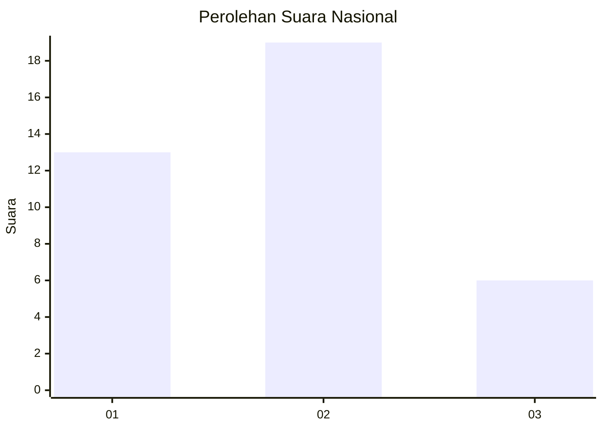
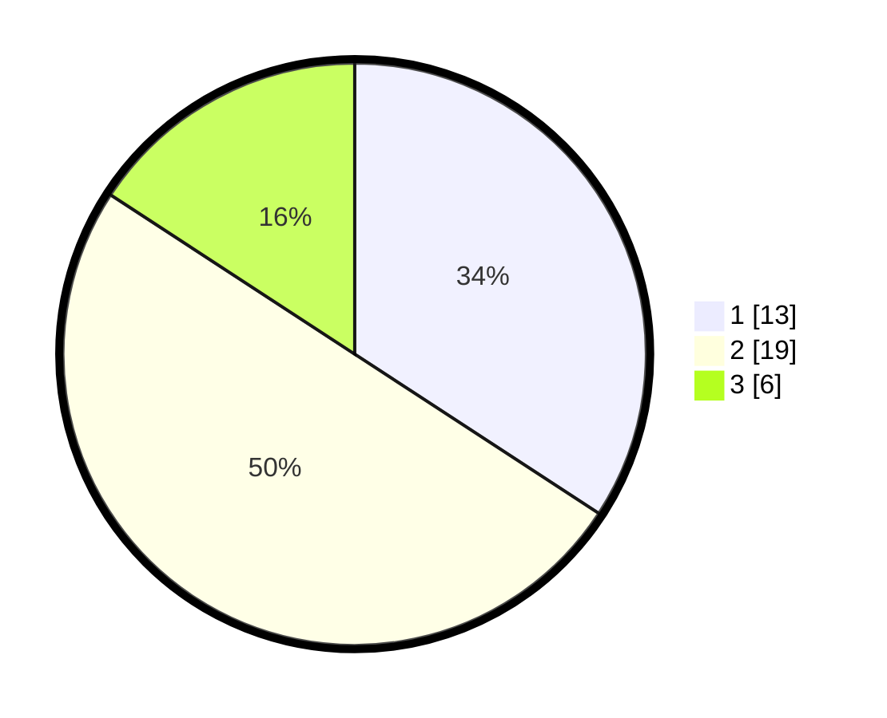

# Hasil

## Grafik

## Tabel

| No. | Nama Paslon    | Suara | Suara (raw) | Persentase |
|:--- |:-------------- | -----:| -----------:| ----------:|
| 1   | ANIES MUHAIMIN | 13    | [13][p-1]   | 34,21      |
| 2   | PRABOWO GIBRAN | 19    | [19][p-2]   | 50,00      |
| 3   | GANJAR MAHFUD  | 6     | [6][p-3]    | 15,79      |

[p-1]: https://github.com/gigit-pemilu/pemilu-2024/blob/main/pilpres/hitung-suara/sub/99-luar-negeri/sub/56-kairo-mesir/sub/01-kairo-mesir/sub/0001-kairo-mesir/sub/001-pos-001/sub/paslon-1.txt
[p-2]: https://github.com/gigit-pemilu/pemilu-2024/blob/main/pilpres/hitung-suara/sub/99-luar-negeri/sub/56-kairo-mesir/sub/01-kairo-mesir/sub/0001-kairo-mesir/sub/001-pos-001/sub/paslon-2.txt
[p-3]: https://github.com/gigit-pemilu/pemilu-2024/blob/main/pilpres/hitung-suara/sub/99-luar-negeri/sub/56-kairo-mesir/sub/01-kairo-mesir/sub/0001-kairo-mesir/sub/001-pos-001/sub/paslon-3.txt

## Foto C Plano

https://sirekap-obj-formc.kpu.go.id/ed2a/pemilu/ppwp/99/56/01/00/01/9956010001001-20240216-025056--c74b0533-f839-4d85-84ab-5174d7cdbb67.jpg

https://sirekap-obj-formc.kpu.go.id/ed2a/pemilu/ppwp/99/56/01/00/01/9956010001001-20240216-025222--f24ec93b-b162-4466-b9a6-849e27df94d5.jpg

https://sirekap-obj-formc.kpu.go.id/ed2a/pemilu/ppwp/99/56/01/00/01/9956010001001-20240216-025507--cecbfea6-3c76-408c-8470-f38e6a1c3d32.jpg

## Metadata

| Key        | Value               |
| ---------- | ------------------- |
| Time Stamp | 2024-02-17 19:30:00 |

## DATA PEMILIH TETAP

Jumlah pemilih dalam DPT: **66**.
 * L: **10**.
 * P: **56**.

## DATA PENGGUNA HAK PILIH

Jumlah pengguna hak pilih dalam DPT: **39**.
 * L: **5**.
 * P: **34**.

Jumlah pengguna hak pilih dalam DPTb: **0**.
 * L: **0**.
 * P: **0**.

Jumlah pengguna hak pilih dalam DPK: **3**.
 * L: **1**.
 * P: **2**.

Jumlah pengguna hak pilih: **42**.
 * L: **6**.
 * P: **36**.

## JUMLAH SUARA SAH DAN TIDAK SAH

JUMLAH SELURUH SUARA SAH: **38**.

JUMLAH SUARA TIDAK SAH: **4**.

JUMLAH SELURUH SUARA SAH DAN SUARA TIDAK SAH: **42**.

