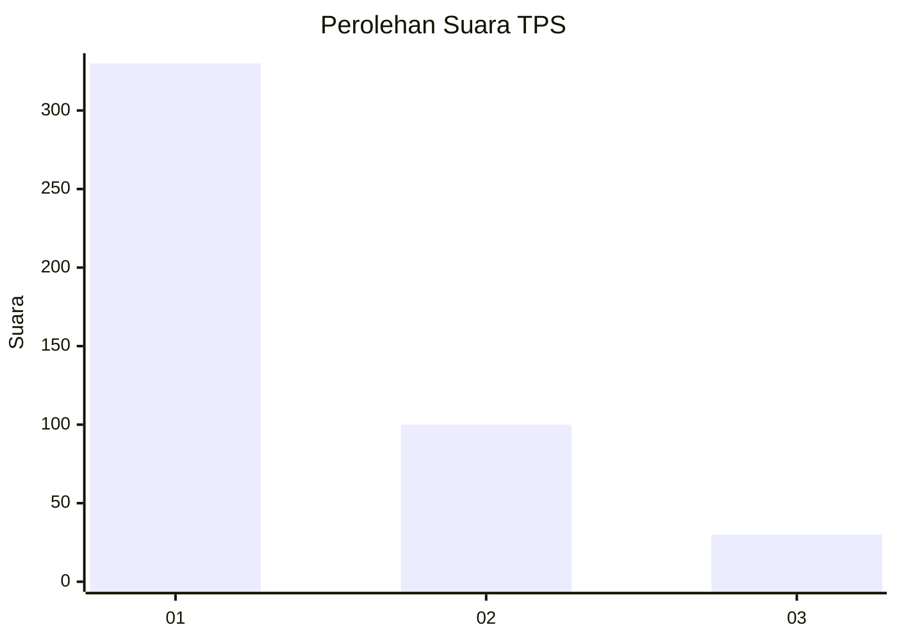
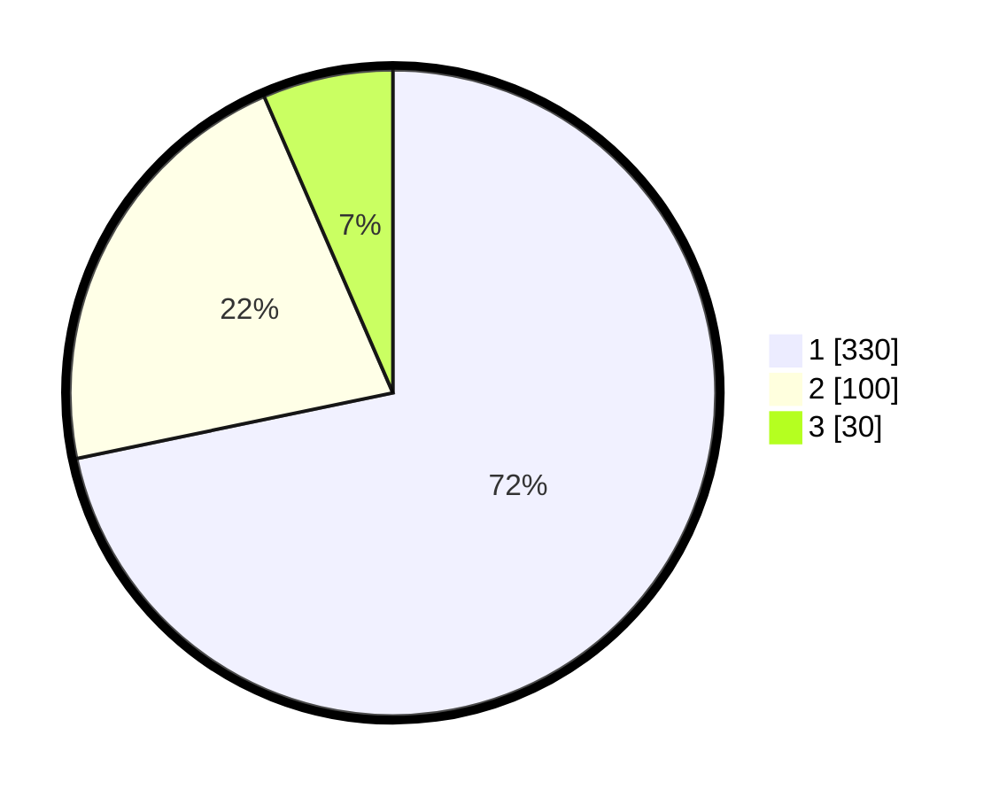

# Hasil

## Grafik

## Tabel

| No. | Nama Paslon    | Suara | Suara (raw) | Persentase |
|:--- |:-------------- | -----:| -----------:| ----------:|
| 1   | ANIES MUHAIMIN | 330   | [330][p-1]  | 71,74      |
| 2   | PRABOWO GIBRAN | 100   | [100][p-2]  | 21,74      |
| 3   | GANJAR MAHFUD  | 30    | [30][p-3]   | 6,52       |

[p-1]: https://github.com/gigit-pemilu/pemilu-2024-99-luar-negeri/blob/main/pilpres/hitung-suara/sub/99-luar-negeri/sub/56-kairo-mesir/sub/01-kairo-mesir/sub/0001-kairo-mesir/sub/002-tps-001/sub/paslon-1.txt
[p-2]: https://github.com/gigit-pemilu/pemilu-2024-99-luar-negeri/blob/main/pilpres/hitung-suara/sub/99-luar-negeri/sub/56-kairo-mesir/sub/01-kairo-mesir/sub/0001-kairo-mesir/sub/002-tps-001/sub/paslon-2.txt
[p-3]: https://github.com/gigit-pemilu/pemilu-2024-99-luar-negeri/blob/main/pilpres/hitung-suara/sub/99-luar-negeri/sub/56-kairo-mesir/sub/01-kairo-mesir/sub/0001-kairo-mesir/sub/002-tps-001/sub/paslon-3.txt

## Foto C Plano

https://sirekap-obj-formc.kpu.go.id/a620/pemilu/ppwp/99/56/01/00/01/9956010001002-20240215-221315--f05fbc2b-2c04-4ec1-b249-a7f88c86d03e.jpg

https://sirekap-obj-formc.kpu.go.id/a620/pemilu/ppwp/99/56/01/00/01/9956010001002-20240215-222301--faa1460f-5859-4ba7-b360-33e69cfe3364.jpg

https://sirekap-obj-formc.kpu.go.id/a620/pemilu/ppwp/99/56/01/00/01/9956010001002-20240215-221430--84647889-49f3-459e-a72c-0b4ebbf5b877.jpg

## Metadata

| Key        | Value               |
| ---------- | ------------------- |
| Time Stamp | 2024-02-17 16:00:02 |

## DATA PEMILIH TETAP

Jumlah pemilih dalam DPT: **551**.
 * L: **469**.
 * P: **82**.

## DATA PENGGUNA HAK PILIH

Jumlah pengguna hak pilih dalam DPT: **323**.
 * L: **277**.
 * P: **46**.

Jumlah pengguna hak pilih dalam DPTb: **135**.
 * L: **76**.
 * P: **59**.

Jumlah pengguna hak pilih dalam DPK: **11**.
 * L: **8**.
 * P: **3**.

Jumlah pengguna hak pilih: **469**.
 * L: **361**.
 * P: **108**.

## JUMLAH SUARA SAH DAN TIDAK SAH

JUMLAH SELURUH SUARA SAH: **460**.

JUMLAH SUARA TIDAK SAH: **9**.

JUMLAH SELURUH SUARA SAH DAN SUARA TIDAK SAH: **469**.

