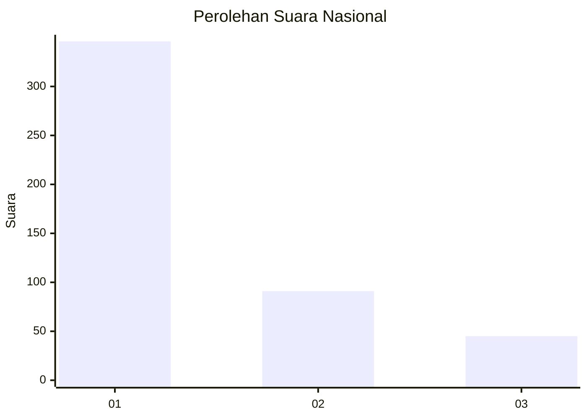
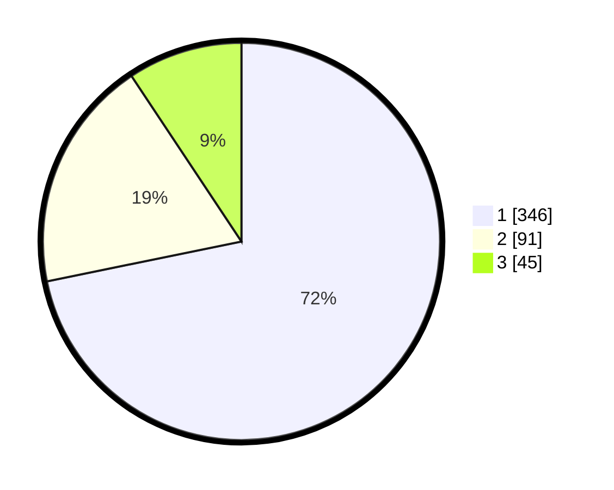

# Hasil

## Grafik

## Tabel

| No. | Nama Paslon    | Suara | Suara (raw) | Persentase |
|:--- |:-------------- | -----:| -----------:| ----------:|
| 1   | ANIES MUHAIMIN | 346   | [346][p-1]  | 71,78      |
| 2   | PRABOWO GIBRAN | 91    | [91][p-2]   | 18,88      |
| 3   | GANJAR MAHFUD  | 45    | [45][p-3]   | 9,34       |

[p-1]: https://github.com/gigit-pemilu/pemilu-2024/blob/main/pilpres/hitung-suara/sub/99-luar-negeri/sub/56-kairo-mesir/sub/01-kairo-mesir/sub/0001-kairo-mesir/sub/003-tps-002/sub/paslon-1.txt
[p-2]: https://github.com/gigit-pemilu/pemilu-2024/blob/main/pilpres/hitung-suara/sub/99-luar-negeri/sub/56-kairo-mesir/sub/01-kairo-mesir/sub/0001-kairo-mesir/sub/003-tps-002/sub/paslon-2.txt
[p-3]: https://github.com/gigit-pemilu/pemilu-2024/blob/main/pilpres/hitung-suara/sub/99-luar-negeri/sub/56-kairo-mesir/sub/01-kairo-mesir/sub/0001-kairo-mesir/sub/003-tps-002/sub/paslon-3.txt

## Foto C Plano

https://sirekap-obj-formc.kpu.go.id/fe1e/pemilu/ppwp/99/56/01/00/01/9956010001003-20240215-221333--e80f0323-d1ce-45fb-91df-9adaff49f2c4.jpg

https://sirekap-obj-formc.kpu.go.id/fe1e/pemilu/ppwp/99/56/01/00/01/9956010001003-20240215-221551--b8cfed0a-2a41-46ff-bb62-b0fc2762f5a4.jpg

https://sirekap-obj-formc.kpu.go.id/fe1e/pemilu/ppwp/99/56/01/00/01/9956010001003-20240215-221705--8729f48e-ff9e-41e5-9228-3a130653bbdc.jpg

## Metadata

| Key        | Value               |
| ---------- | ------------------- |
| Time Stamp | 2024-02-15 23:29:50 |

## DATA PEMILIH TETAP

Jumlah pemilih dalam DPT: **551**.
 * L: **472**.
 * P: **79**.

## DATA PENGGUNA HAK PILIH

Jumlah pengguna hak pilih dalam DPT: **358**.
 * L: **298**.
 * P: **60**.

Jumlah pengguna hak pilih dalam DPTb: **122**.
 * L: **69**.
 * P: **53**.

Jumlah pengguna hak pilih dalam DPK: **9**.
 * L: **4**.
 * P: **5**.

Jumlah pengguna hak pilih: **489**.
 * L: **371**.
 * P: **118**.

## JUMLAH SUARA SAH DAN TIDAK SAH

JUMLAH SELURUH SUARA SAH: **482**.

JUMLAH SUARA TIDAK SAH: **7**.

JUMLAH SELURUH SUARA SAH DAN SUARA TIDAK SAH: **489**.

