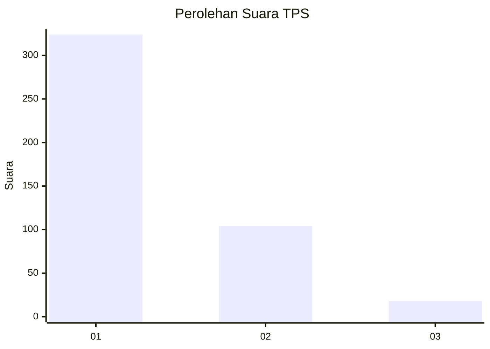
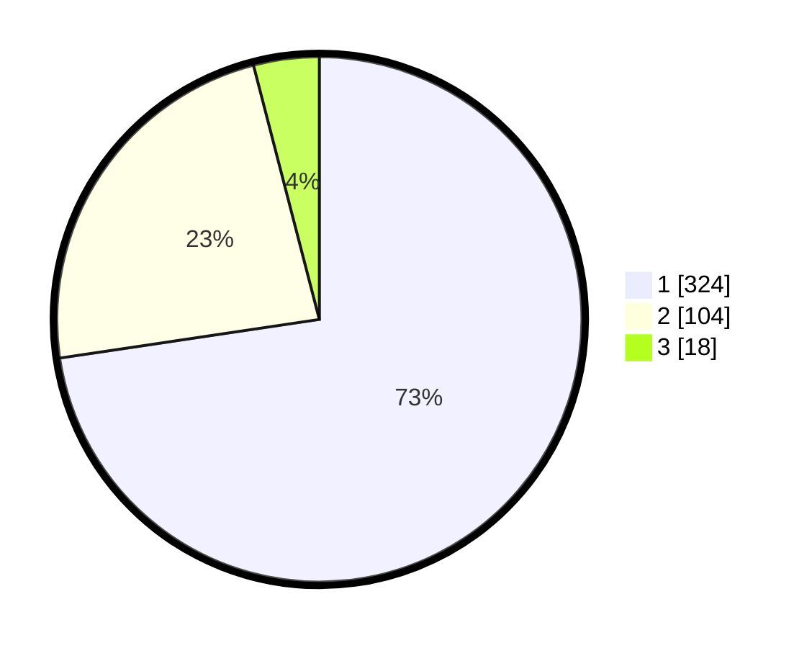

# Hasil

## Grafik

## Tabel

| No. | Nama Paslon    | Suara | Suara (raw) | Persentase |
|:--- |:-------------- | -----:| -----------:| ----------:|
| 1   | ANIES MUHAIMIN | 324   | [324][p-1]  | 72,65      |
| 2   | PRABOWO GIBRAN | 104   | [104][p-2]  | 23,32      |
| 3   | GANJAR MAHFUD  | 18    | [18][p-3]   | 4,04       |

[p-1]: https://github.com/gigit-pemilu/pemilu-2024-99-luar-negeri/blob/main/pilpres/hitung-suara/sub/99-luar-negeri/sub/56-kairo-mesir/sub/01-kairo-mesir/sub/0001-kairo-mesir/sub/004-tps-003/sub/paslon-1.txt
[p-2]: https://github.com/gigit-pemilu/pemilu-2024-99-luar-negeri/blob/main/pilpres/hitung-suara/sub/99-luar-negeri/sub/56-kairo-mesir/sub/01-kairo-mesir/sub/0001-kairo-mesir/sub/004-tps-003/sub/paslon-2.txt
[p-3]: https://github.com/gigit-pemilu/pemilu-2024-99-luar-negeri/blob/main/pilpres/hitung-suara/sub/99-luar-negeri/sub/56-kairo-mesir/sub/01-kairo-mesir/sub/0001-kairo-mesir/sub/004-tps-003/sub/paslon-3.txt

## Foto C Plano

https://sirekap-obj-formc.kpu.go.id/3df0/pemilu/ppwp/99/56/01/00/01/9956010001004-20240215-221248--667b1248-e13a-4e48-b880-5287347f9c6d.jpg

https://sirekap-obj-formc.kpu.go.id/3df0/pemilu/ppwp/99/56/01/00/01/9956010001004-20240215-223027--24fd53e5-a7c3-4430-8172-4d4bb0379ae9.jpg

https://sirekap-obj-formc.kpu.go.id/3df0/pemilu/ppwp/99/56/01/00/01/9956010001004-20240215-223040--61658f59-fc0c-493c-b98e-63b38581ad01.jpg

## Metadata

| Key        | Value               |
| ---------- | ------------------- |
| Time Stamp | 2024-02-17 16:00:02 |

## DATA PEMILIH TETAP

Jumlah pemilih dalam DPT: **552**.
 * L: **326**.
 * P: **226**.

## DATA PENGGUNA HAK PILIH

Jumlah pengguna hak pilih dalam DPT: **328**.
 * L: **186**.
 * P: **142**.

Jumlah pengguna hak pilih dalam DPTb: **129**.
 * L: **70**.
 * P: **59**.

Jumlah pengguna hak pilih dalam DPK: **1**.
 * L: **1**.
 * P: **0**.

Jumlah pengguna hak pilih: **458**.
 * L: **257**.
 * P: **201**.

## JUMLAH SUARA SAH DAN TIDAK SAH

JUMLAH SELURUH SUARA SAH: **446**.

JUMLAH SUARA TIDAK SAH: **12**.

JUMLAH SELURUH SUARA SAH DAN SUARA TIDAK SAH: **458**.

