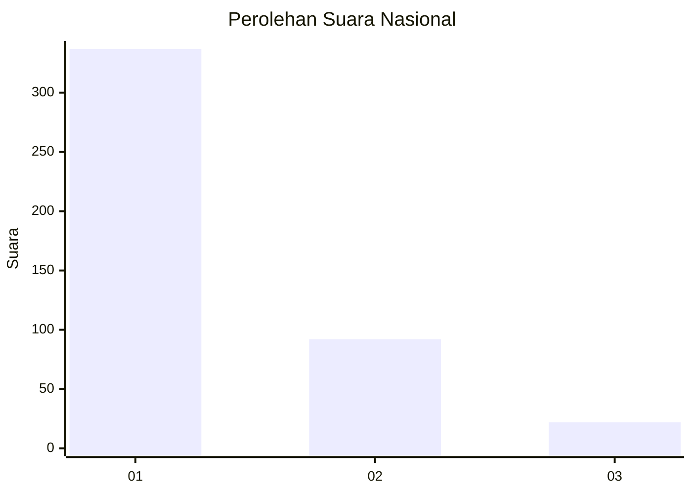
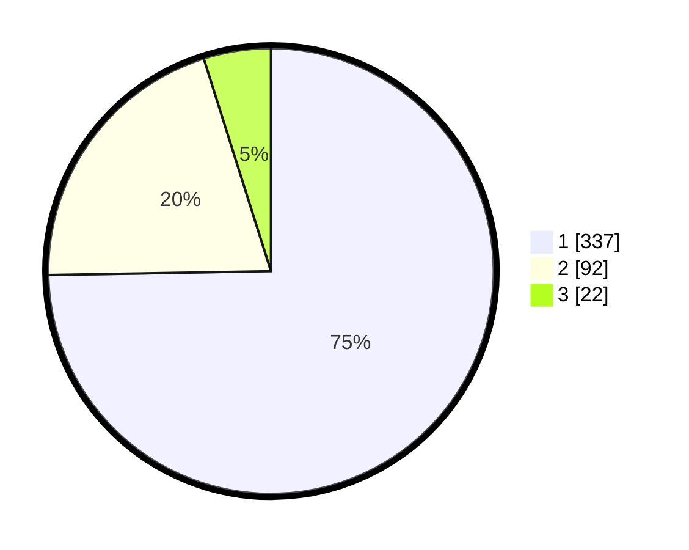

# Hasil

## Grafik

## Tabel

| No. | Nama Paslon    | Suara | Suara (raw) | Persentase |
|:--- |:-------------- | -----:| -----------:| ----------:|
| 1   | ANIES MUHAIMIN | 337   | [337][p-1]  | 74,72      |
| 2   | PRABOWO GIBRAN | 92    | [92][p-2]   | 20,40      |
| 3   | GANJAR MAHFUD  | 22    | [22][p-3]   | 4,88       |

[p-1]: https://github.com/gigit-pemilu/pemilu-2024/blob/main/pilpres/hitung-suara/sub/99-luar-negeri/sub/56-kairo-mesir/sub/01-kairo-mesir/sub/0001-kairo-mesir/sub/005-tps-004/sub/paslon-1.txt
[p-2]: https://github.com/gigit-pemilu/pemilu-2024/blob/main/pilpres/hitung-suara/sub/99-luar-negeri/sub/56-kairo-mesir/sub/01-kairo-mesir/sub/0001-kairo-mesir/sub/005-tps-004/sub/paslon-2.txt
[p-3]: https://github.com/gigit-pemilu/pemilu-2024/blob/main/pilpres/hitung-suara/sub/99-luar-negeri/sub/56-kairo-mesir/sub/01-kairo-mesir/sub/0001-kairo-mesir/sub/005-tps-004/sub/paslon-3.txt

## Foto C Plano

https://sirekap-obj-formc.kpu.go.id/da0b/pemilu/ppwp/99/56/01/00/01/9956010001005-20240216-005548--169efb55-b89b-46ce-80e0-803f7e15db0f.jpg

https://sirekap-obj-formc.kpu.go.id/da0b/pemilu/ppwp/99/56/01/00/01/9956010001005-20240216-005304--900aed09-b0a3-4504-80ee-5f755ba69745.jpg

https://sirekap-obj-formc.kpu.go.id/da0b/pemilu/ppwp/99/56/01/00/01/9956010001005-20240216-005102--67245aba-7275-4de6-ba90-b12586fa3b24.jpg

## Metadata

| Key        | Value               |
| ---------- | ------------------- |
| Time Stamp | 2024-02-17 16:00:02 |

## DATA PEMILIH TETAP

Jumlah pemilih dalam DPT: **552**.
 * L: **332**.
 * P: **220**.

## DATA PENGGUNA HAK PILIH

Jumlah pengguna hak pilih dalam DPT: **325**.
 * L: **193**.
 * P: **132**.

Jumlah pengguna hak pilih dalam DPTb: **131**.
 * L: **92**.
 * P: **39**.

Jumlah pengguna hak pilih dalam DPK: **5**.
 * L: **3**.
 * P: **2**.

Jumlah pengguna hak pilih: **461**.
 * L: **288**.
 * P: **173**.

## JUMLAH SUARA SAH DAN TIDAK SAH

JUMLAH SELURUH SUARA SAH: **451**.

JUMLAH SUARA TIDAK SAH: **10**.

JUMLAH SELURUH SUARA SAH DAN SUARA TIDAK SAH: **461**.

