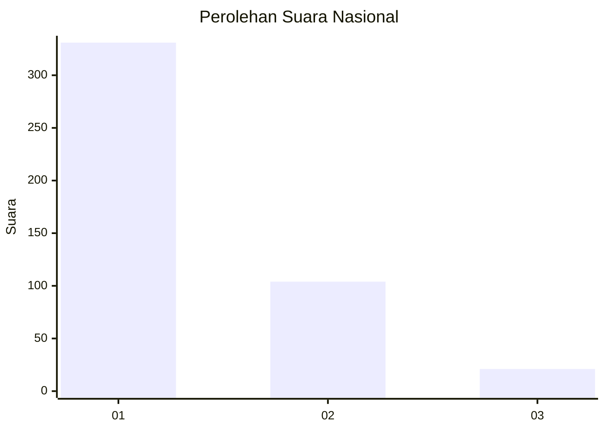
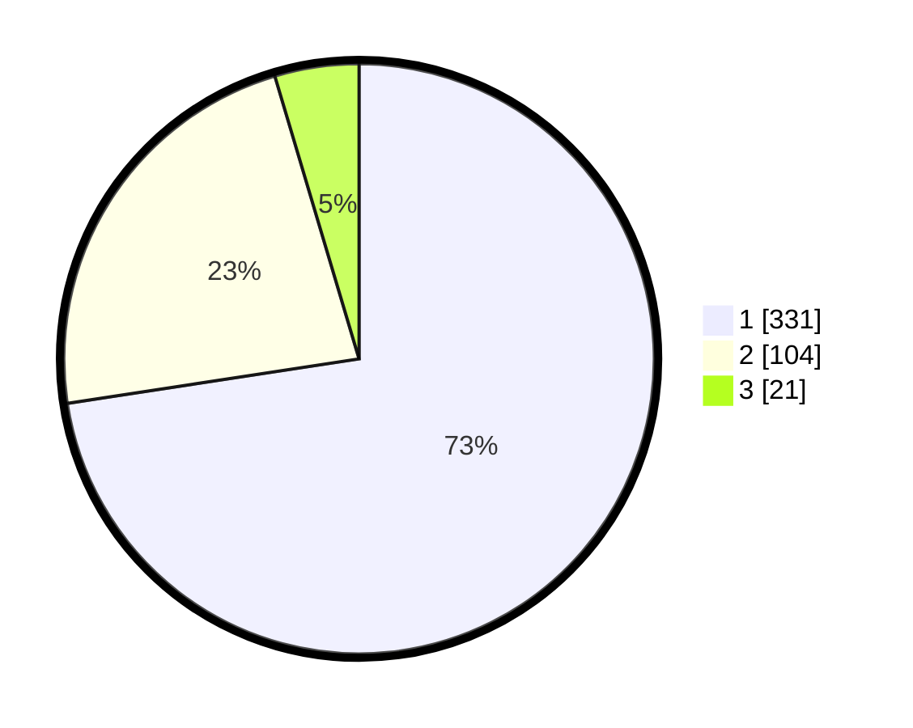

# Hasil

## Grafik

## Tabel

| No. | Nama Paslon    | Suara | Suara (raw) | Persentase |
|:--- |:-------------- | -----:| -----------:| ----------:|
| 1   | ANIES MUHAIMIN | 331   | [331][p-1]  | 72,59      |
| 2   | PRABOWO GIBRAN | 104   | [104][p-2]  | 22,81      |
| 3   | GANJAR MAHFUD  | 21    | [21][p-3]   | 4,61       |

[p-1]: https://github.com/gigit-pemilu/pemilu-2024/blob/main/pilpres/hitung-suara/sub/99-luar-negeri/sub/56-kairo-mesir/sub/01-kairo-mesir/sub/0001-kairo-mesir/sub/006-tps-005/sub/paslon-1.txt
[p-2]: https://github.com/gigit-pemilu/pemilu-2024/blob/main/pilpres/hitung-suara/sub/99-luar-negeri/sub/56-kairo-mesir/sub/01-kairo-mesir/sub/0001-kairo-mesir/sub/006-tps-005/sub/paslon-2.txt
[p-3]: https://github.com/gigit-pemilu/pemilu-2024/blob/main/pilpres/hitung-suara/sub/99-luar-negeri/sub/56-kairo-mesir/sub/01-kairo-mesir/sub/0001-kairo-mesir/sub/006-tps-005/sub/paslon-3.txt

## Foto C Plano

https://sirekap-obj-formc.kpu.go.id/3d84/pemilu/ppwp/99/56/01/00/01/9956010001006-20240215-221518--d13dfc28-286c-4fc7-a93f-cfc8c0d701de.jpg

https://sirekap-obj-formc.kpu.go.id/3d84/pemilu/ppwp/99/56/01/00/01/9956010001006-20240215-221744--dee2fadb-857c-4ad9-a054-7f61b640b00e.jpg

https://sirekap-obj-formc.kpu.go.id/3d84/pemilu/ppwp/99/56/01/00/01/9956010001006-20240215-221843--61d0780b-00e6-4f7e-abb5-cb4fed6dd31a.jpg

## Metadata

| Key        | Value               |
| ---------- | ------------------- |
| Time Stamp | 2024-02-19 18:00:00 |

## DATA PEMILIH TETAP

Jumlah pemilih dalam DPT: **552**.
 * L: **285**.
 * P: **267**.

## DATA PENGGUNA HAK PILIH

Jumlah pengguna hak pilih dalam DPT: **339**.
 * L: **172**.
 * P: **167**.

Jumlah pengguna hak pilih dalam DPTb: **131**.
 * L: **80**.
 * P: **51**.

Jumlah pengguna hak pilih dalam DPK: **0**.
 * L: **0**.
 * P: **0**.

Jumlah pengguna hak pilih: **470**.
 * L: **252**.
 * P: **218**.

## JUMLAH SUARA SAH DAN TIDAK SAH

JUMLAH SELURUH SUARA SAH: **456**.

JUMLAH SUARA TIDAK SAH: **14**.

JUMLAH SELURUH SUARA SAH DAN SUARA TIDAK SAH: **470**.

