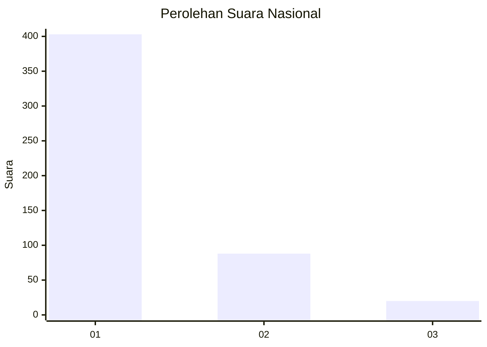
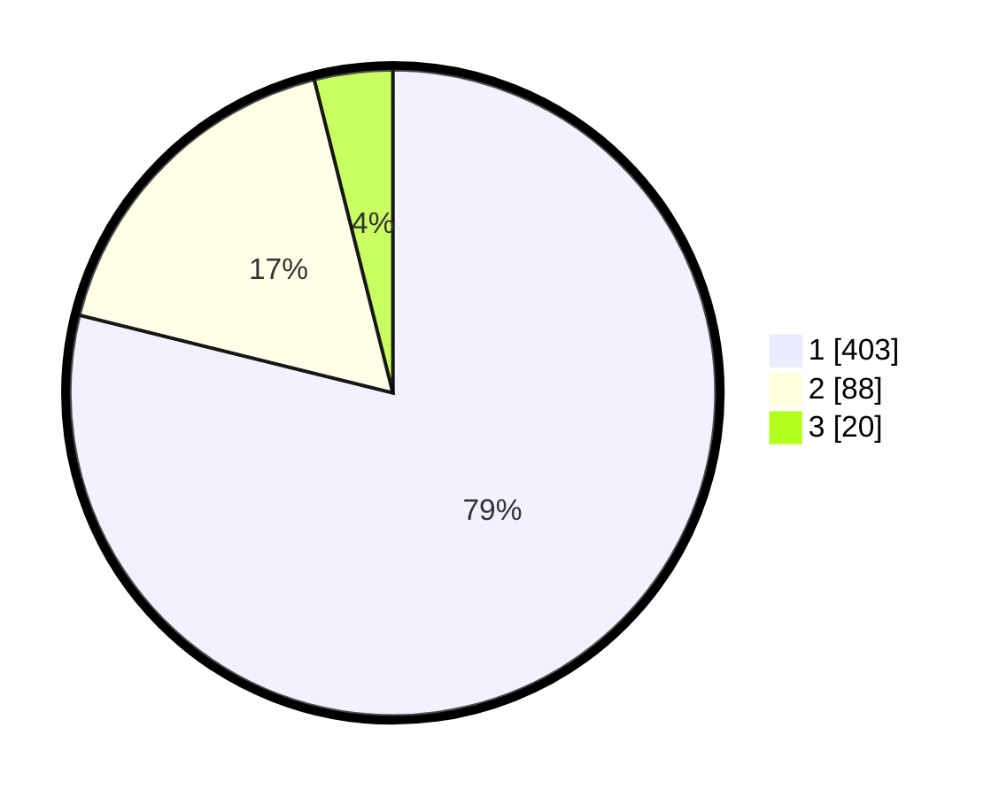

# Hasil

## Grafik

## Tabel

| No. | Nama Paslon    | Suara | Suara (raw) | Persentase |
|:--- |:-------------- | -----:| -----------:| ----------:|
| 1   | ANIES MUHAIMIN | 403   | [403][p-1]  | 78,86      |
| 2   | PRABOWO GIBRAN | 88    | [88][p-2]   | 17,22      |
| 3   | GANJAR MAHFUD  | 20    | [20][p-3]   | 3,91       |

[p-1]: https://github.com/gigit-pemilu/pemilu-2024/blob/main/pilpres/hitung-suara/sub/99-luar-negeri/sub/56-kairo-mesir/sub/01-kairo-mesir/sub/0001-kairo-mesir/sub/007-tps-006/sub/paslon-1.txt
[p-2]: https://github.com/gigit-pemilu/pemilu-2024/blob/main/pilpres/hitung-suara/sub/99-luar-negeri/sub/56-kairo-mesir/sub/01-kairo-mesir/sub/0001-kairo-mesir/sub/007-tps-006/sub/paslon-2.txt
[p-3]: https://github.com/gigit-pemilu/pemilu-2024/blob/main/pilpres/hitung-suara/sub/99-luar-negeri/sub/56-kairo-mesir/sub/01-kairo-mesir/sub/0001-kairo-mesir/sub/007-tps-006/sub/paslon-3.txt

## Foto C Plano

https://sirekap-obj-formc.kpu.go.id/3ae8/pemilu/ppwp/99/56/01/00/01/9956010001007-20240215-222433--36eb68c7-39c1-45a8-9f57-1d5c7bfbd21c.jpg

https://sirekap-obj-formc.kpu.go.id/3ae8/pemilu/ppwp/99/56/01/00/01/9956010001007-20240215-222637--f36c30cf-8ccf-466c-8eb5-cc7e2f40f4c6.jpg

https://sirekap-obj-formc.kpu.go.id/3ae8/pemilu/ppwp/99/56/01/00/01/9956010001007-20240215-222737--dda9be7c-daa6-443b-8e96-ac2fe9db2377.jpg

## Metadata

| Key        | Value               |
| ---------- | ------------------- |
| Time Stamp | 2024-02-17 16:00:02 |

## DATA PEMILIH TETAP

Jumlah pemilih dalam DPT: **552**.
 * L: **374**.
 * P: **179**.

## DATA PENGGUNA HAK PILIH

Jumlah pengguna hak pilih dalam DPT: **367**.
 * L: **239**.
 * P: **128**.

Jumlah pengguna hak pilih dalam DPTb: **131**.
 * L: **74**.
 * P: **57**.

Jumlah pengguna hak pilih dalam DPK: **21**.
 * L: **10**.
 * P: **11**.

Jumlah pengguna hak pilih: **519**.
 * L: **323**.
 * P: **196**.

## JUMLAH SUARA SAH DAN TIDAK SAH

JUMLAH SELURUH SUARA SAH: **511**.

JUMLAH SUARA TIDAK SAH: **8**.

JUMLAH SELURUH SUARA SAH DAN SUARA TIDAK SAH: **519**.

