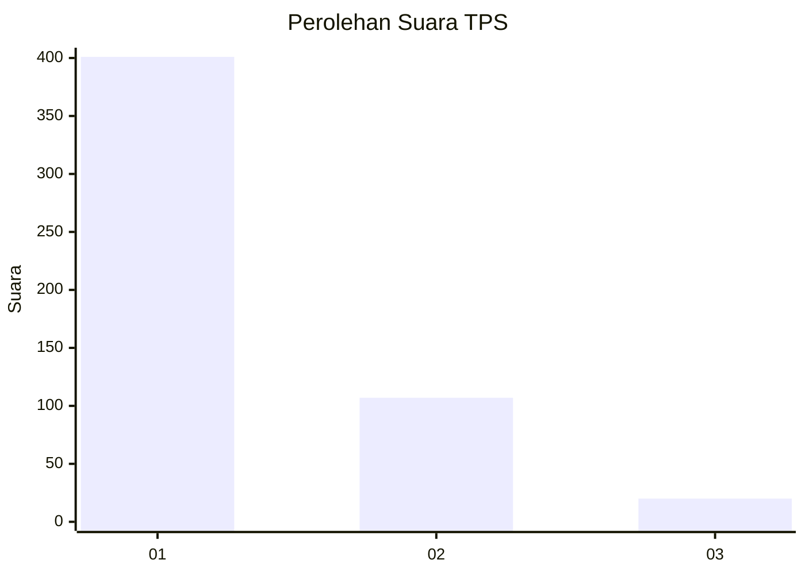
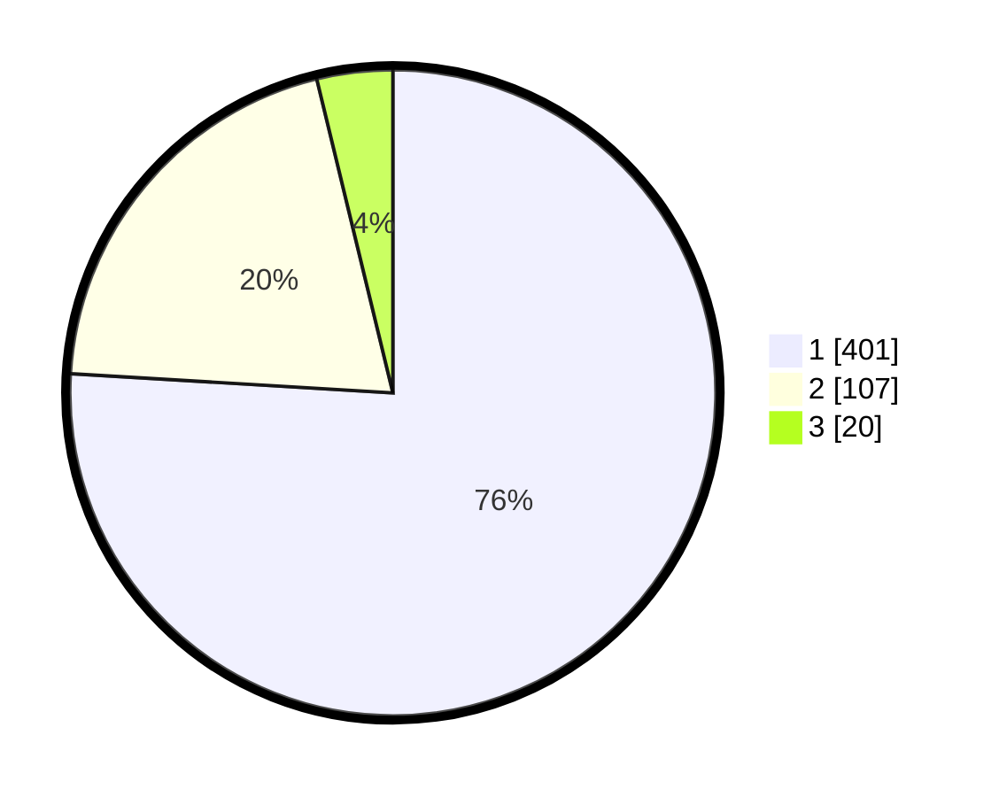

# Hasil

## Grafik

## Tabel

| No. | Nama Paslon    | Suara | Suara (raw) | Persentase |
|:--- |:-------------- | -----:| -----------:| ----------:|
| 1   | ANIES MUHAIMIN | 401   | [401][p-1]  | 75,95      |
| 2   | PRABOWO GIBRAN | 107   | [107][p-2]  | 20,27      |
| 3   | GANJAR MAHFUD  | 20    | [20][p-3]   | 3,79       |

[p-1]: https://github.com/gigit-pemilu/pemilu-2024-99-luar-negeri/blob/main/pilpres/hitung-suara/sub/99-luar-negeri/sub/56-kairo-mesir/sub/01-kairo-mesir/sub/0001-kairo-mesir/sub/008-tps-007/sub/paslon-1.txt
[p-2]: https://github.com/gigit-pemilu/pemilu-2024-99-luar-negeri/blob/main/pilpres/hitung-suara/sub/99-luar-negeri/sub/56-kairo-mesir/sub/01-kairo-mesir/sub/0001-kairo-mesir/sub/008-tps-007/sub/paslon-2.txt
[p-3]: https://github.com/gigit-pemilu/pemilu-2024-99-luar-negeri/blob/main/pilpres/hitung-suara/sub/99-luar-negeri/sub/56-kairo-mesir/sub/01-kairo-mesir/sub/0001-kairo-mesir/sub/008-tps-007/sub/paslon-3.txt

## Foto C Plano

https://sirekap-obj-formc.kpu.go.id/0b09/pemilu/ppwp/99/56/01/00/01/9956010001008-20240215-033454--98bcc9bb-a908-42c8-97d4-883f94ee2d8f.jpg

https://sirekap-obj-formc.kpu.go.id/0b09/pemilu/ppwp/99/56/01/00/01/9956010001008-20240215-033525--44000bae-14e8-46b3-b308-76157f8921f6.jpg

https://sirekap-obj-formc.kpu.go.id/0b09/pemilu/ppwp/99/56/01/00/01/9956010001008-20240216-005532--1b1b2275-a98f-41a9-86e4-b52838ad9356.jpg

## Metadata

| Key        | Value               |
| ---------- | ------------------- |
| Time Stamp | 2024-02-17 16:00:02 |

## DATA PEMILIH TETAP

Jumlah pemilih dalam DPT: **552**.
 * L: **340**.
 * P: **212**.

## DATA PENGGUNA HAK PILIH

Jumlah pengguna hak pilih dalam DPT: **347**.
 * L: **202**.
 * P: **145**.

Jumlah pengguna hak pilih dalam DPTb: **145**.
 * L: **88**.
 * P: **57**.

Jumlah pengguna hak pilih dalam DPK: **45**.
 * L: **29**.
 * P: **16**.

Jumlah pengguna hak pilih: **537**.
 * L: **319**.
 * P: **218**.

## JUMLAH SUARA SAH DAN TIDAK SAH

JUMLAH SELURUH SUARA SAH: **528**.

JUMLAH SUARA TIDAK SAH: **9**.

JUMLAH SELURUH SUARA SAH DAN SUARA TIDAK SAH: **537**.

