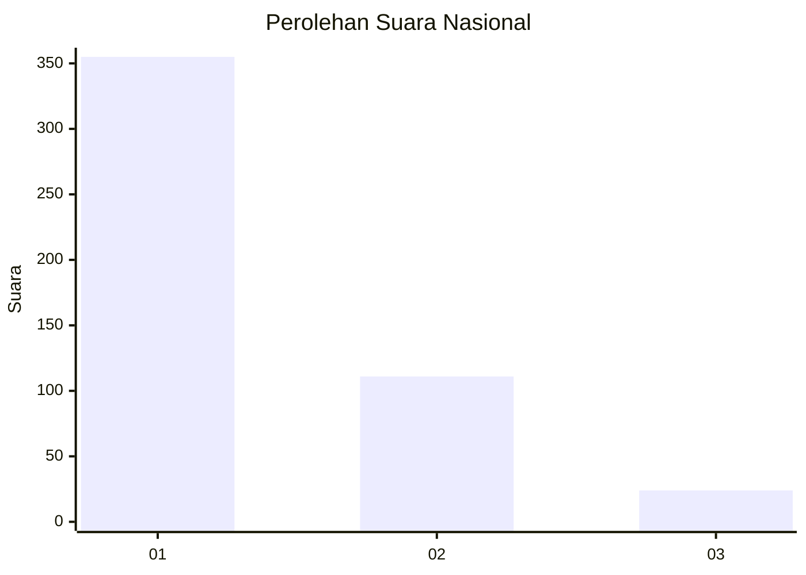
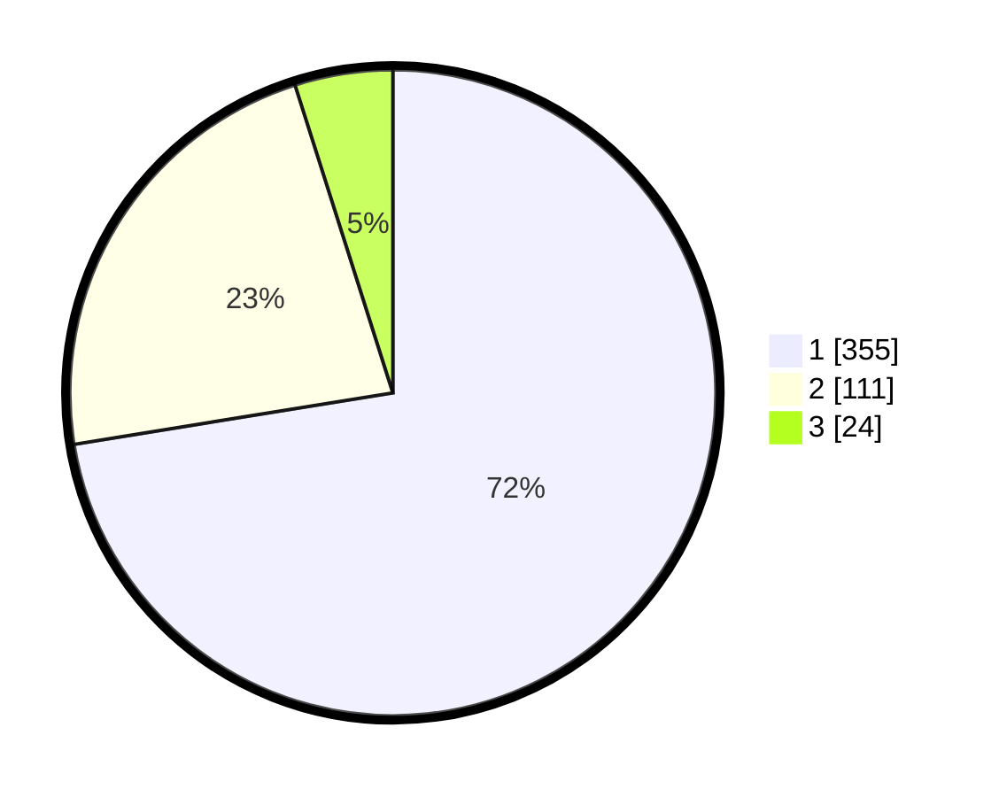

# Hasil

## Grafik

## Tabel

| No. | Nama Paslon    | Suara | Suara (raw) | Persentase |
|:--- |:-------------- | -----:| -----------:| ----------:|
| 1   | ANIES MUHAIMIN | 355   | [355][p-1]  | 72,45      |
| 2   | PRABOWO GIBRAN | 111   | [111][p-2]  | 22,65      |
| 3   | GANJAR MAHFUD  | 24    | [24][p-3]   | 4,90       |

[p-1]: https://github.com/gigit-pemilu/pemilu-2024/blob/main/pilpres/hitung-suara/sub/99-luar-negeri/sub/56-kairo-mesir/sub/01-kairo-mesir/sub/0001-kairo-mesir/sub/009-tps-008/sub/paslon-1.txt
[p-2]: https://github.com/gigit-pemilu/pemilu-2024/blob/main/pilpres/hitung-suara/sub/99-luar-negeri/sub/56-kairo-mesir/sub/01-kairo-mesir/sub/0001-kairo-mesir/sub/009-tps-008/sub/paslon-2.txt
[p-3]: https://github.com/gigit-pemilu/pemilu-2024/blob/main/pilpres/hitung-suara/sub/99-luar-negeri/sub/56-kairo-mesir/sub/01-kairo-mesir/sub/0001-kairo-mesir/sub/009-tps-008/sub/paslon-3.txt

## Foto C Plano

https://sirekap-obj-formc.kpu.go.id/95bf/pemilu/ppwp/99/56/01/00/01/9956010001009-20240215-230511--69a0683b-0458-4bd0-b8d3-960ed195ec1a.jpg

https://sirekap-obj-formc.kpu.go.id/95bf/pemilu/ppwp/99/56/01/00/01/9956010001009-20240215-231038--0d95b460-4945-4994-950e-705d10bb0b7a.jpg

https://sirekap-obj-formc.kpu.go.id/95bf/pemilu/ppwp/99/56/01/00/01/9956010001009-20240215-231216--799083f0-ca4d-4d49-a79c-5d82d077c381.jpg

## Metadata

| Key        | Value               |
| ---------- | ------------------- |
| Time Stamp | 2024-02-17 19:30:00 |

## DATA PEMILIH TETAP

Jumlah pemilih dalam DPT: **552**.
 * L: **344**.
 * P: **208**.

## DATA PENGGUNA HAK PILIH

Jumlah pengguna hak pilih dalam DPT: **350**.
 * L: **201**.
 * P: **149**.

Jumlah pengguna hak pilih dalam DPTb: **134**.
 * L: **78**.
 * P: **56**.

Jumlah pengguna hak pilih dalam DPK: **17**.
 * L: **12**.
 * P: **5**.

Jumlah pengguna hak pilih: **501**.
 * L: **291**.
 * P: **210**.

## JUMLAH SUARA SAH DAN TIDAK SAH

JUMLAH SELURUH SUARA SAH: **490**.

JUMLAH SUARA TIDAK SAH: **11**.

JUMLAH SELURUH SUARA SAH DAN SUARA TIDAK SAH: **501**.

