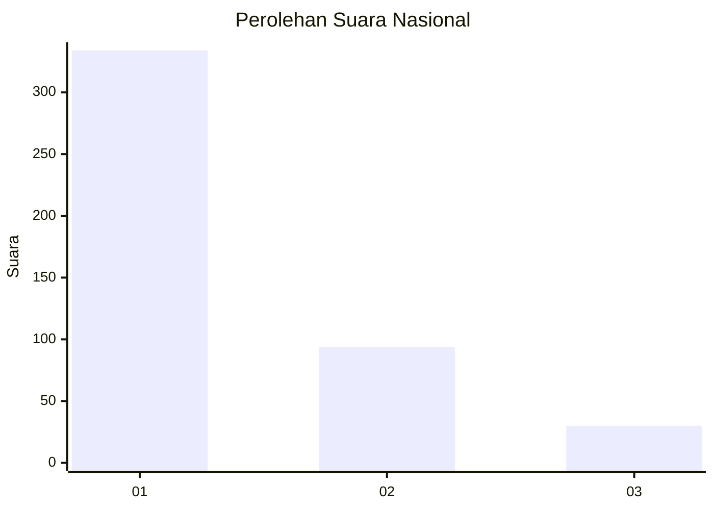
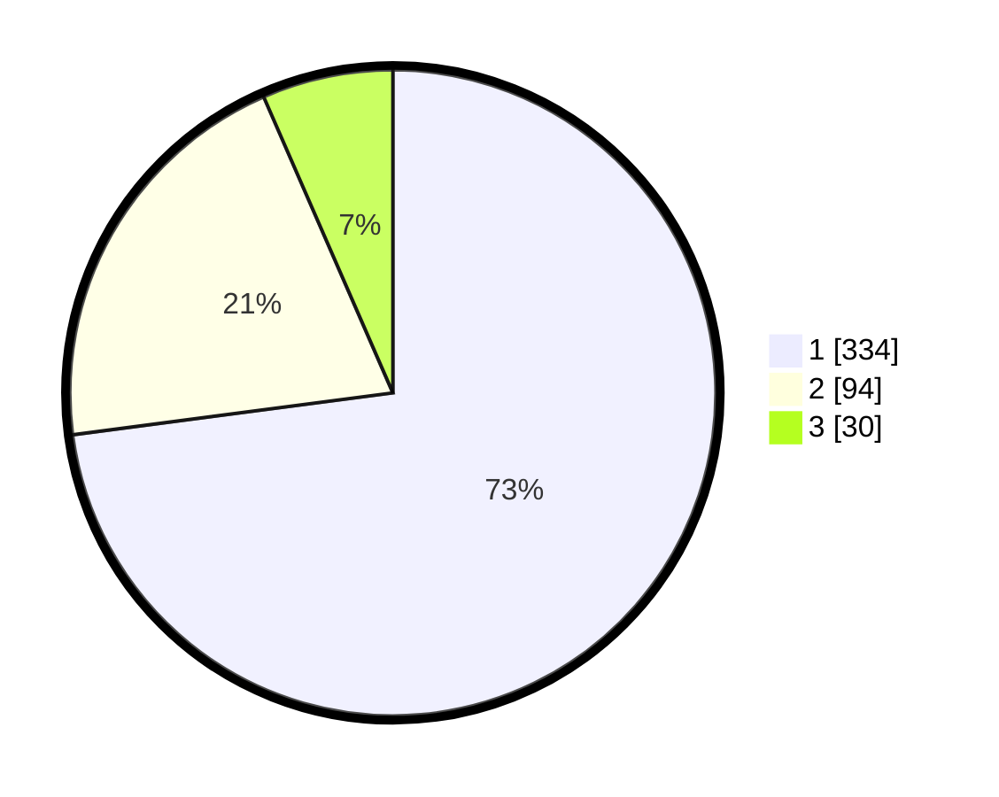

# Hasil

## Grafik

## Tabel

| No. | Nama Paslon    | Suara | Suara (raw) | Persentase |
|:--- |:-------------- | -----:| -----------:| ----------:|
| 1   | ANIES MUHAIMIN | 334   | [334][p-1]  | 72,93      |
| 2   | PRABOWO GIBRAN | 94    | [94][p-2]   | 20,52      |
| 3   | GANJAR MAHFUD  | 30    | [30][p-3]   | 6,55       |

[p-1]: https://github.com/gigit-pemilu/pemilu-2024/blob/main/pilpres/hitung-suara/sub/99-luar-negeri/sub/56-kairo-mesir/sub/01-kairo-mesir/sub/0001-kairo-mesir/sub/010-tps-009/sub/paslon-1.txt
[p-2]: https://github.com/gigit-pemilu/pemilu-2024/blob/main/pilpres/hitung-suara/sub/99-luar-negeri/sub/56-kairo-mesir/sub/01-kairo-mesir/sub/0001-kairo-mesir/sub/010-tps-009/sub/paslon-2.txt
[p-3]: https://github.com/gigit-pemilu/pemilu-2024/blob/main/pilpres/hitung-suara/sub/99-luar-negeri/sub/56-kairo-mesir/sub/01-kairo-mesir/sub/0001-kairo-mesir/sub/010-tps-009/sub/paslon-3.txt

## Foto C Plano

https://sirekap-obj-formc.kpu.go.id/2704/pemilu/ppwp/99/56/01/00/01/9956010001010-20240215-221337--6a10f3f5-ba92-4cd5-b436-c745bf0d3141.jpg

https://sirekap-obj-formc.kpu.go.id/2704/pemilu/ppwp/99/56/01/00/01/9956010001010-20240215-222323--8858b3ee-edf6-4538-a6d8-4d83fd12fa9a.jpg

https://sirekap-obj-formc.kpu.go.id/2704/pemilu/ppwp/99/56/01/00/01/9956010001010-20240215-222435--0b258b73-7e0f-42a6-9992-8444705e69fc.jpg

## Metadata

| Key        | Value               |
| ---------- | ------------------- |
| Time Stamp | 2024-02-15 22:30:27 |

## DATA PEMILIH TETAP

Jumlah pemilih dalam DPT: **552**.
 * L: **287**.
 * P: **265**.

## DATA PENGGUNA HAK PILIH

Jumlah pengguna hak pilih dalam DPT: **317**.
 * L: **148**.
 * P: **169**.

Jumlah pengguna hak pilih dalam DPTb: **134**.
 * L: **92**.
 * P: **42**.

Jumlah pengguna hak pilih dalam DPK: **16**.
 * L: **8**.
 * P: **8**.

Jumlah pengguna hak pilih: **467**.
 * L: **248**.
 * P: **219**.

## JUMLAH SUARA SAH DAN TIDAK SAH

JUMLAH SELURUH SUARA SAH: **458**.

JUMLAH SUARA TIDAK SAH: **9**.

JUMLAH SELURUH SUARA SAH DAN SUARA TIDAK SAH: **467**.

