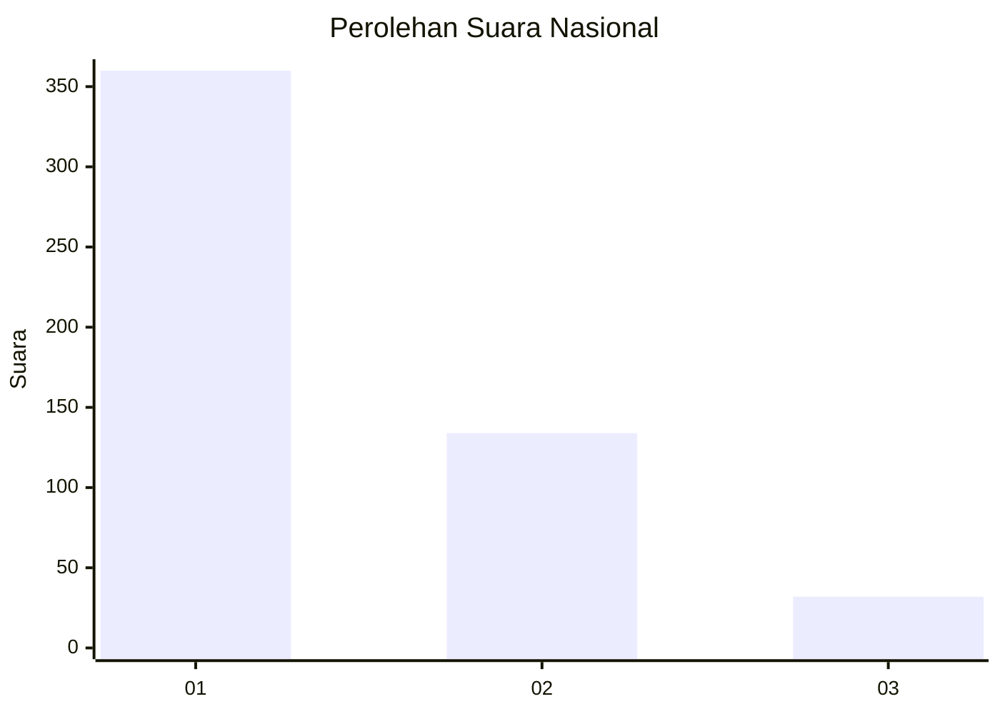
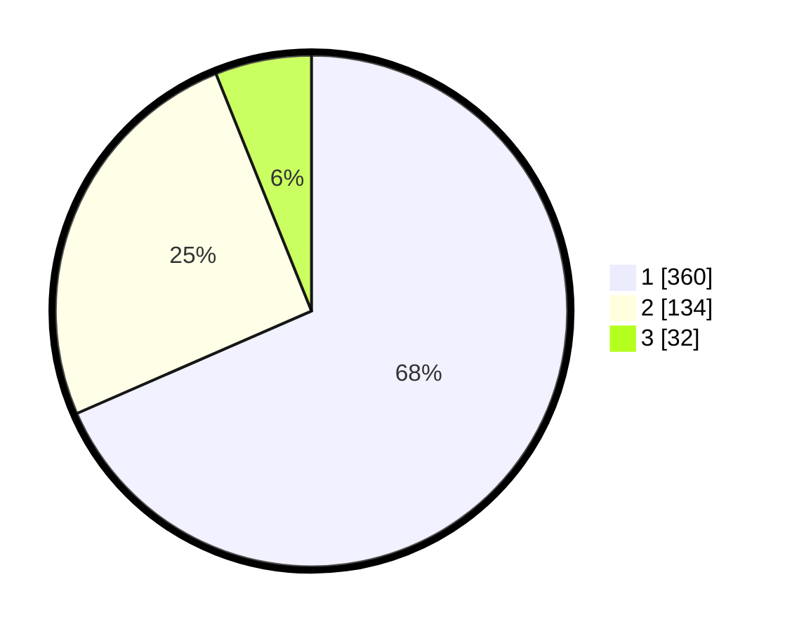

# Hasil

## Grafik

## Tabel

| No. | Nama Paslon    | Suara | Suara (raw) | Persentase |
|:--- |:-------------- | -----:| -----------:| ----------:|
| 1   | ANIES MUHAIMIN | 360   | [360][p-1]  | 68,44      |
| 2   | PRABOWO GIBRAN | 134   | [134][p-2]  | 25,48      |
| 3   | GANJAR MAHFUD  | 32    | [32][p-3]   | 6,08       |

[p-1]: https://github.com/gigit-pemilu/pemilu-2024/blob/main/pilpres/hitung-suara/sub/99-luar-negeri/sub/56-kairo-mesir/sub/01-kairo-mesir/sub/0001-kairo-mesir/sub/011-tps-010/sub/paslon-1.txt
[p-2]: https://github.com/gigit-pemilu/pemilu-2024/blob/main/pilpres/hitung-suara/sub/99-luar-negeri/sub/56-kairo-mesir/sub/01-kairo-mesir/sub/0001-kairo-mesir/sub/011-tps-010/sub/paslon-2.txt
[p-3]: https://github.com/gigit-pemilu/pemilu-2024/blob/main/pilpres/hitung-suara/sub/99-luar-negeri/sub/56-kairo-mesir/sub/01-kairo-mesir/sub/0001-kairo-mesir/sub/011-tps-010/sub/paslon-3.txt

## Foto C Plano

https://sirekap-obj-formc.kpu.go.id/c98f/pemilu/ppwp/99/56/01/00/01/9956010001011-20240216-051348--1fd9d07a-69aa-46fb-a290-52fba758d26d.jpg

https://sirekap-obj-formc.kpu.go.id/c98f/pemilu/ppwp/99/56/01/00/01/9956010001011-20240216-053132--4df1ac65-93b0-461a-80e7-885d60fb523e.jpg

https://sirekap-obj-formc.kpu.go.id/c98f/pemilu/ppwp/99/56/01/00/01/9956010001011-20240216-051354--350be49d-af12-4779-bd98-a1409a9a98ce.jpg

## Metadata

| Key        | Value               |
| ---------- | ------------------- |
| Time Stamp | 2024-02-17 16:00:02 |

## DATA PEMILIH TETAP

Jumlah pemilih dalam DPT: **551**.
 * L: **383**.
 * P: **168**.

## DATA PENGGUNA HAK PILIH

Jumlah pengguna hak pilih dalam DPT: **342**.
 * L: **235**.
 * P: **107**.

Jumlah pengguna hak pilih dalam DPTb: **149**.
 * L: **101**.
 * P: **48**.

Jumlah pengguna hak pilih dalam DPK: **49**.
 * L: **21**.
 * P: **28**.

Jumlah pengguna hak pilih: **540**.
 * L: **357**.
 * P: **183**.

## JUMLAH SUARA SAH DAN TIDAK SAH

JUMLAH SELURUH SUARA SAH: **526**.

JUMLAH SUARA TIDAK SAH: **14**.

JUMLAH SELURUH SUARA SAH DAN SUARA TIDAK SAH: **540**.

