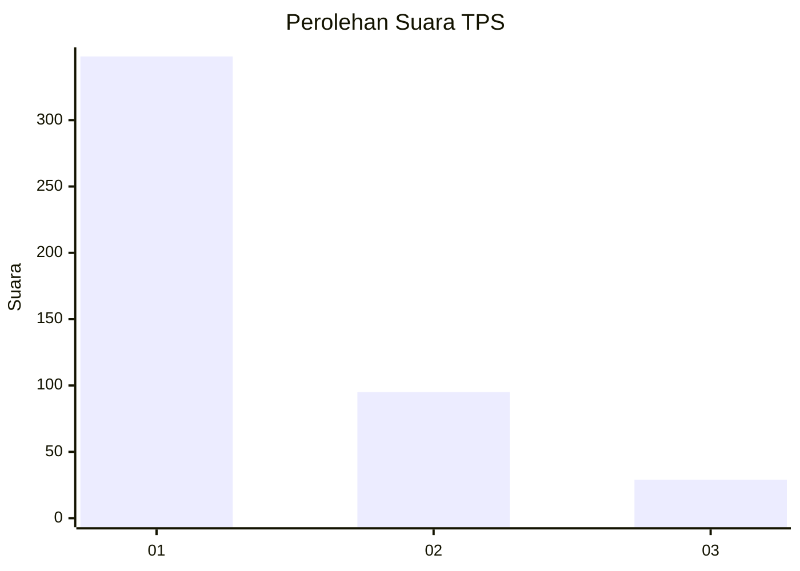
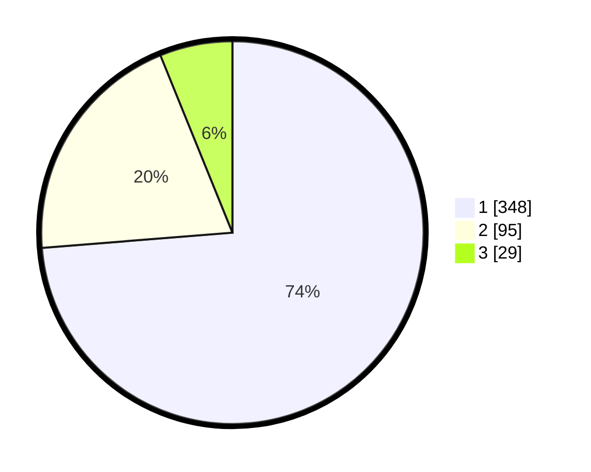

# Hasil

## Grafik

## Tabel

| No. | Nama Paslon    | Suara | Suara (raw) | Persentase |
|:--- |:-------------- | -----:| -----------:| ----------:|
| 1   | ANIES MUHAIMIN | 348   | [348][p-1]  | 73,73      |
| 2   | PRABOWO GIBRAN | 95    | [95][p-2]   | 20,13      |
| 3   | GANJAR MAHFUD  | 29    | [29][p-3]   | 6,14       |

[p-1]: https://github.com/gigit-pemilu/pemilu-2024-99-luar-negeri/blob/main/pilpres/hitung-suara/sub/99-luar-negeri/sub/56-kairo-mesir/sub/01-kairo-mesir/sub/0001-kairo-mesir/sub/012-tps-011/sub/paslon-1.txt
[p-2]: https://github.com/gigit-pemilu/pemilu-2024-99-luar-negeri/blob/main/pilpres/hitung-suara/sub/99-luar-negeri/sub/56-kairo-mesir/sub/01-kairo-mesir/sub/0001-kairo-mesir/sub/012-tps-011/sub/paslon-2.txt
[p-3]: https://github.com/gigit-pemilu/pemilu-2024-99-luar-negeri/blob/main/pilpres/hitung-suara/sub/99-luar-negeri/sub/56-kairo-mesir/sub/01-kairo-mesir/sub/0001-kairo-mesir/sub/012-tps-011/sub/paslon-3.txt

## Foto C Plano

https://sirekap-obj-formc.kpu.go.id/7a15/pemilu/ppwp/99/56/01/00/01/9956010001012-20240215-225002--1fa3f66c-28ff-4538-b42f-f478af8d4c0e.jpg

https://sirekap-obj-formc.kpu.go.id/7a15/pemilu/ppwp/99/56/01/00/01/9956010001012-20240215-225811--e3955da7-b7fb-4d8d-86ca-05fcfc975c73.jpg

https://sirekap-obj-formc.kpu.go.id/7a15/pemilu/ppwp/99/56/01/00/01/9956010001012-20240215-225120--26933a55-c538-49db-b3dd-78ef007339c6.jpg

## Metadata

| Key        | Value               |
| ---------- | ------------------- |
| Time Stamp | 2024-02-17 16:00:02 |

## DATA PEMILIH TETAP

Jumlah pemilih dalam DPT: **552**.
 * L: **523**.
 * P: **29**.

## DATA PENGGUNA HAK PILIH

Jumlah pengguna hak pilih dalam DPT: **314**.
 * L: **300**.
 * P: **14**.

Jumlah pengguna hak pilih dalam DPTb: **140**.
 * L: **101**.
 * P: **39**.

Jumlah pengguna hak pilih dalam DPK: **32**.
 * L: **20**.
 * P: **12**.

Jumlah pengguna hak pilih: **486**.
 * L: **421**.
 * P: **65**.

## JUMLAH SUARA SAH DAN TIDAK SAH

JUMLAH SELURUH SUARA SAH: **472**.

JUMLAH SUARA TIDAK SAH: **15**.

JUMLAH SELURUH SUARA SAH DAN SUARA TIDAK SAH: **487**.

