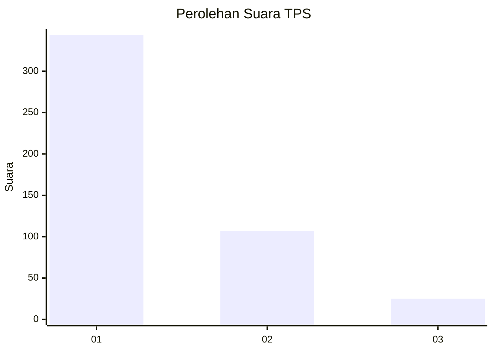
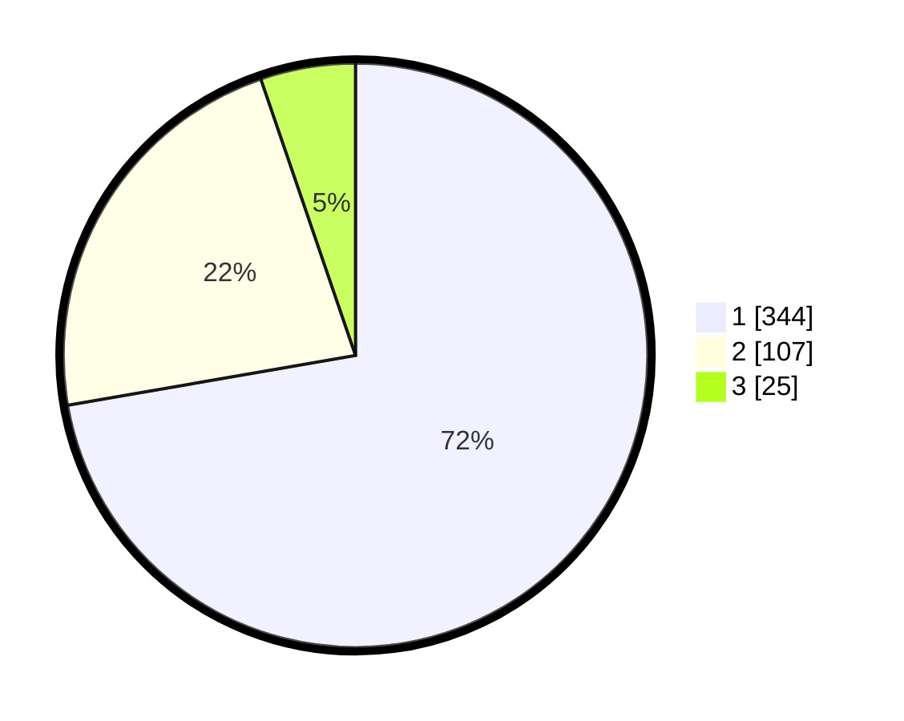

# Hasil

## Grafik

## Tabel

| No. | Nama Paslon    | Suara | Suara (raw) | Persentase |
|:--- |:-------------- | -----:| -----------:| ----------:|
| 1   | ANIES MUHAIMIN | 344   | [344][p-1]  | 72,27      |
| 2   | PRABOWO GIBRAN | 107   | [107][p-2]  | 22,48      |
| 3   | GANJAR MAHFUD  | 25    | [25][p-3]   | 5,25       |

[p-1]: https://github.com/gigit-pemilu/pemilu-2024-99-luar-negeri/blob/main/pilpres/hitung-suara/sub/99-luar-negeri/sub/56-kairo-mesir/sub/01-kairo-mesir/sub/0001-kairo-mesir/sub/013-tps-012/sub/paslon-1.txt
[p-2]: https://github.com/gigit-pemilu/pemilu-2024-99-luar-negeri/blob/main/pilpres/hitung-suara/sub/99-luar-negeri/sub/56-kairo-mesir/sub/01-kairo-mesir/sub/0001-kairo-mesir/sub/013-tps-012/sub/paslon-2.txt
[p-3]: https://github.com/gigit-pemilu/pemilu-2024-99-luar-negeri/blob/main/pilpres/hitung-suara/sub/99-luar-negeri/sub/56-kairo-mesir/sub/01-kairo-mesir/sub/0001-kairo-mesir/sub/013-tps-012/sub/paslon-3.txt

## Foto C Plano

https://sirekap-obj-formc.kpu.go.id/3b68/pemilu/ppwp/99/56/01/00/01/9956010001013-20240215-223153--c204102a-e5f7-42f5-9301-50b42089e57a.jpg

https://sirekap-obj-formc.kpu.go.id/3b68/pemilu/ppwp/99/56/01/00/01/9956010001013-20240215-224709--4877d1ca-d25f-4603-b6ee-64565682487d.jpg

https://sirekap-obj-formc.kpu.go.id/3b68/pemilu/ppwp/99/56/01/00/01/9956010001013-20240215-225257--3fd03412-fdf3-4841-9080-948dd88a2760.jpg

## Metadata

| Key        | Value               |
| ---------- | ------------------- |
| Time Stamp | 2024-02-17 16:00:02 |

## DATA PEMILIH TETAP

Jumlah pemilih dalam DPT: **552**.
 * L: **552**.
 * P: **0**.

## DATA PENGGUNA HAK PILIH

Jumlah pengguna hak pilih dalam DPT: **329**.
 * L: **329**.
 * P: **0**.

Jumlah pengguna hak pilih dalam DPTb: **150**.
 * L: **95**.
 * P: **55**.

Jumlah pengguna hak pilih dalam DPK: **10**.
 * L: **10**.
 * P: **0**.

Jumlah pengguna hak pilih: **489**.
 * L: **434**.
 * P: **55**.

## JUMLAH SUARA SAH DAN TIDAK SAH

JUMLAH SELURUH SUARA SAH: **476**.

JUMLAH SUARA TIDAK SAH: **13**.

JUMLAH SELURUH SUARA SAH DAN SUARA TIDAK SAH: **489**.

