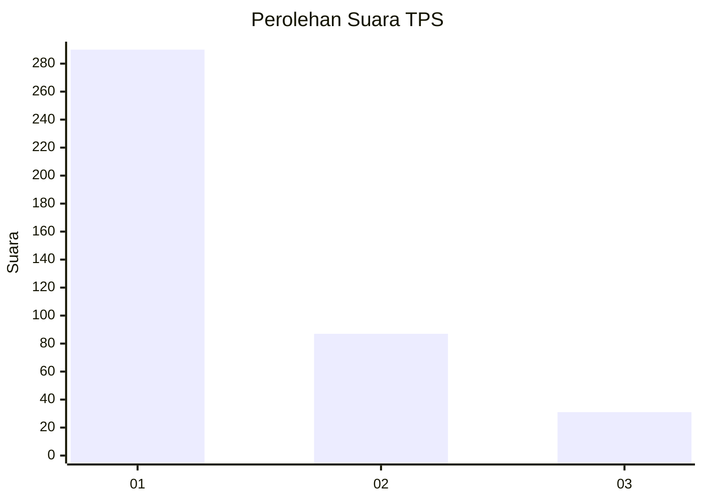
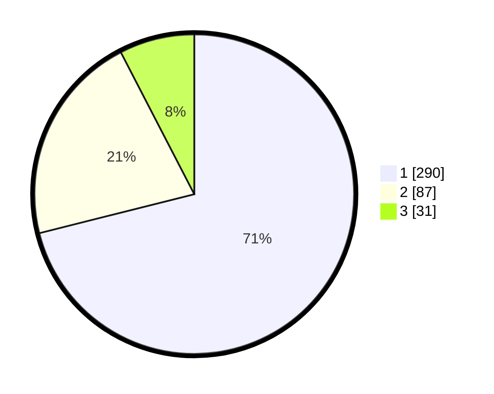

# Hasil

## Grafik

## Tabel

| No. | Nama Paslon    | Suara | Suara (raw) | Persentase |
|:--- |:-------------- | -----:| -----------:| ----------:|
| 1   | ANIES MUHAIMIN | 290   | [290][p-1]  | 71,08      |
| 2   | PRABOWO GIBRAN | 87    | [87][p-2]   | 21,32      |
| 3   | GANJAR MAHFUD  | 31    | [31][p-3]   | 7,60       |

[p-1]: https://github.com/gigit-pemilu/pemilu-2024-99-luar-negeri/blob/main/pilpres/hitung-suara/sub/99-luar-negeri/sub/56-kairo-mesir/sub/01-kairo-mesir/sub/0001-kairo-mesir/sub/014-tps-013/sub/paslon-1.txt
[p-2]: https://github.com/gigit-pemilu/pemilu-2024-99-luar-negeri/blob/main/pilpres/hitung-suara/sub/99-luar-negeri/sub/56-kairo-mesir/sub/01-kairo-mesir/sub/0001-kairo-mesir/sub/014-tps-013/sub/paslon-2.txt
[p-3]: https://github.com/gigit-pemilu/pemilu-2024-99-luar-negeri/blob/main/pilpres/hitung-suara/sub/99-luar-negeri/sub/56-kairo-mesir/sub/01-kairo-mesir/sub/0001-kairo-mesir/sub/014-tps-013/sub/paslon-3.txt

## Foto C Plano

https://sirekap-obj-formc.kpu.go.id/e523/pemilu/ppwp/99/56/01/00/01/9956010001014-20240216-021001--cda38290-6585-4202-b128-8e0e90609d13.jpg

https://sirekap-obj-formc.kpu.go.id/e523/pemilu/ppwp/99/56/01/00/01/9956010001014-20240216-022120--616e5d1c-05e9-4683-aa04-071334e19f95.jpg

https://sirekap-obj-formc.kpu.go.id/e523/pemilu/ppwp/99/56/01/00/01/9956010001014-20240216-021144--dc76b841-7979-4006-9845-cef45594f592.jpg

## Metadata

| Key        | Value               |
| ---------- | ------------------- |
| Time Stamp | 2024-02-17 16:00:02 |

## DATA PEMILIH TETAP

Jumlah pemilih dalam DPT: **552**.
 * L: **552**.
 * P: **0**.

## DATA PENGGUNA HAK PILIH

Jumlah pengguna hak pilih dalam DPT: **292**.
 * L: **292**.
 * P: **0**.

Jumlah pengguna hak pilih dalam DPTb: **121**.
 * L: **69**.
 * P: **52**.

Jumlah pengguna hak pilih dalam DPK: **1**.
 * L: **0**.
 * P: **1**.

Jumlah pengguna hak pilih: **414**.
 * L: **361**.
 * P: **53**.

## JUMLAH SUARA SAH DAN TIDAK SAH

JUMLAH SELURUH SUARA SAH: **408**.

JUMLAH SUARA TIDAK SAH: **6**.

JUMLAH SELURUH SUARA SAH DAN SUARA TIDAK SAH: **414**.

