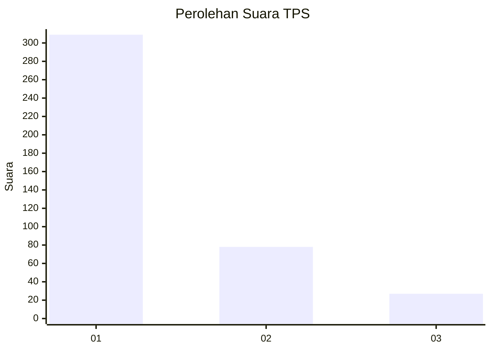
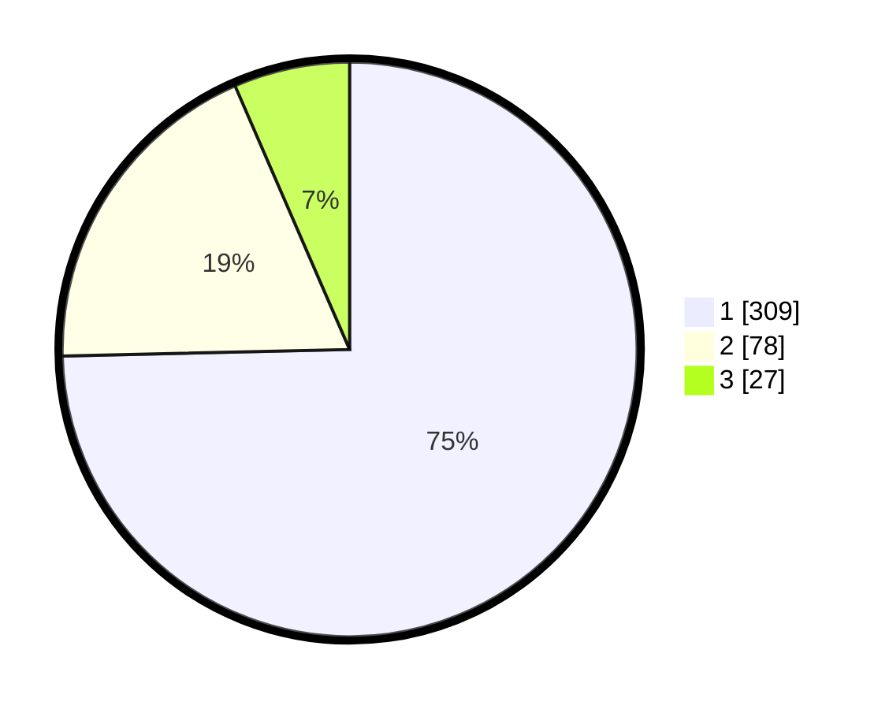

# Hasil

## Grafik

## Tabel

| No. | Nama Paslon    | Suara | Suara (raw) | Persentase |
|:--- |:-------------- | -----:| -----------:| ----------:|
| 1   | ANIES MUHAIMIN | 309   | [309][p-1]  | 74,64      |
| 2   | PRABOWO GIBRAN | 78    | [78][p-2]   | 18,84      |
| 3   | GANJAR MAHFUD  | 27    | [27][p-3]   | 6,52       |

[p-1]: https://github.com/gigit-pemilu/pemilu-2024-99-luar-negeri/blob/main/pilpres/hitung-suara/sub/99-luar-negeri/sub/56-kairo-mesir/sub/01-kairo-mesir/sub/0001-kairo-mesir/sub/015-tps-014/sub/paslon-1.txt
[p-2]: https://github.com/gigit-pemilu/pemilu-2024-99-luar-negeri/blob/main/pilpres/hitung-suara/sub/99-luar-negeri/sub/56-kairo-mesir/sub/01-kairo-mesir/sub/0001-kairo-mesir/sub/015-tps-014/sub/paslon-2.txt
[p-3]: https://github.com/gigit-pemilu/pemilu-2024-99-luar-negeri/blob/main/pilpres/hitung-suara/sub/99-luar-negeri/sub/56-kairo-mesir/sub/01-kairo-mesir/sub/0001-kairo-mesir/sub/015-tps-014/sub/paslon-3.txt

## Foto C Plano

https://sirekap-obj-formc.kpu.go.id/22f6/pemilu/ppwp/99/56/01/00/01/9956010001015-20240216-012313--98ddd63d-556c-4330-8646-276391d61349.jpg

https://sirekap-obj-formc.kpu.go.id/22f6/pemilu/ppwp/99/56/01/00/01/9956010001015-20240216-004856--0bd2041f-4465-4645-b536-fdb9e27b7323.jpg

https://sirekap-obj-formc.kpu.go.id/22f6/pemilu/ppwp/99/56/01/00/01/9956010001015-20240215-111326--ad920d2f-f669-4b6c-8842-ed2864a3272b.jpg

## Metadata

| Key        | Value               |
| ---------- | ------------------- |
| Time Stamp | 2024-02-16 02:00:27 |

## DATA PEMILIH TETAP

Jumlah pemilih dalam DPT: **552**.
 * L: **508**.
 * P: **44**.

## DATA PENGGUNA HAK PILIH

Jumlah pengguna hak pilih dalam DPT: **303**.
 * L: **276**.
 * P: **27**.

Jumlah pengguna hak pilih dalam DPTb: **124**.
 * L: **66**.
 * P: **58**.

Jumlah pengguna hak pilih dalam DPK: **3**.
 * L: **1**.
 * P: **2**.

Jumlah pengguna hak pilih: **430**.
 * L: **343**.
 * P: **87**.

## JUMLAH SUARA SAH DAN TIDAK SAH

JUMLAH SELURUH SUARA SAH: **414**.

JUMLAH SUARA TIDAK SAH: **16**.

JUMLAH SELURUH SUARA SAH DAN SUARA TIDAK SAH: **430**.

