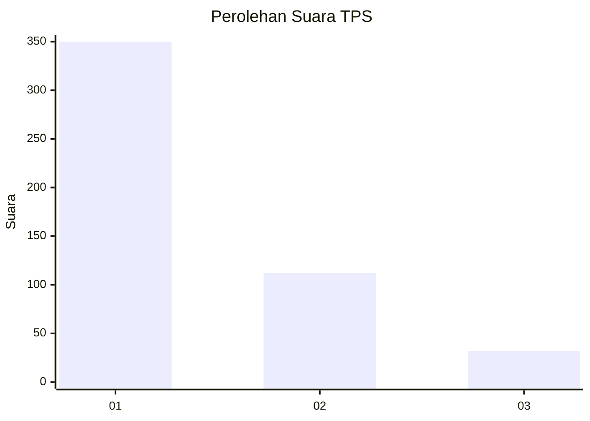
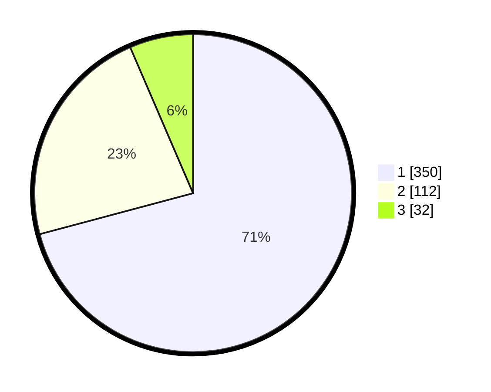

# Hasil

## Grafik

## Tabel

| No. | Nama Paslon    | Suara | Suara (raw) | Persentase |
|:--- |:-------------- | -----:| -----------:| ----------:|
| 1   | ANIES MUHAIMIN | 350   | [350][p-1]  | 70,85      |
| 2   | PRABOWO GIBRAN | 112   | [112][p-2]  | 22,67      |
| 3   | GANJAR MAHFUD  | 32    | [32][p-3]   | 6,48       |

[p-1]: https://github.com/gigit-pemilu/pemilu-2024-99-luar-negeri/blob/main/pilpres/hitung-suara/sub/99-luar-negeri/sub/56-kairo-mesir/sub/01-kairo-mesir/sub/0001-kairo-mesir/sub/016-tps-015/sub/paslon-1.txt
[p-2]: https://github.com/gigit-pemilu/pemilu-2024-99-luar-negeri/blob/main/pilpres/hitung-suara/sub/99-luar-negeri/sub/56-kairo-mesir/sub/01-kairo-mesir/sub/0001-kairo-mesir/sub/016-tps-015/sub/paslon-2.txt
[p-3]: https://github.com/gigit-pemilu/pemilu-2024-99-luar-negeri/blob/main/pilpres/hitung-suara/sub/99-luar-negeri/sub/56-kairo-mesir/sub/01-kairo-mesir/sub/0001-kairo-mesir/sub/016-tps-015/sub/paslon-3.txt

## Foto C Plano

https://sirekap-obj-formc.kpu.go.id/33cb/pemilu/ppwp/99/56/01/00/01/9956010001016-20240215-094039--40087777-5d4d-4bc1-8b1a-610634943f00.jpg

https://sirekap-obj-formc.kpu.go.id/33cb/pemilu/ppwp/99/56/01/00/01/9956010001016-20240215-094150--6a6c7732-d1f9-4ea2-a098-483db7154094.jpg

https://sirekap-obj-formc.kpu.go.id/33cb/pemilu/ppwp/99/56/01/00/01/9956010001016-20240215-094433--0e2618b4-07f6-4f63-a3f2-38af71fbd7eb.jpg

## Metadata

| Key        | Value               |
| ---------- | ------------------- |
| Time Stamp | 2024-02-19 06:16:00 |

## DATA PEMILIH TETAP

Jumlah pemilih dalam DPT: **553**.
 * L: **157**.
 * P: **396**.

## DATA PENGGUNA HAK PILIH

Jumlah pengguna hak pilih dalam DPT: **358**.
 * L: **87**.
 * P: **271**.

Jumlah pengguna hak pilih dalam DPTb: **124**.
 * L: **79**.
 * P: **45**.

Jumlah pengguna hak pilih dalam DPK: **20**.
 * L: **14**.
 * P: **6**.

Jumlah pengguna hak pilih: **502**.
 * L: **180**.
 * P: **322**.

## JUMLAH SUARA SAH DAN TIDAK SAH

JUMLAH SELURUH SUARA SAH: **494**.

JUMLAH SUARA TIDAK SAH: **8**.

JUMLAH SELURUH SUARA SAH DAN SUARA TIDAK SAH: **502**.

