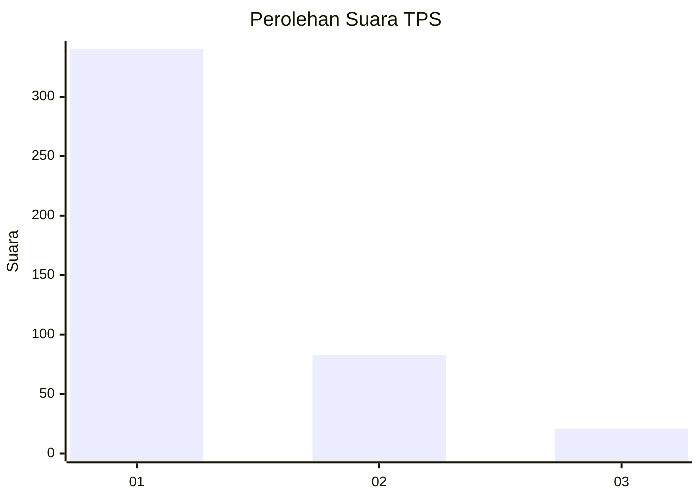
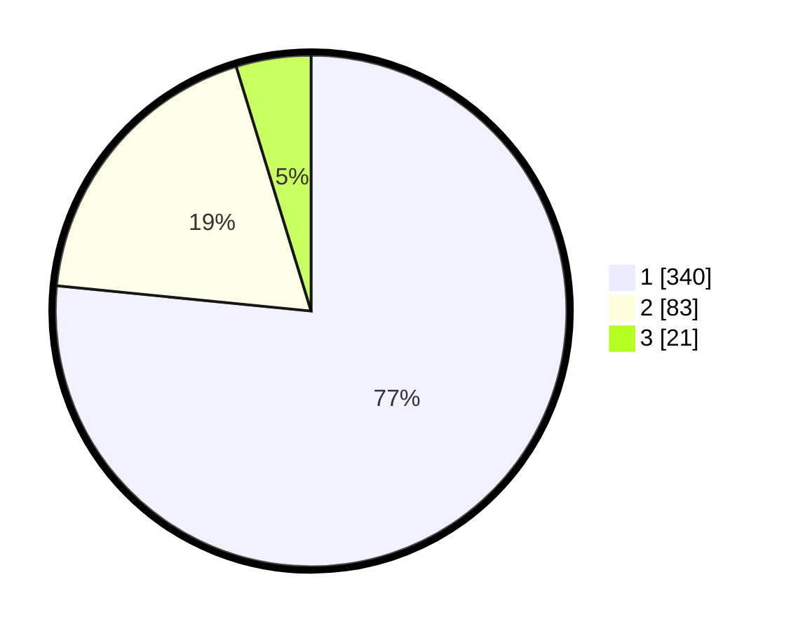

# Hasil

## Grafik

## Tabel

| No. | Nama Paslon    | Suara | Suara (raw) | Persentase |
|:--- |:-------------- | -----:| -----------:| ----------:|
| 1   | ANIES MUHAIMIN | 340   | [340][p-1]  | 76,58      |
| 2   | PRABOWO GIBRAN | 83    | [83][p-2]   | 18,69      |
| 3   | GANJAR MAHFUD  | 21    | [21][p-3]   | 4,73       |

[p-1]: https://github.com/gigit-pemilu/pemilu-2024-99-luar-negeri/blob/main/pilpres/hitung-suara/sub/99-luar-negeri/sub/56-kairo-mesir/sub/01-kairo-mesir/sub/0001-kairo-mesir/sub/017-tps-016/sub/paslon-1.txt
[p-2]: https://github.com/gigit-pemilu/pemilu-2024-99-luar-negeri/blob/main/pilpres/hitung-suara/sub/99-luar-negeri/sub/56-kairo-mesir/sub/01-kairo-mesir/sub/0001-kairo-mesir/sub/017-tps-016/sub/paslon-2.txt
[p-3]: https://github.com/gigit-pemilu/pemilu-2024-99-luar-negeri/blob/main/pilpres/hitung-suara/sub/99-luar-negeri/sub/56-kairo-mesir/sub/01-kairo-mesir/sub/0001-kairo-mesir/sub/017-tps-016/sub/paslon-3.txt

## Foto C Plano

https://sirekap-obj-formc.kpu.go.id/8838/pemilu/ppwp/99/56/01/00/01/9956010001017-20240215-114442--b53d667c-b90d-4435-a078-972a3307eb7f.jpg

https://sirekap-obj-formc.kpu.go.id/8838/pemilu/ppwp/99/56/01/00/01/9956010001017-20240216-014516--674ed13c-d6fb-4f1e-ad85-ee77e36ba47f.jpg

https://sirekap-obj-formc.kpu.go.id/8838/pemilu/ppwp/99/56/01/00/01/9956010001017-20240215-114710--4026c1b2-2774-440d-87c9-8dcaac7d6b2c.jpg

## Metadata

| Key        | Value               |
| ---------- | ------------------- |
| Time Stamp | 2024-02-16 02:00:27 |

## DATA PEMILIH TETAP

Jumlah pemilih dalam DPT: **552**.
 * L: **226**.
 * P: **326**.

## DATA PENGGUNA HAK PILIH

Jumlah pengguna hak pilih dalam DPT: **310**.
 * L: **116**.
 * P: **194**.

Jumlah pengguna hak pilih dalam DPTb: **140**.
 * L: **94**.
 * P: **46**.

Jumlah pengguna hak pilih dalam DPK: **3**.
 * L: **0**.
 * P: **3**.

Jumlah pengguna hak pilih: **453**.
 * L: **210**.
 * P: **243**.

## JUMLAH SUARA SAH DAN TIDAK SAH

JUMLAH SELURUH SUARA SAH: **444**.

JUMLAH SUARA TIDAK SAH: **9**.

JUMLAH SELURUH SUARA SAH DAN SUARA TIDAK SAH: **453**.

