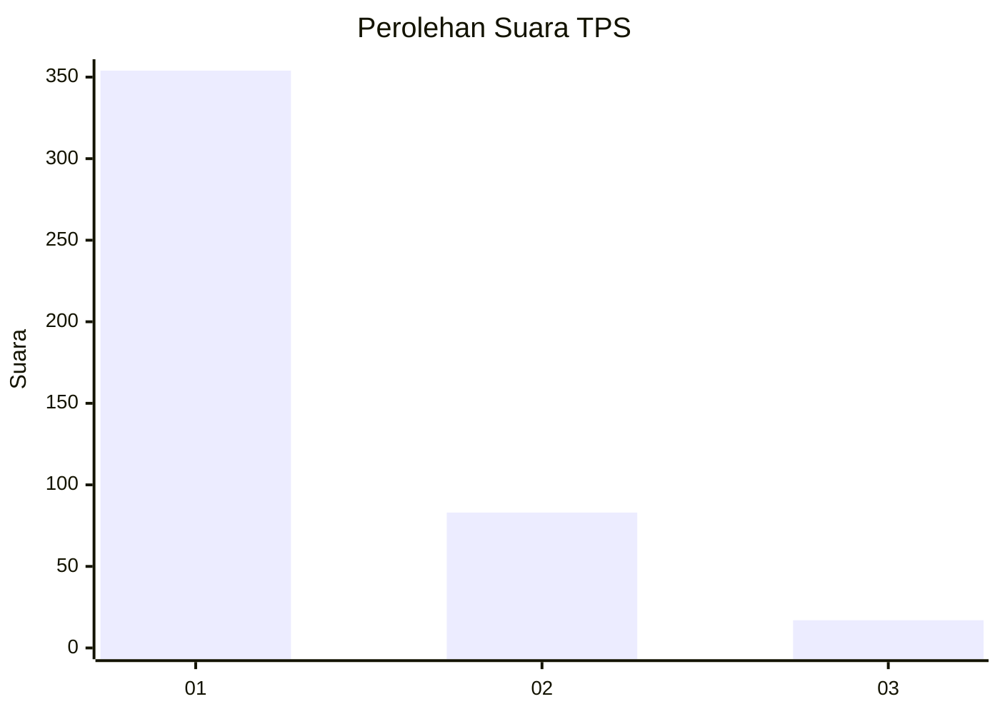
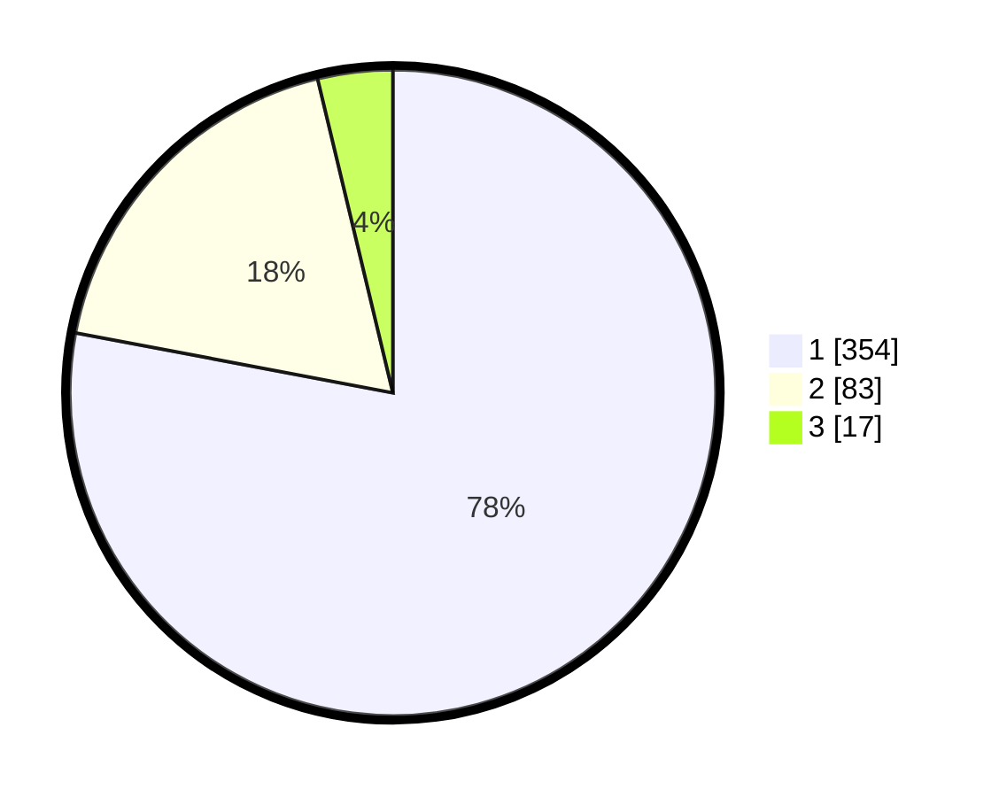

# Hasil

## Grafik

## Tabel

| No. | Nama Paslon    | Suara | Suara (raw) | Persentase |
|:--- |:-------------- | -----:| -----------:| ----------:|
| 1   | ANIES MUHAIMIN | 354   | [354][p-1]  | 77,97      |
| 2   | PRABOWO GIBRAN | 83    | [83][p-2]   | 18,28      |
| 3   | GANJAR MAHFUD  | 17    | [17][p-3]   | 3,74       |

[p-1]: https://github.com/gigit-pemilu/pemilu-2024-99-luar-negeri/blob/main/pilpres/hitung-suara/sub/99-luar-negeri/sub/56-kairo-mesir/sub/01-kairo-mesir/sub/0001-kairo-mesir/sub/018-tps-017/sub/paslon-1.txt
[p-2]: https://github.com/gigit-pemilu/pemilu-2024-99-luar-negeri/blob/main/pilpres/hitung-suara/sub/99-luar-negeri/sub/56-kairo-mesir/sub/01-kairo-mesir/sub/0001-kairo-mesir/sub/018-tps-017/sub/paslon-2.txt
[p-3]: https://github.com/gigit-pemilu/pemilu-2024-99-luar-negeri/blob/main/pilpres/hitung-suara/sub/99-luar-negeri/sub/56-kairo-mesir/sub/01-kairo-mesir/sub/0001-kairo-mesir/sub/018-tps-017/sub/paslon-3.txt

## Foto C Plano

https://sirekap-obj-formc.kpu.go.id/c285/pemilu/ppwp/99/56/01/00/01/9956010001018-20240216-004005--aece34b7-057d-4fee-941c-697f2e5885cd.jpg

https://sirekap-obj-formc.kpu.go.id/c285/pemilu/ppwp/99/56/01/00/01/9956010001018-20240216-004939--32b292b8-15c1-49b1-9098-f3040743b7f1.jpg

https://sirekap-obj-formc.kpu.go.id/c285/pemilu/ppwp/99/56/01/00/01/9956010001018-20240215-105020--0a4270ba-dd51-4932-b705-1a695723d3e3.jpg

## Metadata

| Key        | Value               |
| ---------- | ------------------- |
| Time Stamp | 2024-02-17 16:00:02 |

## DATA PEMILIH TETAP

Jumlah pemilih dalam DPT: **552**.
 * L: **328**.
 * P: **224**.

## DATA PENGGUNA HAK PILIH

Jumlah pengguna hak pilih dalam DPT: **324**.
 * L: **185**.
 * P: **139**.

Jumlah pengguna hak pilih dalam DPTb: **132**.
 * L: **73**.
 * P: **59**.

Jumlah pengguna hak pilih dalam DPK: **5**.
 * L: **4**.
 * P: **1**.

Jumlah pengguna hak pilih: **461**.
 * L: **262**.
 * P: **199**.

## JUMLAH SUARA SAH DAN TIDAK SAH

JUMLAH SELURUH SUARA SAH: **454**.

JUMLAH SUARA TIDAK SAH: **7**.

JUMLAH SELURUH SUARA SAH DAN SUARA TIDAK SAH: **461**.

