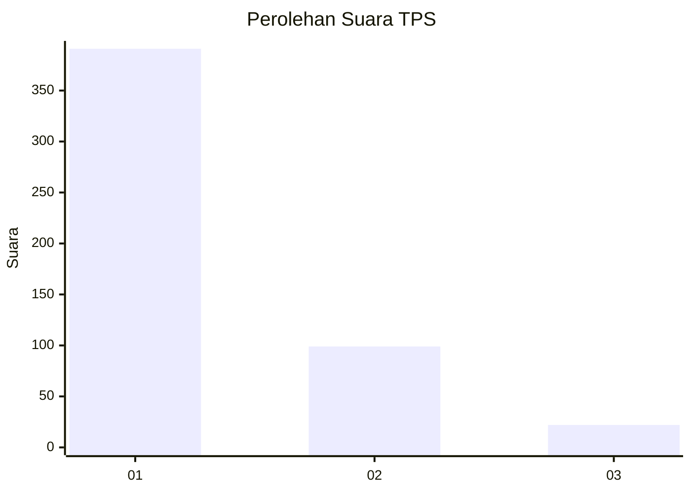
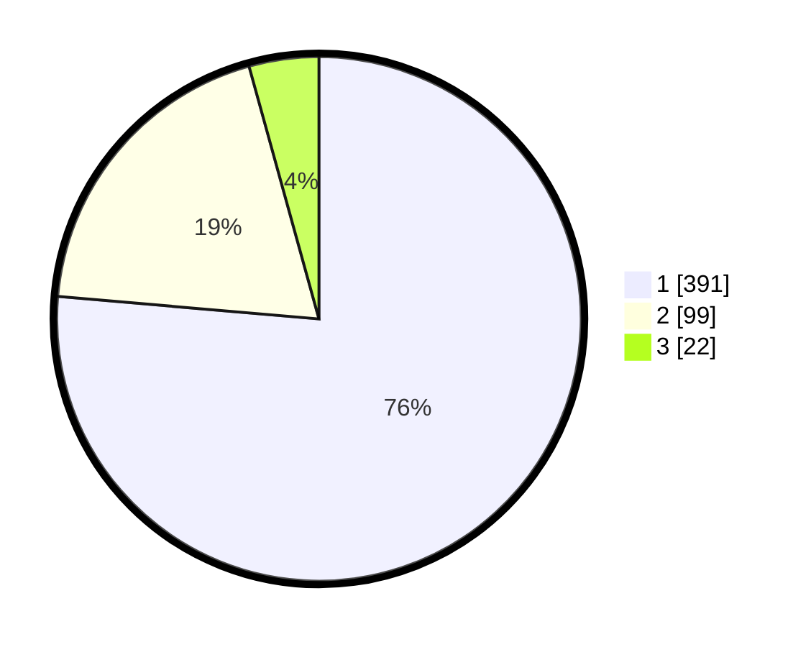

# Hasil

## Grafik

## Tabel

| No. | Nama Paslon    | Suara | Suara (raw) | Persentase |
|:--- |:-------------- | -----:| -----------:| ----------:|
| 1   | ANIES MUHAIMIN | 391   | [391][p-1]  | 76,37      |
| 2   | PRABOWO GIBRAN | 99    | [99][p-2]   | 19,34      |
| 3   | GANJAR MAHFUD  | 22    | [22][p-3]   | 4,30       |

[p-1]: https://github.com/gigit-pemilu/pemilu-2024-99-luar-negeri/blob/main/pilpres/hitung-suara/sub/99-luar-negeri/sub/56-kairo-mesir/sub/01-kairo-mesir/sub/0001-kairo-mesir/sub/019-tps-018/sub/paslon-1.txt
[p-2]: https://github.com/gigit-pemilu/pemilu-2024-99-luar-negeri/blob/main/pilpres/hitung-suara/sub/99-luar-negeri/sub/56-kairo-mesir/sub/01-kairo-mesir/sub/0001-kairo-mesir/sub/019-tps-018/sub/paslon-2.txt
[p-3]: https://github.com/gigit-pemilu/pemilu-2024-99-luar-negeri/blob/main/pilpres/hitung-suara/sub/99-luar-negeri/sub/56-kairo-mesir/sub/01-kairo-mesir/sub/0001-kairo-mesir/sub/019-tps-018/sub/paslon-3.txt

## Foto C Plano

https://sirekap-obj-formc.kpu.go.id/07b5/pemilu/ppwp/99/56/01/00/01/9956010001019-20240215-100648--703afe1b-2a42-4fe8-a130-3864521ca778.jpg

https://sirekap-obj-formc.kpu.go.id/07b5/pemilu/ppwp/99/56/01/00/01/9956010001019-20240215-100741--b69e9920-4e4f-4264-b3fb-a557197a4861.jpg

https://sirekap-obj-formc.kpu.go.id/07b5/pemilu/ppwp/99/56/01/00/01/9956010001019-20240216-005826--d12be6a1-7b63-4157-8321-fb38f9279e8c.jpg

## Metadata

| Key        | Value               |
| ---------- | ------------------- |
| Time Stamp | 2024-02-16 01:00:27 |

## DATA PEMILIH TETAP

Jumlah pemilih dalam DPT: **552**.
 * L: **150**.
 * P: **402**.

## DATA PENGGUNA HAK PILIH

Jumlah pengguna hak pilih dalam DPT: **354**.
 * L: **91**.
 * P: **263**.

Jumlah pengguna hak pilih dalam DPTb: **145**.
 * L: **74**.
 * P: **71**.

Jumlah pengguna hak pilih dalam DPK: **19**.
 * L: **8**.
 * P: **11**.

Jumlah pengguna hak pilih: **518**.
 * L: **173**.
 * P: **345**.

## JUMLAH SUARA SAH DAN TIDAK SAH

JUMLAH SELURUH SUARA SAH: **512**.

JUMLAH SUARA TIDAK SAH: **6**.

JUMLAH SELURUH SUARA SAH DAN SUARA TIDAK SAH: **518**.

