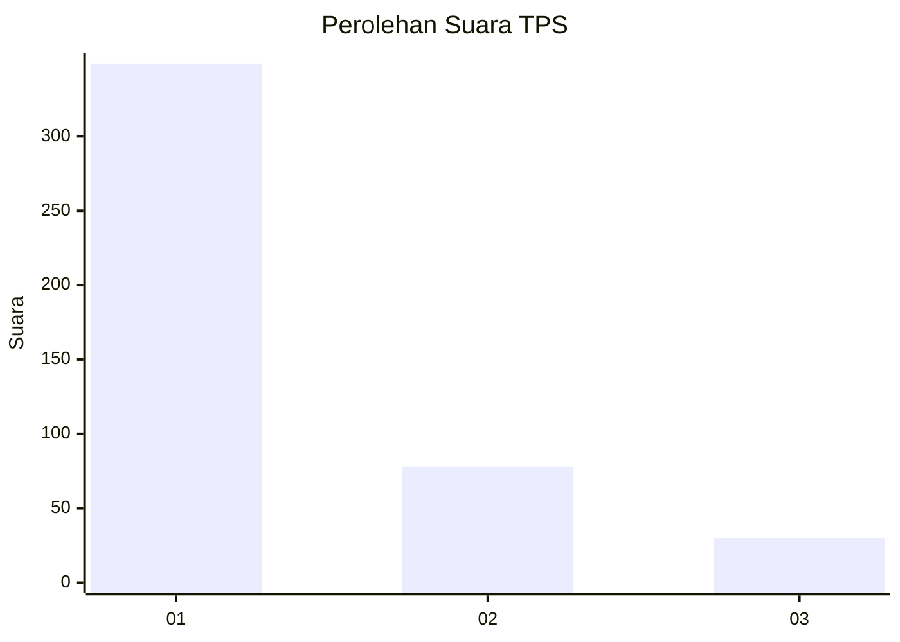
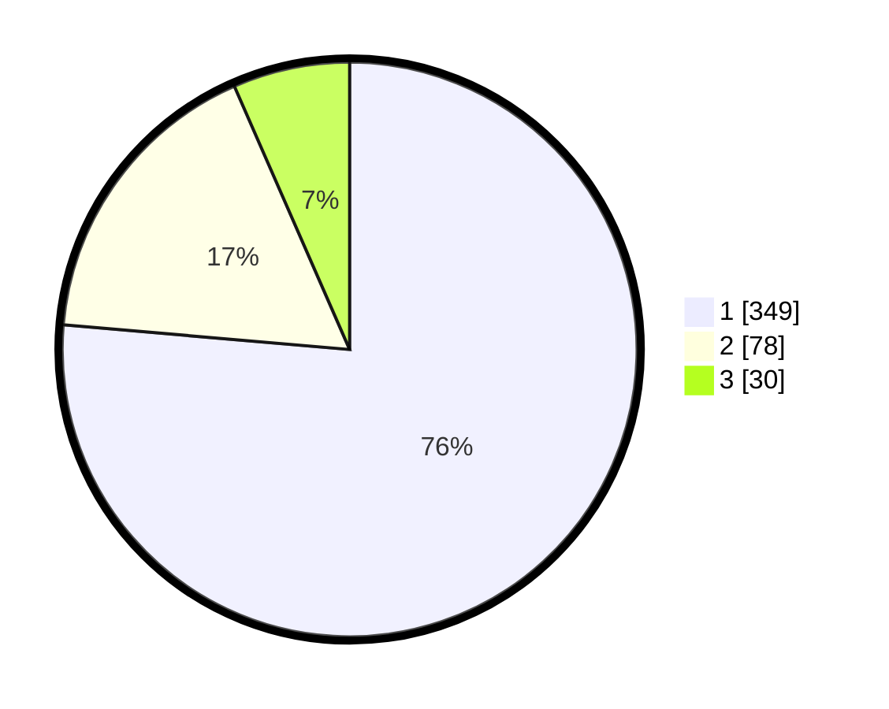

# Hasil

## Grafik

## Tabel

| No. | Nama Paslon    | Suara | Suara (raw) | Persentase |
|:--- |:-------------- | -----:| -----------:| ----------:|
| 1   | ANIES MUHAIMIN | 349   | [349][p-1]  | 76,37      |
| 2   | PRABOWO GIBRAN | 78    | [78][p-2]   | 17,07      |
| 3   | GANJAR MAHFUD  | 30    | [30][p-3]   | 6,56       |

[p-1]: https://github.com/gigit-pemilu/pemilu-2024-99-luar-negeri/blob/main/pilpres/hitung-suara/sub/99-luar-negeri/sub/56-kairo-mesir/sub/01-kairo-mesir/sub/0001-kairo-mesir/sub/020-tps-019/sub/paslon-1.txt
[p-2]: https://github.com/gigit-pemilu/pemilu-2024-99-luar-negeri/blob/main/pilpres/hitung-suara/sub/99-luar-negeri/sub/56-kairo-mesir/sub/01-kairo-mesir/sub/0001-kairo-mesir/sub/020-tps-019/sub/paslon-2.txt
[p-3]: https://github.com/gigit-pemilu/pemilu-2024-99-luar-negeri/blob/main/pilpres/hitung-suara/sub/99-luar-negeri/sub/56-kairo-mesir/sub/01-kairo-mesir/sub/0001-kairo-mesir/sub/020-tps-019/sub/paslon-3.txt

## Foto C Plano

https://sirekap-obj-formc.kpu.go.id/ce73/pemilu/ppwp/99/56/01/00/01/9956010001020-20240215-102504--d1f5212c-cda1-43b6-af63-9dc0ba7d392d.jpg

https://sirekap-obj-formc.kpu.go.id/ce73/pemilu/ppwp/99/56/01/00/01/9956010001020-20240215-102649--ef94a0d4-8b61-4f01-a7af-2e1c94dd3f84.jpg

https://sirekap-obj-formc.kpu.go.id/ce73/pemilu/ppwp/99/56/01/00/01/9956010001020-20240215-102913--199b1709-3d96-4ce5-9be3-1aed20d052c9.jpg

## Metadata

| Key        | Value               |
| ---------- | ------------------- |
| Time Stamp | 2024-02-16 01:00:27 |

## DATA PEMILIH TETAP

Jumlah pemilih dalam DPT: **552**.
 * L: **290**.
 * P: **262**.

## DATA PENGGUNA HAK PILIH

Jumlah pengguna hak pilih dalam DPT: **303**.
 * L: **152**.
 * P: **151**.

Jumlah pengguna hak pilih dalam DPTb: **136**.
 * L: **96**.
 * P: **40**.

Jumlah pengguna hak pilih dalam DPK: **28**.
 * L: **12**.
 * P: **16**.

Jumlah pengguna hak pilih: **467**.
 * L: **260**.
 * P: **207**.

## JUMLAH SUARA SAH DAN TIDAK SAH

JUMLAH SELURUH SUARA SAH: **457**.

JUMLAH SUARA TIDAK SAH: **10**.

JUMLAH SELURUH SUARA SAH DAN SUARA TIDAK SAH: **467**.

