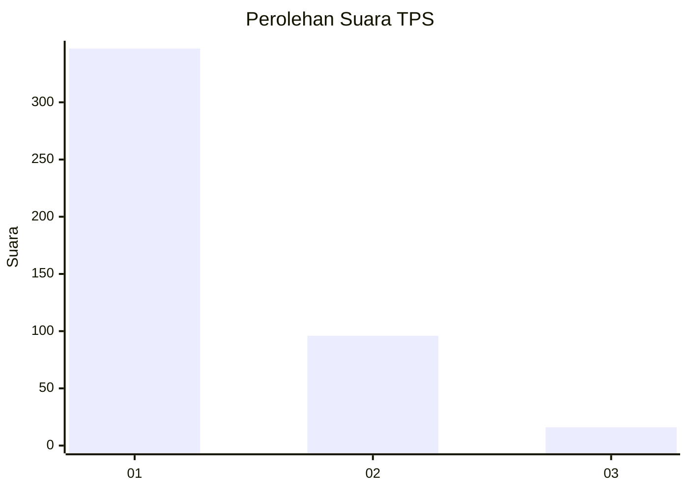
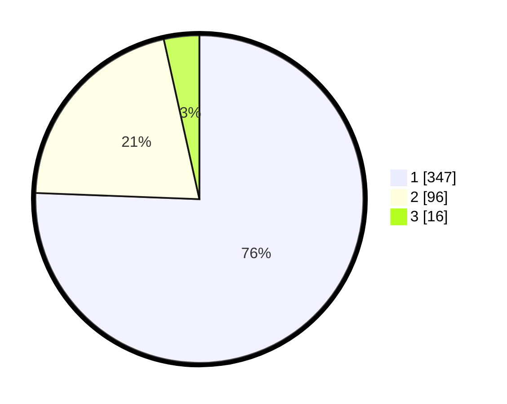

# Hasil

## Grafik

## Tabel

| No. | Nama Paslon    | Suara | Suara (raw) | Persentase |
|:--- |:-------------- | -----:| -----------:| ----------:|
| 1   | ANIES MUHAIMIN | 347   | [347][p-1]  | 75,60      |
| 2   | PRABOWO GIBRAN | 96    | [96][p-2]   | 20,92      |
| 3   | GANJAR MAHFUD  | 16    | [16][p-3]   | 3,49       |

[p-1]: https://github.com/gigit-pemilu/pemilu-2024-99-luar-negeri/blob/main/pilpres/hitung-suara/sub/99-luar-negeri/sub/56-kairo-mesir/sub/01-kairo-mesir/sub/0001-kairo-mesir/sub/021-tps-020/sub/paslon-1.txt
[p-2]: https://github.com/gigit-pemilu/pemilu-2024-99-luar-negeri/blob/main/pilpres/hitung-suara/sub/99-luar-negeri/sub/56-kairo-mesir/sub/01-kairo-mesir/sub/0001-kairo-mesir/sub/021-tps-020/sub/paslon-2.txt
[p-3]: https://github.com/gigit-pemilu/pemilu-2024-99-luar-negeri/blob/main/pilpres/hitung-suara/sub/99-luar-negeri/sub/56-kairo-mesir/sub/01-kairo-mesir/sub/0001-kairo-mesir/sub/021-tps-020/sub/paslon-3.txt

## Foto C Plano

https://sirekap-obj-formc.kpu.go.id/7dd2/pemilu/ppwp/99/56/01/00/01/9956010001021-20240216-014108--aae3cd16-a18d-47c9-8d7b-f2d3feb955e2.jpg

https://sirekap-obj-formc.kpu.go.id/7dd2/pemilu/ppwp/99/56/01/00/01/9956010001021-20240216-014208--284e8aac-c12f-4368-a31a-b1b2f101b641.jpg

https://sirekap-obj-formc.kpu.go.id/7dd2/pemilu/ppwp/99/56/01/00/01/9956010001021-20240216-014527--d367e1b9-023a-4e5b-bc76-b3ce10ea5fb3.jpg

## Metadata

| Key        | Value               |
| ---------- | ------------------- |
| Time Stamp | 2024-02-17 16:00:02 |

## DATA PEMILIH TETAP

Jumlah pemilih dalam DPT: **535**.
 * L: **286**.
 * P: **249**.

## DATA PENGGUNA HAK PILIH

Jumlah pengguna hak pilih dalam DPT: **315**.
 * L: **162**.
 * P: **153**.

Jumlah pengguna hak pilih dalam DPTb: **129**.
 * L: **90**.
 * P: **39**.

Jumlah pengguna hak pilih dalam DPK: **19**.
 * L: **2**.
 * P: **17**.

Jumlah pengguna hak pilih: **463**.
 * L: **254**.
 * P: **209**.

## JUMLAH SUARA SAH DAN TIDAK SAH

JUMLAH SELURUH SUARA SAH: **459**.

JUMLAH SUARA TIDAK SAH: **4**.

JUMLAH SELURUH SUARA SAH DAN SUARA TIDAK SAH: **463**.

