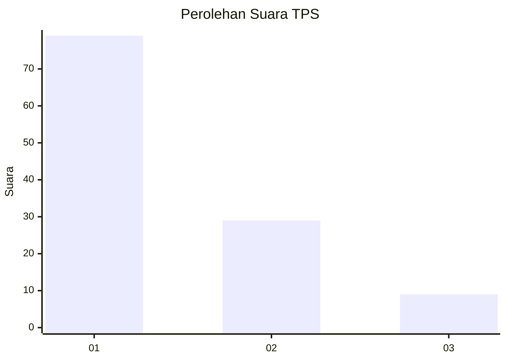
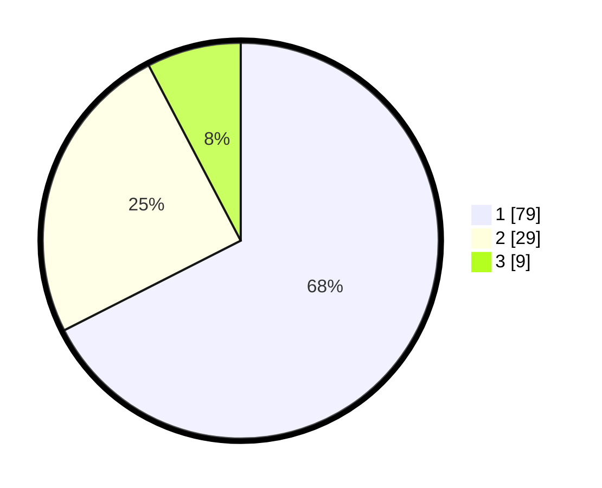

# Hasil

## Grafik

## Tabel

| No. | Nama Paslon    | Suara | Suara (raw) | Persentase |
|:--- |:-------------- | -----:| -----------:| ----------:|
| 1   | ANIES MUHAIMIN | 79    | [79][p-1]   | 67,52      |
| 2   | PRABOWO GIBRAN | 29    | [29][p-2]   | 24,79      |
| 3   | GANJAR MAHFUD  | 9     | [9][p-3]    | 7,69       |

[p-1]: https://github.com/gigit-pemilu/pemilu-2024-99-luar-negeri/blob/main/pilpres/hitung-suara/sub/99-luar-negeri/sub/57-karachi-pakistan/sub/01-karachi-pakistan/sub/0001-karachi-pakistan/sub/001-tps/sub/paslon-1.txt
[p-2]: https://github.com/gigit-pemilu/pemilu-2024-99-luar-negeri/blob/main/pilpres/hitung-suara/sub/99-luar-negeri/sub/57-karachi-pakistan/sub/01-karachi-pakistan/sub/0001-karachi-pakistan/sub/001-tps/sub/paslon-2.txt
[p-3]: https://github.com/gigit-pemilu/pemilu-2024-99-luar-negeri/blob/main/pilpres/hitung-suara/sub/99-luar-negeri/sub/57-karachi-pakistan/sub/01-karachi-pakistan/sub/0001-karachi-pakistan/sub/001-tps/sub/paslon-3.txt

## Foto C Plano

https://sirekap-obj-formc.kpu.go.id/e1cf/pemilu/ppwp/99/57/01/00/01/9957010001001-20240219-190427--7619d88a-174b-48c5-afad-b36ffcc395bf.jpg

https://sirekap-obj-formc.kpu.go.id/e1cf/pemilu/ppwp/99/57/01/00/01/9957010001001-20240219-190429--24516bbe-6b13-4989-be18-e5a402318802.jpg

https://sirekap-obj-formc.kpu.go.id/e1cf/pemilu/ppwp/99/57/01/00/01/9957010001001-20240219-190428--3650586f-6b41-48cc-b515-8d02f7cb3ac7.jpg

## Metadata

| Key        | Value               |
| ---------- | ------------------- |
| Time Stamp | 2024-02-19 20:00:00 |

## DATA PEMILIH TETAP

Jumlah pemilih dalam DPT: **134**.
 * L: **28**.
 * P: **106**.

## DATA PENGGUNA HAK PILIH

Jumlah pengguna hak pilih dalam DPT: **99**.
 * L: **24**.
 * P: **75**.

Jumlah pengguna hak pilih dalam DPTb: **19**.
 * L: **15**.
 * P: **4**.

Jumlah pengguna hak pilih dalam DPK: **1**.
 * L: **0**.
 * P: **1**.

Jumlah pengguna hak pilih: **119**.
 * L: **39**.
 * P: **80**.

## JUMLAH SUARA SAH DAN TIDAK SAH

JUMLAH SELURUH SUARA SAH: **117**.

JUMLAH SUARA TIDAK SAH: **2**.

JUMLAH SELURUH SUARA SAH DAN SUARA TIDAK SAH: **119**.

