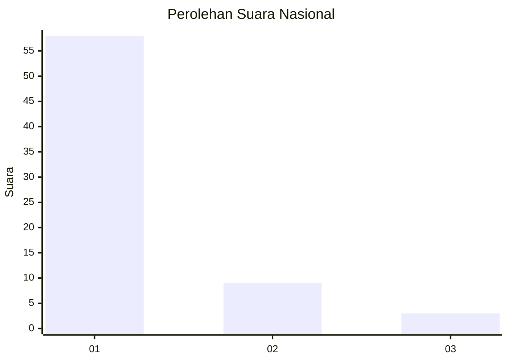
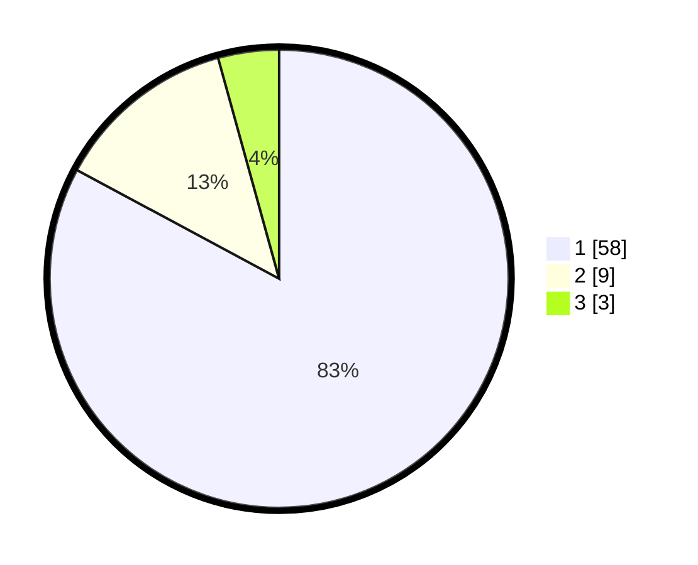

# Hasil

## Grafik

## Tabel

| No. | Nama Paslon    | Suara | Suara (raw) | Persentase |
|:--- |:-------------- | -----:| -----------:| ----------:|
| 1   | ANIES MUHAIMIN | 58    | [58][p-1]   | 82,86      |
| 2   | PRABOWO GIBRAN | 9     | [9][p-2]    | 12,86      |
| 3   | GANJAR MAHFUD  | 3     | [3][p-3]    | 4,29       |

[p-1]: https://github.com/gigit-pemilu/pemilu-2024/blob/main/pilpres/hitung-suara/sub/99-luar-negeri/sub/57-karachi-pakistan/sub/01-karachi-pakistan/sub/0001-karachi-pakistan/sub/002-tps/sub/paslon-1.txt
[p-2]: https://github.com/gigit-pemilu/pemilu-2024/blob/main/pilpres/hitung-suara/sub/99-luar-negeri/sub/57-karachi-pakistan/sub/01-karachi-pakistan/sub/0001-karachi-pakistan/sub/002-tps/sub/paslon-2.txt
[p-3]: https://github.com/gigit-pemilu/pemilu-2024/blob/main/pilpres/hitung-suara/sub/99-luar-negeri/sub/57-karachi-pakistan/sub/01-karachi-pakistan/sub/0001-karachi-pakistan/sub/002-tps/sub/paslon-3.txt

## Foto C Plano

https://sirekap-obj-formc.kpu.go.id/2f1b/pemilu/ppwp/99/57/01/00/01/9957010001002-20240219-185534--19def61d-b9c6-4c34-a1e1-e66b0183fada.jpg

https://sirekap-obj-formc.kpu.go.id/2f1b/pemilu/ppwp/99/57/01/00/01/9957010001002-20240219-185536--8ba613f9-b30f-4463-abdd-f4553ff699d1.jpg

https://sirekap-obj-formc.kpu.go.id/2f1b/pemilu/ppwp/99/57/01/00/01/9957010001002-20240219-185535--d466ef39-5a13-4fe6-9d61-f0f868935801.jpg

## Metadata

| Key        | Value               |
| ---------- | ------------------- |
| Time Stamp | 2024-02-19 20:00:00 |

## DATA PEMILIH TETAP

Jumlah pemilih dalam DPT: **78**.
 * L: **77**.
 * P: **1**.

## DATA PENGGUNA HAK PILIH

Jumlah pengguna hak pilih dalam DPT: **58**.
 * L: **58**.
 * P: **0**.

Jumlah pengguna hak pilih dalam DPTb: **8**.
 * L: **6**.
 * P: **2**.

Jumlah pengguna hak pilih dalam DPK: **5**.
 * L: **3**.
 * P: **2**.

Jumlah pengguna hak pilih: **71**.
 * L: **67**.
 * P: **4**.

## JUMLAH SUARA SAH DAN TIDAK SAH

JUMLAH SELURUH SUARA SAH: **70**.

JUMLAH SUARA TIDAK SAH: **1**.

JUMLAH SELURUH SUARA SAH DAN SUARA TIDAK SAH: **71**.

