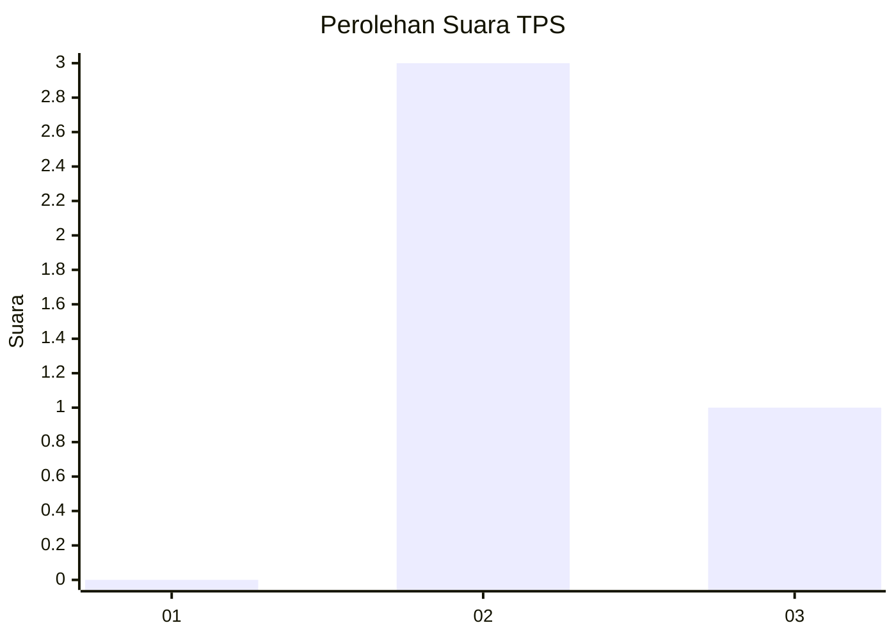
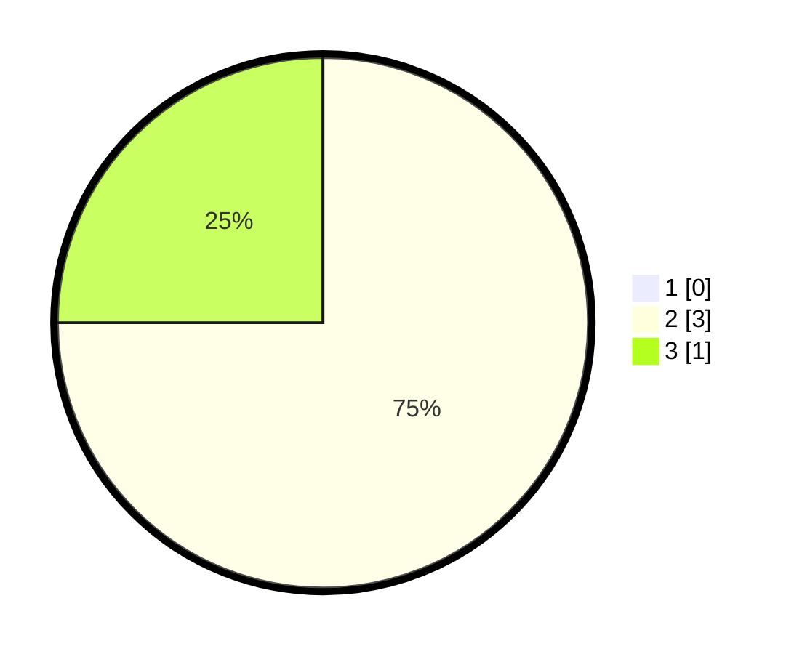

# Hasil

## Grafik

## Tabel

| No. | Nama Paslon    | Suara | Suara (raw) | Persentase |
|:--- |:-------------- | -----:| -----------:| ----------:|
| 1   | ANIES MUHAIMIN | 0     | [0][p-1]    | 0,00       |
| 2   | PRABOWO GIBRAN | 3     | [3][p-2]    | 75,00      |
| 3   | GANJAR MAHFUD  | 1     | [1][p-3]    | 25,00      |

[p-1]: https://github.com/gigit-pemilu/pemilu-2024-99-luar-negeri/blob/main/pilpres/hitung-suara/sub/99-luar-negeri/sub/58-khartoum-sudan/sub/01-khartoum-sudan/sub/0001-khartoum-sudan/sub/001-pos-001/sub/paslon-1.txt
[p-2]: https://github.com/gigit-pemilu/pemilu-2024-99-luar-negeri/blob/main/pilpres/hitung-suara/sub/99-luar-negeri/sub/58-khartoum-sudan/sub/01-khartoum-sudan/sub/0001-khartoum-sudan/sub/001-pos-001/sub/paslon-2.txt
[p-3]: https://github.com/gigit-pemilu/pemilu-2024-99-luar-negeri/blob/main/pilpres/hitung-suara/sub/99-luar-negeri/sub/58-khartoum-sudan/sub/01-khartoum-sudan/sub/0001-khartoum-sudan/sub/001-pos-001/sub/paslon-3.txt

## Foto C Plano

https://sirekap-obj-formc.kpu.go.id/6413/pemilu/ppwp/99/58/01/00/01/9958010001001-20240216-143857--a51cfcf7-84b3-474d-bcbd-41e7708f57f3.jpg

https://sirekap-obj-formc.kpu.go.id/6413/pemilu/ppwp/99/58/01/00/01/9958010001001-20240216-143858--c2299f35-dd83-4ae6-bda1-7a6454dfe18b.jpg

https://sirekap-obj-formc.kpu.go.id/6413/pemilu/ppwp/99/58/01/00/01/9958010001001-20240216-143858--968bf70f-3d6e-4229-bb37-325211bd3e99.jpg

## Metadata

| Key        | Value               |
| ---------- | ------------------- |
| Time Stamp | 2024-02-17 19:30:00 |

## DATA PEMILIH TETAP

Jumlah pemilih dalam DPT: **6**.
 * L: **5**.
 * P: **1**.

## DATA PENGGUNA HAK PILIH

Jumlah pengguna hak pilih dalam DPT: **4**.
 * L: **3**.
 * P: **1**.

Jumlah pengguna hak pilih dalam DPTb: **0**.
 * L: **0**.
 * P: **0**.

Jumlah pengguna hak pilih dalam DPK: **0**.
 * L: **0**.
 * P: **0**.

Jumlah pengguna hak pilih: **4**.
 * L: **3**.
 * P: **1**.

## JUMLAH SUARA SAH DAN TIDAK SAH

JUMLAH SELURUH SUARA SAH: **4**.

JUMLAH SUARA TIDAK SAH: **0**.

JUMLAH SELURUH SUARA SAH DAN SUARA TIDAK SAH: **4**.

