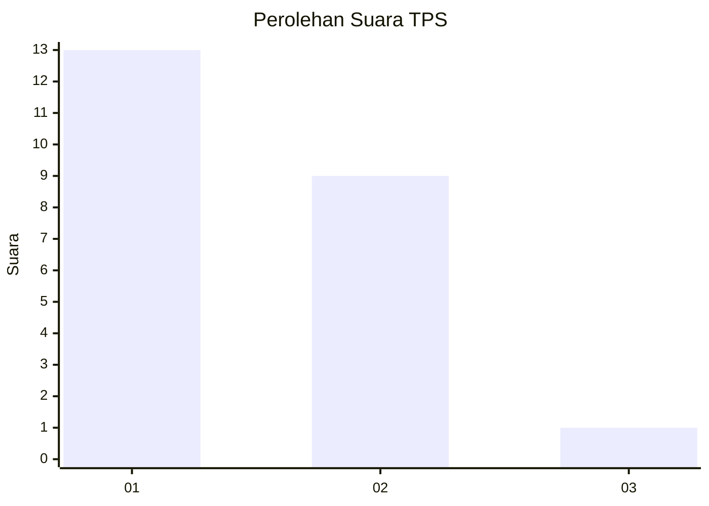
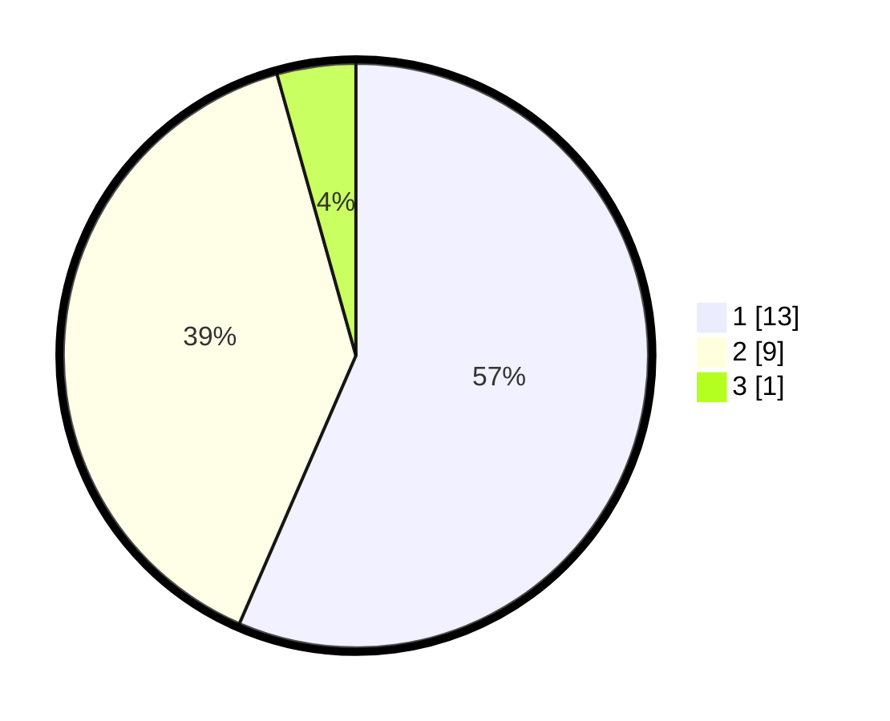

# Hasil

## Grafik

## Tabel

| No. | Nama Paslon    | Suara | Suara (raw) | Persentase |
|:--- |:-------------- | -----:| -----------:| ----------:|
| 1   | ANIES MUHAIMIN | 13    | [13][p-1]   | 56,52      |
| 2   | PRABOWO GIBRAN | 9     | [9][p-2]    | 39,13      |
| 3   | GANJAR MAHFUD  | 1     | [1][p-3]    | 4,35       |

[p-1]: https://github.com/gigit-pemilu/pemilu-2024-99-luar-negeri/blob/main/pilpres/hitung-suara/sub/99-luar-negeri/sub/58-khartoum-sudan/sub/01-khartoum-sudan/sub/0001-khartoum-sudan/sub/002-tps-001/sub/paslon-1.txt
[p-2]: https://github.com/gigit-pemilu/pemilu-2024-99-luar-negeri/blob/main/pilpres/hitung-suara/sub/99-luar-negeri/sub/58-khartoum-sudan/sub/01-khartoum-sudan/sub/0001-khartoum-sudan/sub/002-tps-001/sub/paslon-2.txt
[p-3]: https://github.com/gigit-pemilu/pemilu-2024-99-luar-negeri/blob/main/pilpres/hitung-suara/sub/99-luar-negeri/sub/58-khartoum-sudan/sub/01-khartoum-sudan/sub/0001-khartoum-sudan/sub/002-tps-001/sub/paslon-3.txt

## Foto C Plano

https://sirekap-obj-formc.kpu.go.id/980d/pemilu/ppwp/99/58/01/00/01/9958010001002-20240216-065723--a1d543b7-a183-49a6-ac2b-cd500dd7a2b3.jpg

https://sirekap-obj-formc.kpu.go.id/980d/pemilu/ppwp/99/58/01/00/01/9958010001002-20240216-065725--ee4da15b-138f-4388-8095-65d6d5ed31d6.jpg

https://sirekap-obj-formc.kpu.go.id/980d/pemilu/ppwp/99/58/01/00/01/9958010001002-20240216-065724--ccff42a1-f17f-4661-8693-27665b61f529.jpg

## Metadata

| Key        | Value               |
| ---------- | ------------------- |
| Time Stamp | 2024-02-17 19:30:00 |

## DATA PEMILIH TETAP

Jumlah pemilih dalam DPT: **49**.
 * L: **24**.
 * P: **25**.

## DATA PENGGUNA HAK PILIH

Jumlah pengguna hak pilih dalam DPT: **18**.
 * L: **15**.
 * P: **3**.

Jumlah pengguna hak pilih dalam DPTb: **3**.
 * L: **3**.
 * P: **0**.

Jumlah pengguna hak pilih dalam DPK: **3**.
 * L: **2**.
 * P: **1**.

Jumlah pengguna hak pilih: **24**.
 * L: **20**.
 * P: **4**.

## JUMLAH SUARA SAH DAN TIDAK SAH

JUMLAH SELURUH SUARA SAH: **23**.

JUMLAH SUARA TIDAK SAH: **1**.

JUMLAH SELURUH SUARA SAH DAN SUARA TIDAK SAH: **24**.

