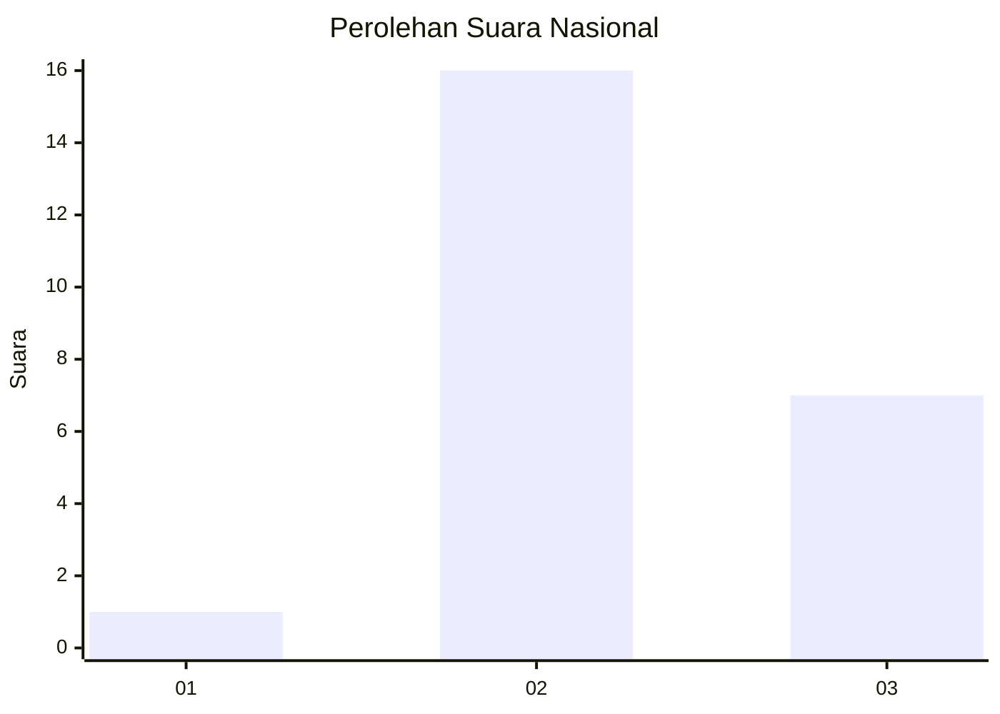
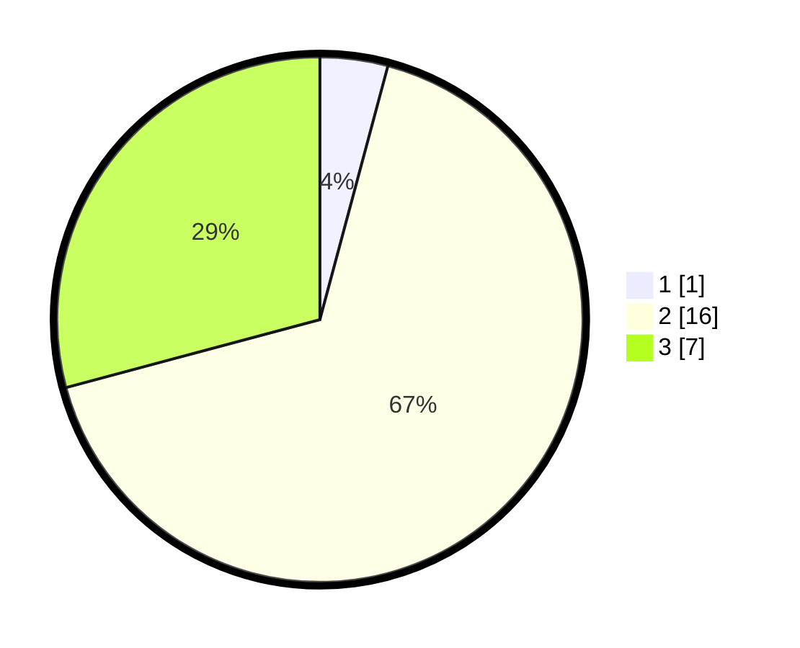

# Hasil

## Grafik

## Tabel

| No. | Nama Paslon    | Suara | Suara (raw) | Persentase |
|:--- |:-------------- | -----:| -----------:| ----------:|
| 1   | ANIES MUHAIMIN | 1     | [1][p-1]    | 4,17       |
| 2   | PRABOWO GIBRAN | 16    | [16][p-2]   | 66,67      |
| 3   | GANJAR MAHFUD  | 7     | [7][p-3]    | 29,17      |

[p-1]: https://github.com/gigit-pemilu/pemilu-2024/blob/main/pilpres/hitung-suara/sub/99-luar-negeri/sub/59-kiev-ukrania/sub/01-kiev-ukrania/sub/0001-kiev-ukrania/sub/001-pos-001/sub/paslon-1.txt
[p-2]: https://github.com/gigit-pemilu/pemilu-2024/blob/main/pilpres/hitung-suara/sub/99-luar-negeri/sub/59-kiev-ukrania/sub/01-kiev-ukrania/sub/0001-kiev-ukrania/sub/001-pos-001/sub/paslon-2.txt
[p-3]: https://github.com/gigit-pemilu/pemilu-2024/blob/main/pilpres/hitung-suara/sub/99-luar-negeri/sub/59-kiev-ukrania/sub/01-kiev-ukrania/sub/0001-kiev-ukrania/sub/001-pos-001/sub/paslon-3.txt

## Foto C Plano

https://sirekap-obj-formc.kpu.go.id/fb1a/pemilu/ppwp/99/59/01/00/01/9959010001001-20240215-221432--0cea800a-67cd-400a-a8e2-ce7182b34440.jpg

https://sirekap-obj-formc.kpu.go.id/fb1a/pemilu/ppwp/99/59/01/00/01/9959010001001-20240215-203822--d7ae9f8c-124b-4028-adbc-bcea8ed0f56d.jpg

https://sirekap-obj-formc.kpu.go.id/fb1a/pemilu/ppwp/99/59/01/00/01/9959010001001-20240215-204031--6e9624ab-24c4-4552-8aaa-8637fc1d76fa.jpg

## Metadata

| Key        | Value               |
| ---------- | ------------------- |
| Time Stamp | 2024-02-17 19:00:04 |

## DATA PEMILIH TETAP

Jumlah pemilih dalam DPT: **28**.
 * L: **14**.
 * P: **14**.

## DATA PENGGUNA HAK PILIH

Jumlah pengguna hak pilih dalam DPT: **24**.
 * L: **10**.
 * P: **14**.

Jumlah pengguna hak pilih dalam DPTb: **1**.
 * L: **0**.
 * P: **1**.

Jumlah pengguna hak pilih dalam DPK: **0**.
 * L: **0**.
 * P: **0**.

Jumlah pengguna hak pilih: **25**.
 * L: **10**.
 * P: **15**.

## JUMLAH SUARA SAH DAN TIDAK SAH

JUMLAH SELURUH SUARA SAH: **24**.

JUMLAH SUARA TIDAK SAH: **1**.

JUMLAH SELURUH SUARA SAH DAN SUARA TIDAK SAH: **25**.

