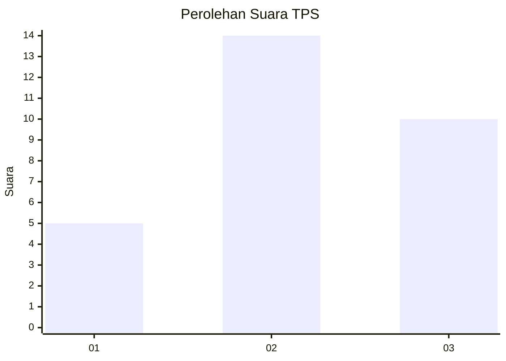
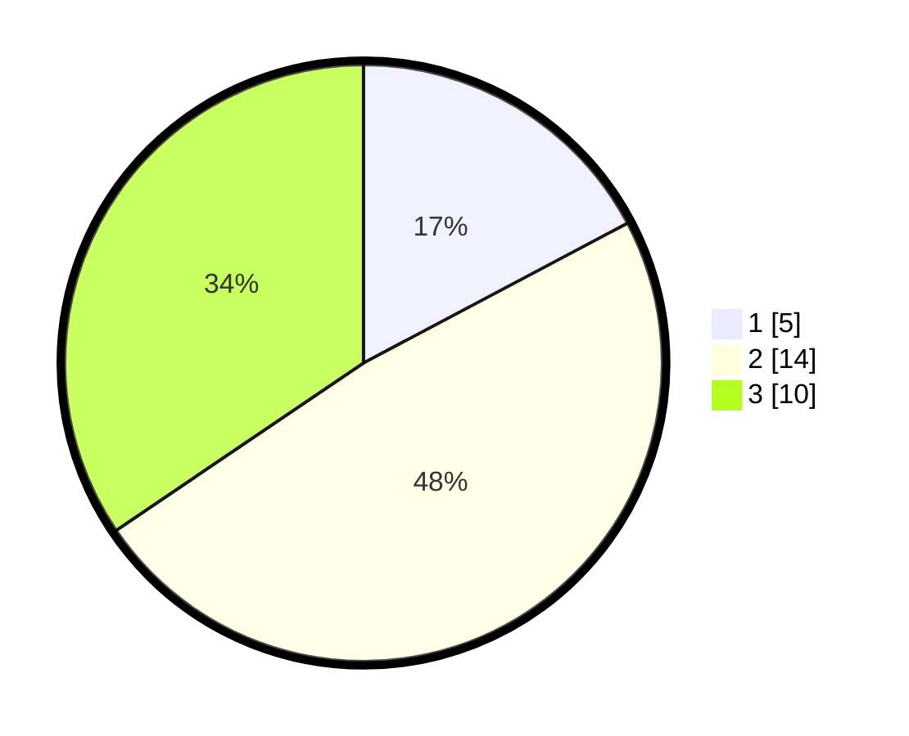

# Hasil

## Grafik

## Tabel

| No. | Nama Paslon    | Suara | Suara (raw) | Persentase |
|:--- |:-------------- | -----:| -----------:| ----------:|
| 1   | ANIES MUHAIMIN | 5     | [5][p-1]    | 17,24      |
| 2   | PRABOWO GIBRAN | 14    | [14][p-2]   | 48,28      |
| 3   | GANJAR MAHFUD  | 10    | [10][p-3]   | 34,48      |

[p-1]: https://github.com/gigit-pemilu/pemilu-2024-99-luar-negeri/blob/main/pilpres/hitung-suara/sub/99-luar-negeri/sub/59-kiev-ukrania/sub/01-kiev-ukrania/sub/0001-kiev-ukrania/sub/002-tps-001/sub/paslon-1.txt
[p-2]: https://github.com/gigit-pemilu/pemilu-2024-99-luar-negeri/blob/main/pilpres/hitung-suara/sub/99-luar-negeri/sub/59-kiev-ukrania/sub/01-kiev-ukrania/sub/0001-kiev-ukrania/sub/002-tps-001/sub/paslon-2.txt
[p-3]: https://github.com/gigit-pemilu/pemilu-2024-99-luar-negeri/blob/main/pilpres/hitung-suara/sub/99-luar-negeri/sub/59-kiev-ukrania/sub/01-kiev-ukrania/sub/0001-kiev-ukrania/sub/002-tps-001/sub/paslon-3.txt

## Foto C Plano

https://sirekap-obj-formc.kpu.go.id/46e9/pemilu/ppwp/99/59/01/00/01/9959010001002-20240215-223947--9493d156-aeed-4d74-a074-ce020d1f012b.jpg

https://sirekap-obj-formc.kpu.go.id/46e9/pemilu/ppwp/99/59/01/00/01/9959010001002-20240216-185119--e62d5e38-4f3b-4f3f-89e3-c805e45691ec.jpg

https://sirekap-obj-formc.kpu.go.id/46e9/pemilu/ppwp/99/59/01/00/01/9959010001002-20240215-224129--9f3e7fbd-49bb-4923-8e1d-999fe84eb6ba.jpg

## Metadata

| Key        | Value               |
| ---------- | ------------------- |
| Time Stamp | 2024-02-17 19:00:04 |

## DATA PEMILIH TETAP

Jumlah pemilih dalam DPT: **24**.
 * L: **11**.
 * P: **13**.

## DATA PENGGUNA HAK PILIH

Jumlah pengguna hak pilih dalam DPT: **22**.
 * L: **10**.
 * P: **12**.

Jumlah pengguna hak pilih dalam DPTb: **4**.
 * L: **2**.
 * P: **2**.

Jumlah pengguna hak pilih dalam DPK: **3**.
 * L: **0**.
 * P: **3**.

Jumlah pengguna hak pilih: **29**.
 * L: **12**.
 * P: **17**.

## JUMLAH SUARA SAH DAN TIDAK SAH

JUMLAH SELURUH SUARA SAH: **29**.

JUMLAH SUARA TIDAK SAH: **0**.

JUMLAH SELURUH SUARA SAH DAN SUARA TIDAK SAH: **29**.

