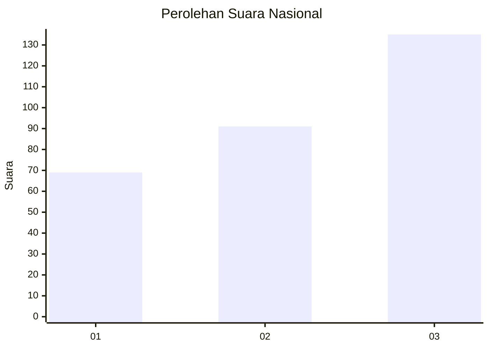
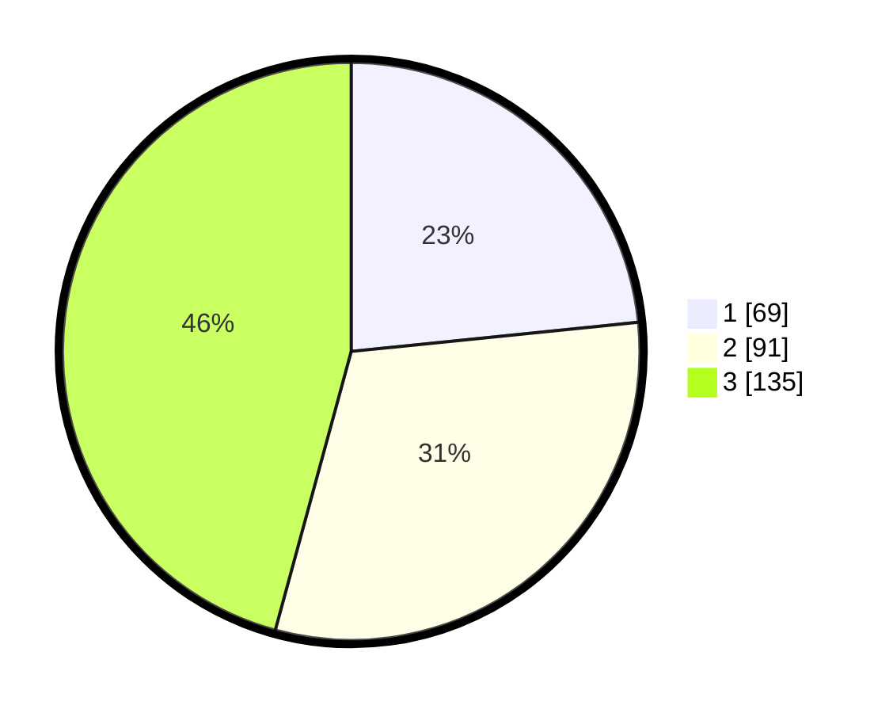

# Hasil

## Grafik

## Tabel

| No. | Nama Paslon    | Suara | Suara (raw) | Persentase |
|:--- |:-------------- | -----:| -----------:| ----------:|
| 1   | ANIES MUHAIMIN | 69    | [69][p-1]   | 23,39      |
| 2   | PRABOWO GIBRAN | 91    | [91][p-2]   | 30,85      |
| 3   | GANJAR MAHFUD  | 135   | [135][p-3]  | 45,76      |

[p-1]: https://github.com/gigit-pemilu/pemilu-2024/blob/main/pilpres/hitung-suara/sub/99-luar-negeri/sub/60-kopenhagen-denmark/sub/01-kopenhagen-denmark/sub/0001-kopenhagen-denmark/sub/001-pos-001/sub/paslon-1.txt
[p-2]: https://github.com/gigit-pemilu/pemilu-2024/blob/main/pilpres/hitung-suara/sub/99-luar-negeri/sub/60-kopenhagen-denmark/sub/01-kopenhagen-denmark/sub/0001-kopenhagen-denmark/sub/001-pos-001/sub/paslon-2.txt
[p-3]: https://github.com/gigit-pemilu/pemilu-2024/blob/main/pilpres/hitung-suara/sub/99-luar-negeri/sub/60-kopenhagen-denmark/sub/01-kopenhagen-denmark/sub/0001-kopenhagen-denmark/sub/001-pos-001/sub/paslon-3.txt

## Foto C Plano

https://sirekap-obj-formc.kpu.go.id/4988/pemilu/ppwp/99/60/01/00/01/9960010001001-20240216-032356--86ec6fb7-4734-4051-a918-92c2581ce82a.jpg

https://sirekap-obj-formc.kpu.go.id/4988/pemilu/ppwp/99/60/01/00/01/9960010001001-20240216-024331--4b636a84-3995-4b67-b482-8c0b7a664dd7.jpg

https://sirekap-obj-formc.kpu.go.id/4988/pemilu/ppwp/99/60/01/00/01/9960010001001-20240216-024410--a2d86669-885a-4752-b8bb-6ba71c6ab044.jpg

## Metadata

| Key        | Value               |
| ---------- | ------------------- |
| Time Stamp | 2024-02-16 03:30:26 |

## DATA PEMILIH TETAP

Jumlah pemilih dalam DPT: **552**.
 * L: **123**.
 * P: **429**.

## DATA PENGGUNA HAK PILIH

Jumlah pengguna hak pilih dalam DPT: **279**.
 * L: **77**.
 * P: **202**.

Jumlah pengguna hak pilih dalam DPTb: **16**.
 * L: **6**.
 * P: **10**.

Jumlah pengguna hak pilih dalam DPK: **0**.
 * L: **0**.
 * P: **0**.

Jumlah pengguna hak pilih: **295**.
 * L: **83**.
 * P: **212**.

## JUMLAH SUARA SAH DAN TIDAK SAH

JUMLAH SELURUH SUARA SAH: **295**.

JUMLAH SUARA TIDAK SAH: **0**.

JUMLAH SELURUH SUARA SAH DAN SUARA TIDAK SAH: **295**.

