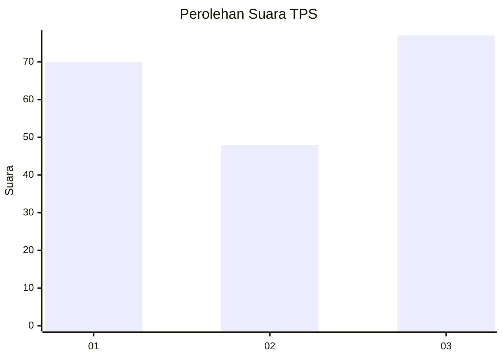
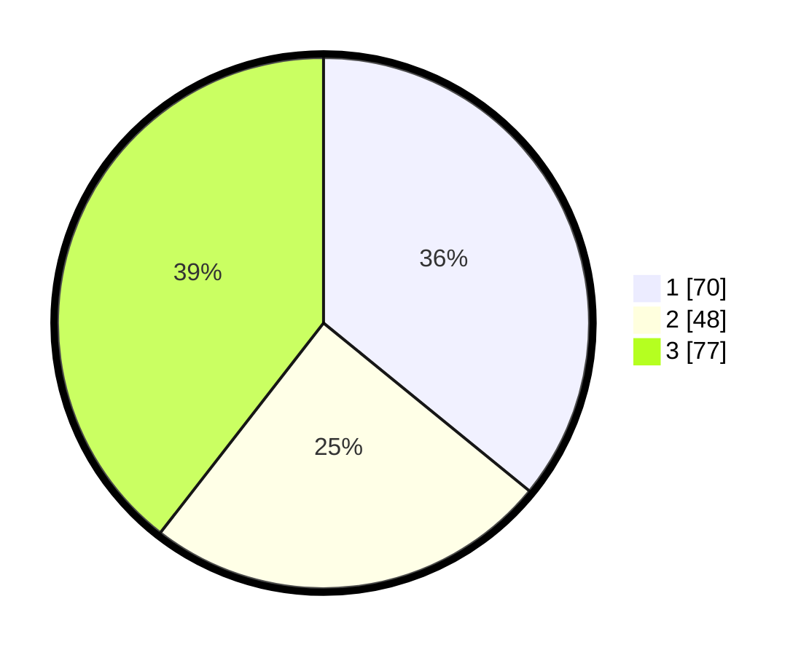

# Hasil

## Grafik

## Tabel

| No. | Nama Paslon    | Suara | Suara (raw) | Persentase |
|:--- |:-------------- | -----:| -----------:| ----------:|
| 1   | ANIES MUHAIMIN | 70    | [70][p-1]   | 35,90      |
| 2   | PRABOWO GIBRAN | 48    | [48][p-2]   | 24,62      |
| 3   | GANJAR MAHFUD  | 77    | [77][p-3]   | 39,49      |

[p-1]: https://github.com/gigit-pemilu/pemilu-2024-99-luar-negeri/blob/main/pilpres/hitung-suara/sub/99-luar-negeri/sub/60-kopenhagen-denmark/sub/01-kopenhagen-denmark/sub/0001-kopenhagen-denmark/sub/002-tps-001/sub/paslon-1.txt
[p-2]: https://github.com/gigit-pemilu/pemilu-2024-99-luar-negeri/blob/main/pilpres/hitung-suara/sub/99-luar-negeri/sub/60-kopenhagen-denmark/sub/01-kopenhagen-denmark/sub/0001-kopenhagen-denmark/sub/002-tps-001/sub/paslon-2.txt
[p-3]: https://github.com/gigit-pemilu/pemilu-2024-99-luar-negeri/blob/main/pilpres/hitung-suara/sub/99-luar-negeri/sub/60-kopenhagen-denmark/sub/01-kopenhagen-denmark/sub/0001-kopenhagen-denmark/sub/002-tps-001/sub/paslon-3.txt

## Foto C Plano

https://sirekap-obj-formc.kpu.go.id/37b2/pemilu/ppwp/99/60/01/00/01/9960010001002-20240215-235810--2eff1f6f-cbda-4841-8afa-0f886f644ce7.jpg

https://sirekap-obj-formc.kpu.go.id/37b2/pemilu/ppwp/99/60/01/00/01/9960010001002-20240214-201133--085a2992-da63-4852-a0a7-75dfb48616eb.jpg

https://sirekap-obj-formc.kpu.go.id/37b2/pemilu/ppwp/99/60/01/00/01/9960010001002-20240214-201237--e6067b26-3d2e-4bdf-aa42-0e1f3be4a014.jpg

## Metadata

| Key        | Value               |
| ---------- | ------------------- |
| Time Stamp | 2024-02-16 22:01:00 |

## DATA PEMILIH TETAP

Jumlah pemilih dalam DPT: **239**.
 * L: **93**.
 * P: **146**.

## DATA PENGGUNA HAK PILIH

Jumlah pengguna hak pilih dalam DPT: **139**.
 * L: **54**.
 * P: **85**.

Jumlah pengguna hak pilih dalam DPTb: **37**.
 * L: **14**.
 * P: **23**.

Jumlah pengguna hak pilih dalam DPK: **24**.
 * L: **8**.
 * P: **16**.

Jumlah pengguna hak pilih: **200**.
 * L: **76**.
 * P: **124**.

## JUMLAH SUARA SAH DAN TIDAK SAH

JUMLAH SELURUH SUARA SAH: **195**.

JUMLAH SUARA TIDAK SAH: **5**.

JUMLAH SELURUH SUARA SAH DAN SUARA TIDAK SAH: **200**.

