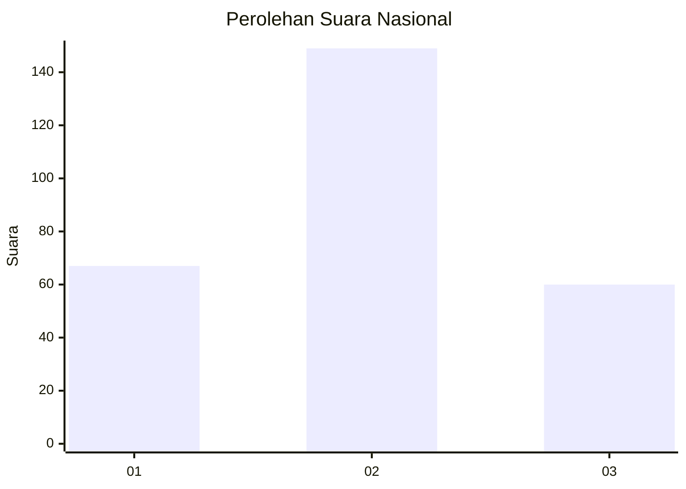
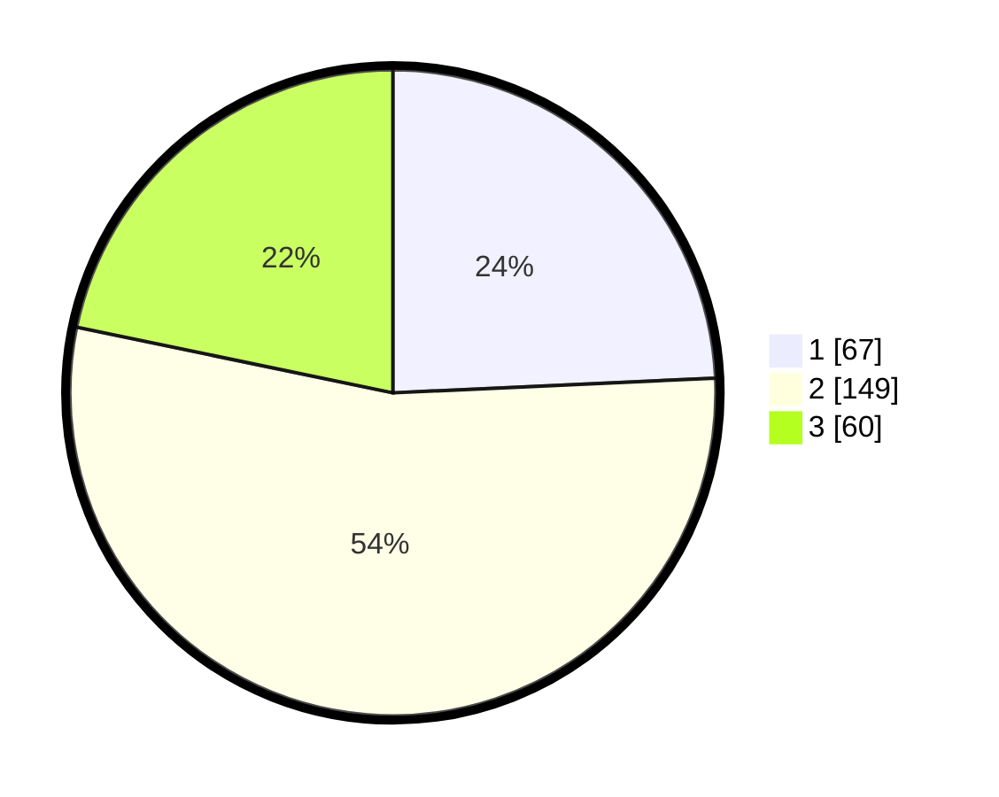

# Hasil

## Grafik

## Tabel

| No. | Nama Paslon    | Suara | Suara (raw) | Persentase |
|:--- |:-------------- | -----:| -----------:| ----------:|
| 1   | ANIES MUHAIMIN | 67    | [67][p-1]   | 24,28      |
| 2   | PRABOWO GIBRAN | 149   | [149][p-2]  | 53,99      |
| 3   | GANJAR MAHFUD  | 60    | [60][p-3]   | 21,74      |

[p-1]: https://github.com/gigit-pemilu/pemilu-2024/blob/main/pilpres/hitung-suara/sub/99-luar-negeri/sub/61-kota-kinabalu-malaysia/sub/01-kota-kinabalu-malaysia/sub/0001-kota-kinabalu-malaysia/sub/001-tps/sub/paslon-1.txt
[p-2]: https://github.com/gigit-pemilu/pemilu-2024/blob/main/pilpres/hitung-suara/sub/99-luar-negeri/sub/61-kota-kinabalu-malaysia/sub/01-kota-kinabalu-malaysia/sub/0001-kota-kinabalu-malaysia/sub/001-tps/sub/paslon-2.txt
[p-3]: https://github.com/gigit-pemilu/pemilu-2024/blob/main/pilpres/hitung-suara/sub/99-luar-negeri/sub/61-kota-kinabalu-malaysia/sub/01-kota-kinabalu-malaysia/sub/0001-kota-kinabalu-malaysia/sub/001-tps/sub/paslon-3.txt

## Foto C Plano

https://sirekap-obj-formc.kpu.go.id/0966/pemilu/ppwp/99/61/01/00/01/9961010001001-20240214-155206--52432072-386f-43f4-bb41-124fca9d18ed.jpg

https://sirekap-obj-formc.kpu.go.id/0966/pemilu/ppwp/99/61/01/00/01/9961010001001-20240214-155456--c51d997d-f90a-4c92-a052-fabeec1e3620.jpg

https://sirekap-obj-formc.kpu.go.id/0966/pemilu/ppwp/99/61/01/00/01/9961010001001-20240214-155914--f48f42de-24c1-4e2b-bd9d-2f937d364b3d.jpg

## Metadata

| Key        | Value               |
| ---------- | ------------------- |
| Time Stamp | 2024-02-14 21:46:01 |

## DATA PEMILIH TETAP

Jumlah pemilih dalam DPT: **278**.
 * L: **157**.
 * P: **121**.

## DATA PENGGUNA HAK PILIH

Jumlah pengguna hak pilih dalam DPT: **82**.
 * L: **46**.
 * P: **36**.

Jumlah pengguna hak pilih dalam DPTb: **120**.
 * L: **54**.
 * P: **66**.

Jumlah pengguna hak pilih dalam DPK: **77**.
 * L: **30**.
 * P: **47**.

Jumlah pengguna hak pilih: **279**.
 * L: **130**.
 * P: **149**.

## JUMLAH SUARA SAH DAN TIDAK SAH

JUMLAH SELURUH SUARA SAH: **276**.

JUMLAH SUARA TIDAK SAH: **3**.

JUMLAH SELURUH SUARA SAH DAN SUARA TIDAK SAH: **279**.

