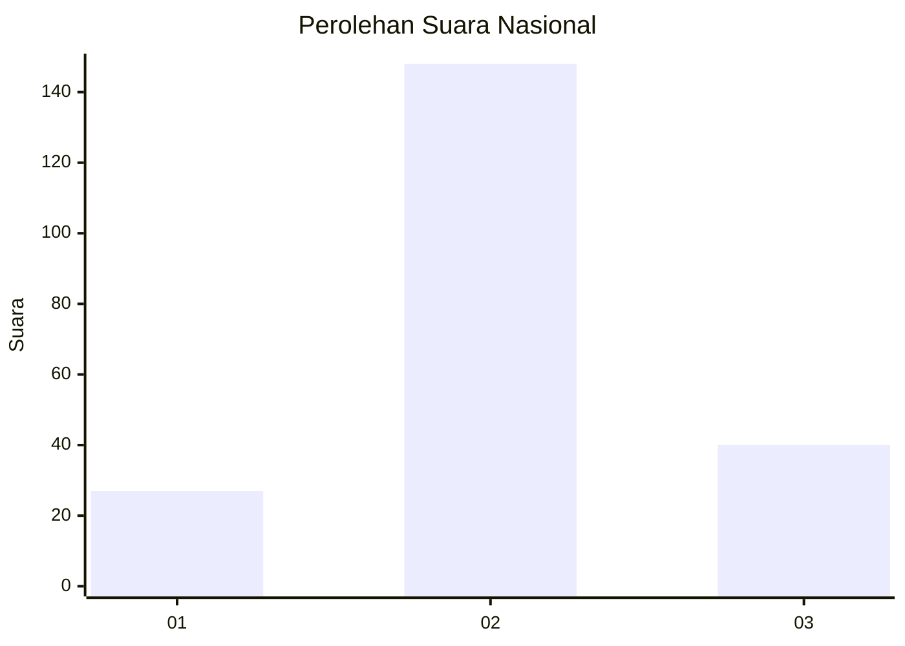
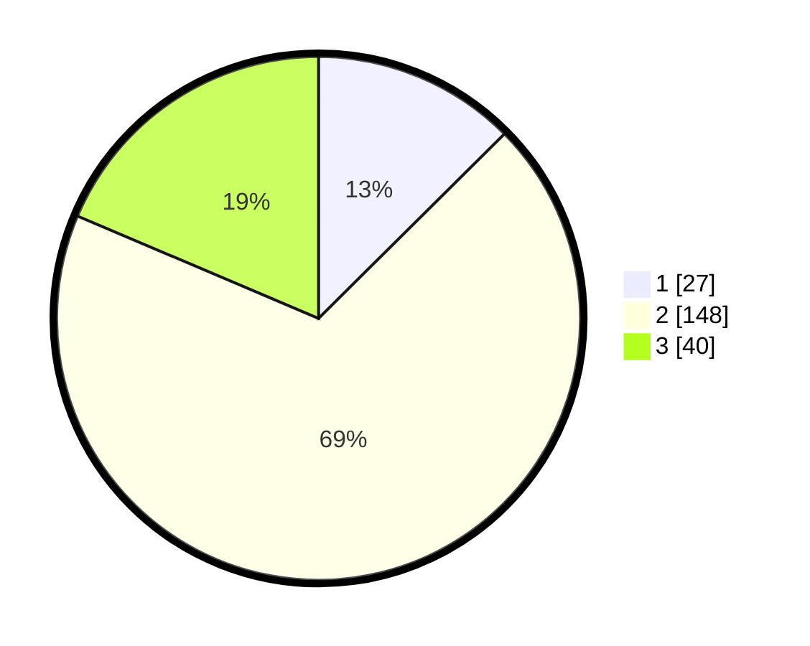

# Hasil

## Grafik

## Tabel

| No. | Nama Paslon    | Suara | Suara (raw) | Persentase |
|:--- |:-------------- | -----:| -----------:| ----------:|
| 1   | ANIES MUHAIMIN | 27    | [27][p-1]   | 12,56      |
| 2   | PRABOWO GIBRAN | 148   | [148][p-2]  | 68,84      |
| 3   | GANJAR MAHFUD  | 40    | [40][p-3]   | 18,60      |

[p-1]: https://github.com/gigit-pemilu/pemilu-2024/blob/main/pilpres/hitung-suara/sub/99-luar-negeri/sub/61-kota-kinabalu-malaysia/sub/01-kota-kinabalu-malaysia/sub/0001-kota-kinabalu-malaysia/sub/002-tps/sub/paslon-1.txt
[p-2]: https://github.com/gigit-pemilu/pemilu-2024/blob/main/pilpres/hitung-suara/sub/99-luar-negeri/sub/61-kota-kinabalu-malaysia/sub/01-kota-kinabalu-malaysia/sub/0001-kota-kinabalu-malaysia/sub/002-tps/sub/paslon-2.txt
[p-3]: https://github.com/gigit-pemilu/pemilu-2024/blob/main/pilpres/hitung-suara/sub/99-luar-negeri/sub/61-kota-kinabalu-malaysia/sub/01-kota-kinabalu-malaysia/sub/0001-kota-kinabalu-malaysia/sub/002-tps/sub/paslon-3.txt

## Foto C Plano

https://sirekap-obj-formc.kpu.go.id/1a6f/pemilu/ppwp/99/61/01/00/01/9961010001002-20240214-152457--d312efae-da02-4244-a607-c80d3caad5a0.jpg

https://sirekap-obj-formc.kpu.go.id/1a6f/pemilu/ppwp/99/61/01/00/01/9961010001002-20240214-152627--667815ff-ca82-4fa1-9392-2b20a37b5823.jpg

https://sirekap-obj-formc.kpu.go.id/1a6f/pemilu/ppwp/99/61/01/00/01/9961010001002-20240214-152809--a61994ec-88ef-49b6-9551-d4593e3cabb6.jpg

## Metadata

| Key        | Value               |
| ---------- | ------------------- |
| Time Stamp | 2024-02-14 21:46:01 |

## DATA PEMILIH TETAP

Jumlah pemilih dalam DPT: **219**.
 * L: **101**.
 * P: **118**.

## DATA PENGGUNA HAK PILIH

Jumlah pengguna hak pilih dalam DPT: **31**.
 * L: **9**.
 * P: **22**.

Jumlah pengguna hak pilih dalam DPTb: **121**.
 * L: **58**.
 * P: **63**.

Jumlah pengguna hak pilih dalam DPK: **67**.
 * L: **25**.
 * P: **42**.

Jumlah pengguna hak pilih: **219**.
 * L: **92**.
 * P: **127**.

## JUMLAH SUARA SAH DAN TIDAK SAH

JUMLAH SELURUH SUARA SAH: **215**.

JUMLAH SUARA TIDAK SAH: **4**.

JUMLAH SELURUH SUARA SAH DAN SUARA TIDAK SAH: **219**.

