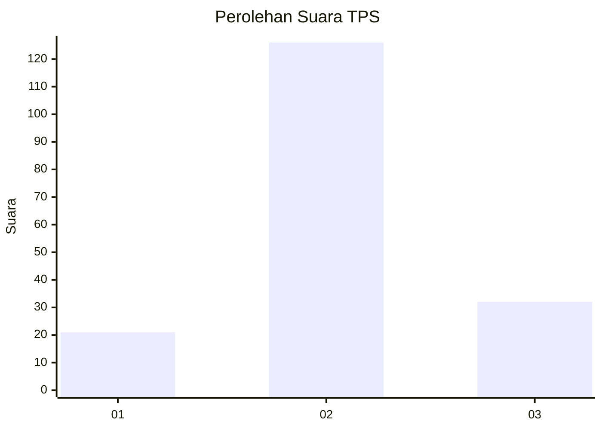
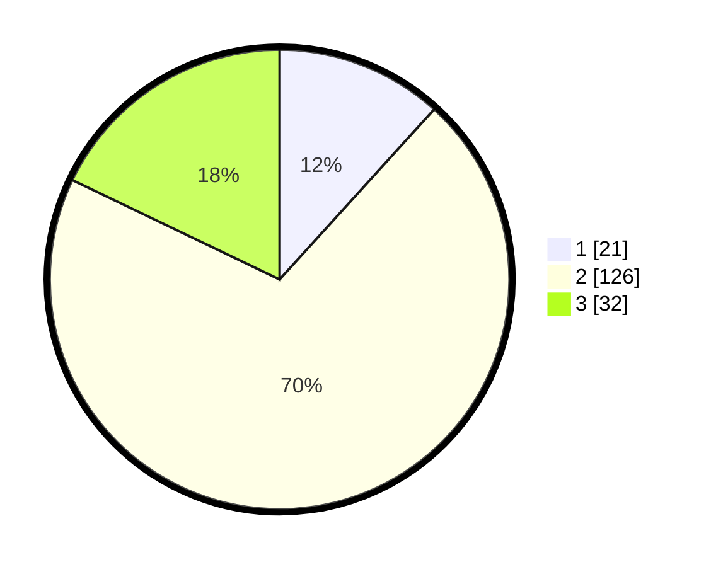

# Hasil

## Grafik

## Tabel

| No. | Nama Paslon    | Suara | Suara (raw) | Persentase |
|:--- |:-------------- | -----:| -----------:| ----------:|
| 1   | ANIES MUHAIMIN | 21    | [21][p-1]   | 11,73      |
| 2   | PRABOWO GIBRAN | 126   | [126][p-2]  | 70,39      |
| 3   | GANJAR MAHFUD  | 32    | [32][p-3]   | 17,88      |

[p-1]: https://github.com/gigit-pemilu/pemilu-2024-99-luar-negeri/blob/main/pilpres/hitung-suara/sub/99-luar-negeri/sub/61-kota-kinabalu-malaysia/sub/01-kota-kinabalu-malaysia/sub/0001-kota-kinabalu-malaysia/sub/003-tps/sub/paslon-1.txt
[p-2]: https://github.com/gigit-pemilu/pemilu-2024-99-luar-negeri/blob/main/pilpres/hitung-suara/sub/99-luar-negeri/sub/61-kota-kinabalu-malaysia/sub/01-kota-kinabalu-malaysia/sub/0001-kota-kinabalu-malaysia/sub/003-tps/sub/paslon-2.txt
[p-3]: https://github.com/gigit-pemilu/pemilu-2024-99-luar-negeri/blob/main/pilpres/hitung-suara/sub/99-luar-negeri/sub/61-kota-kinabalu-malaysia/sub/01-kota-kinabalu-malaysia/sub/0001-kota-kinabalu-malaysia/sub/003-tps/sub/paslon-3.txt

## Foto C Plano

https://sirekap-obj-formc.kpu.go.id/bb6c/pemilu/ppwp/99/61/01/00/01/9961010001003-20240215-032127--a0ac5690-2ecd-4733-b934-cc0c2aa858af.jpg

https://sirekap-obj-formc.kpu.go.id/bb6c/pemilu/ppwp/99/61/01/00/01/9961010001003-20240215-032153--bffacfad-07ca-4b32-84bd-93c2d115b180.jpg

https://sirekap-obj-formc.kpu.go.id/bb6c/pemilu/ppwp/99/61/01/00/01/9961010001003-20240215-032139--949f908d-ec19-4b0a-93e8-6216134989f0.jpg

## Metadata

| Key        | Value               |
| ---------- | ------------------- |
| Time Stamp | 2024-02-15 17:30:25 |

## DATA PEMILIH TETAP

Jumlah pemilih dalam DPT: **236**.
 * L: **149**.
 * P: **87**.

## DATA PENGGUNA HAK PILIH

Jumlah pengguna hak pilih dalam DPT: **20**.
 * L: **7**.
 * P: **13**.

Jumlah pengguna hak pilih dalam DPTb: **94**.
 * L: **34**.
 * P: **60**.

Jumlah pengguna hak pilih dalam DPK: **66**.
 * L: **29**.
 * P: **37**.

Jumlah pengguna hak pilih: **180**.
 * L: **70**.
 * P: **110**.

## JUMLAH SUARA SAH DAN TIDAK SAH

JUMLAH SELURUH SUARA SAH: **179**.

JUMLAH SUARA TIDAK SAH: **1**.

JUMLAH SELURUH SUARA SAH DAN SUARA TIDAK SAH: **180**.

