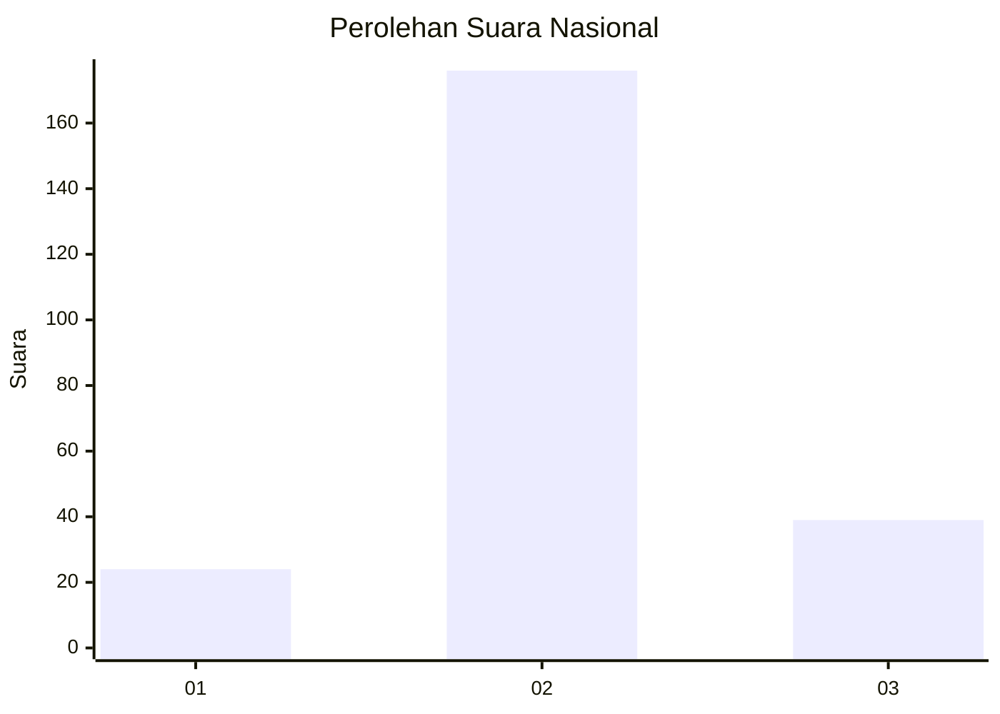
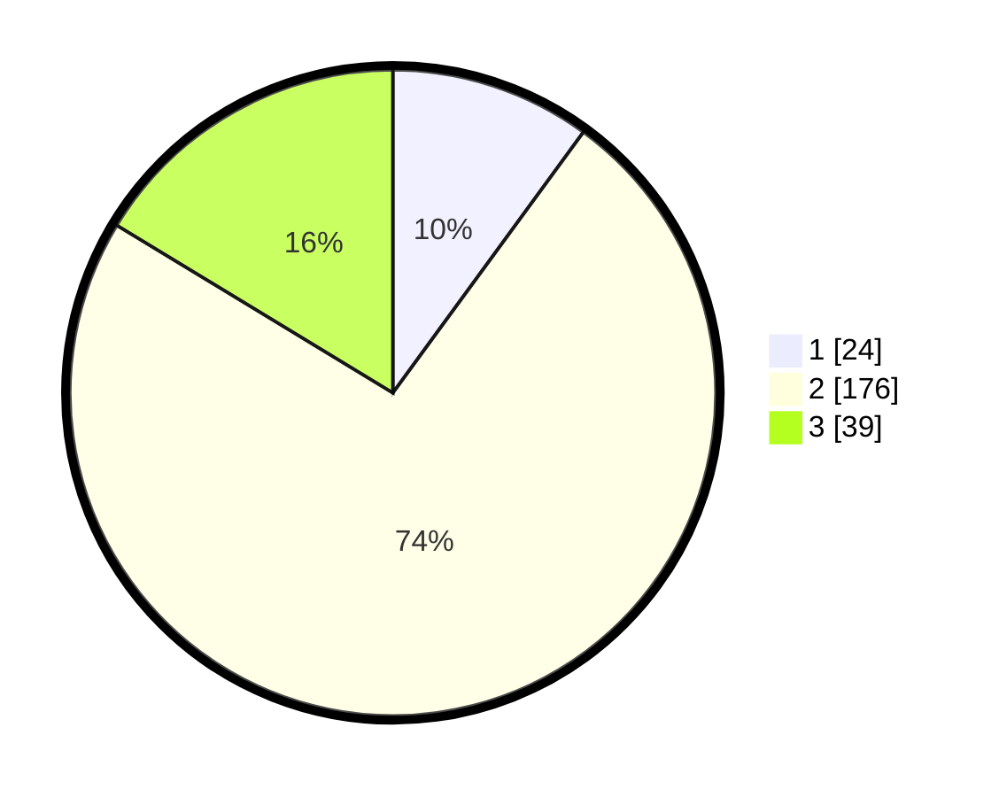

# Hasil

## Grafik

## Tabel

| No. | Nama Paslon    | Suara | Suara (raw) | Persentase |
|:--- |:-------------- | -----:| -----------:| ----------:|
| 1   | ANIES MUHAIMIN | 24    | [24][p-1]   | 10,04      |
| 2   | PRABOWO GIBRAN | 176   | [176][p-2]  | 73,64      |
| 3   | GANJAR MAHFUD  | 39    | [39][p-3]   | 16,32      |

[p-1]: https://github.com/gigit-pemilu/pemilu-2024/blob/main/pilpres/hitung-suara/sub/99-luar-negeri/sub/61-kota-kinabalu-malaysia/sub/01-kota-kinabalu-malaysia/sub/0001-kota-kinabalu-malaysia/sub/004-tps/sub/paslon-1.txt
[p-2]: https://github.com/gigit-pemilu/pemilu-2024/blob/main/pilpres/hitung-suara/sub/99-luar-negeri/sub/61-kota-kinabalu-malaysia/sub/01-kota-kinabalu-malaysia/sub/0001-kota-kinabalu-malaysia/sub/004-tps/sub/paslon-2.txt
[p-3]: https://github.com/gigit-pemilu/pemilu-2024/blob/main/pilpres/hitung-suara/sub/99-luar-negeri/sub/61-kota-kinabalu-malaysia/sub/01-kota-kinabalu-malaysia/sub/0001-kota-kinabalu-malaysia/sub/004-tps/sub/paslon-3.txt

## Foto C Plano

https://sirekap-obj-formc.kpu.go.id/015c/pemilu/ppwp/99/61/01/00/01/9961010001004-20240215-223715--0fd90a58-eced-4171-b867-799b8b74298b.jpg

https://sirekap-obj-formc.kpu.go.id/015c/pemilu/ppwp/99/61/01/00/01/9961010001004-20240218-135354--2dee9f79-db14-4218-895d-f4ce7856de98.jpg

https://sirekap-obj-formc.kpu.go.id/015c/pemilu/ppwp/99/61/01/00/01/9961010001004-20240215-223716--332fe440-c91c-4c2b-bfb1-8dc984c0d0ad.jpg

## Metadata

| Key        | Value               |
| ---------- | ------------------- |
| Time Stamp | 2024-02-21 16:00:00 |

## DATA PEMILIH TETAP

Jumlah pemilih dalam DPT: **273**.
 * L: **121**.
 * P: **152**.

## DATA PENGGUNA HAK PILIH

Jumlah pengguna hak pilih dalam DPT: **46**.
 * L: **13**.
 * P: **33**.

Jumlah pengguna hak pilih dalam DPTb: **114**.
 * L: **48**.
 * P: **66**.

Jumlah pengguna hak pilih dalam DPK: **80**.
 * L: **32**.
 * P: **48**.

Jumlah pengguna hak pilih: **240**.
 * L: **93**.
 * P: **147**.

## JUMLAH SUARA SAH DAN TIDAK SAH

JUMLAH SELURUH SUARA SAH: **239**.

JUMLAH SUARA TIDAK SAH: **1**.

JUMLAH SELURUH SUARA SAH DAN SUARA TIDAK SAH: **240**.

