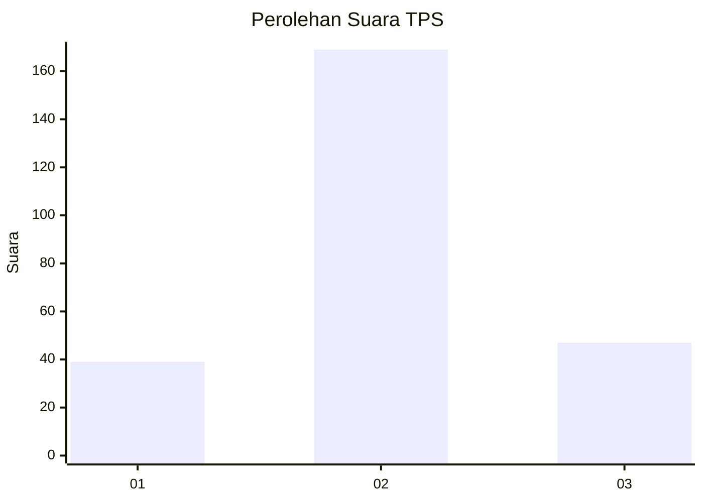
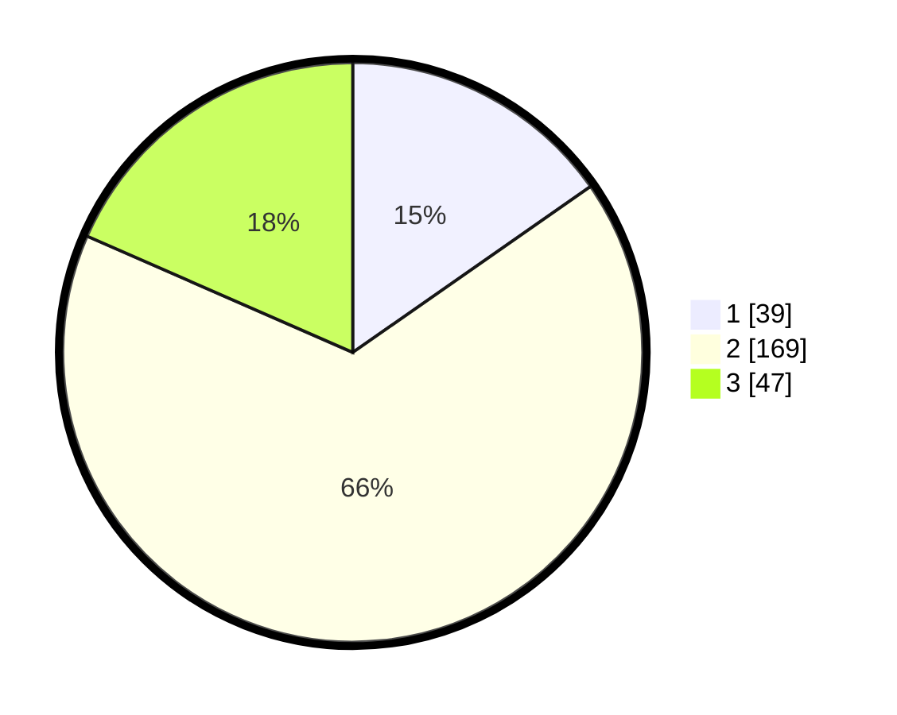

# Hasil

## Grafik

## Tabel

| No. | Nama Paslon    | Suara | Suara (raw) | Persentase |
|:--- |:-------------- | -----:| -----------:| ----------:|
| 1   | ANIES MUHAIMIN | 39    | [39][p-1]   | 15,29      |
| 2   | PRABOWO GIBRAN | 169   | [169][p-2]  | 66,27      |
| 3   | GANJAR MAHFUD  | 47    | [47][p-3]   | 18,43      |

[p-1]: https://github.com/gigit-pemilu/pemilu-2024-99-luar-negeri/blob/main/pilpres/hitung-suara/sub/99-luar-negeri/sub/61-kota-kinabalu-malaysia/sub/01-kota-kinabalu-malaysia/sub/0001-kota-kinabalu-malaysia/sub/005-tps/sub/paslon-1.txt
[p-2]: https://github.com/gigit-pemilu/pemilu-2024-99-luar-negeri/blob/main/pilpres/hitung-suara/sub/99-luar-negeri/sub/61-kota-kinabalu-malaysia/sub/01-kota-kinabalu-malaysia/sub/0001-kota-kinabalu-malaysia/sub/005-tps/sub/paslon-2.txt
[p-3]: https://github.com/gigit-pemilu/pemilu-2024-99-luar-negeri/blob/main/pilpres/hitung-suara/sub/99-luar-negeri/sub/61-kota-kinabalu-malaysia/sub/01-kota-kinabalu-malaysia/sub/0001-kota-kinabalu-malaysia/sub/005-tps/sub/paslon-3.txt

## Foto C Plano

https://sirekap-obj-formc.kpu.go.id/55fb/pemilu/ppwp/99/61/01/00/01/9961010001005-20240216-165715--bd9b58b7-108f-4fbb-bcc5-2eb3140eb136.jpg

https://sirekap-obj-formc.kpu.go.id/55fb/pemilu/ppwp/99/61/01/00/01/9961010001005-20240216-165716--f9a484b9-58fd-4a69-878e-163d8bc03b27.jpg

https://sirekap-obj-formc.kpu.go.id/55fb/pemilu/ppwp/99/61/01/00/01/9961010001005-20240216-165716--ac965e35-b5d7-497f-9c7c-d639595408b2.jpg

## Metadata

| Key        | Value               |
| ---------- | ------------------- |
| Time Stamp | 2024-02-21 16:00:00 |

## DATA PEMILIH TETAP

Jumlah pemilih dalam DPT: **272**.
 * L: **148**.
 * P: **124**.

## DATA PENGGUNA HAK PILIH

Jumlah pengguna hak pilih dalam DPT: **15**.
 * L: **12**.
 * P: **3**.

Jumlah pengguna hak pilih dalam DPTb: **129**.
 * L: **51**.
 * P: **78**.

Jumlah pengguna hak pilih dalam DPK: **116**.
 * L: **48**.
 * P: **68**.

Jumlah pengguna hak pilih: **260**.
 * L: **111**.
 * P: **149**.

## JUMLAH SUARA SAH DAN TIDAK SAH

JUMLAH SELURUH SUARA SAH: **255**.

JUMLAH SUARA TIDAK SAH: **5**.

JUMLAH SELURUH SUARA SAH DAN SUARA TIDAK SAH: **260**.

