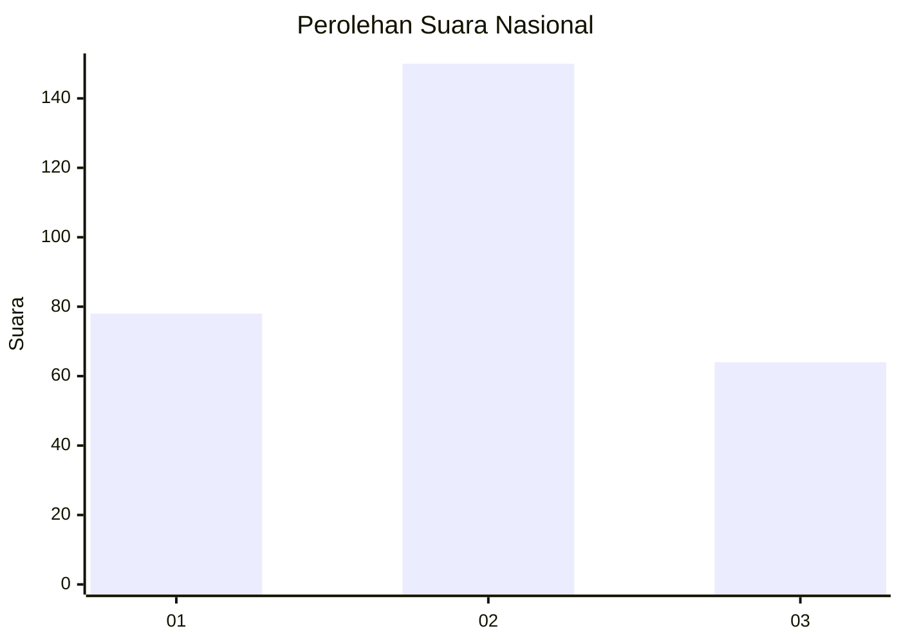
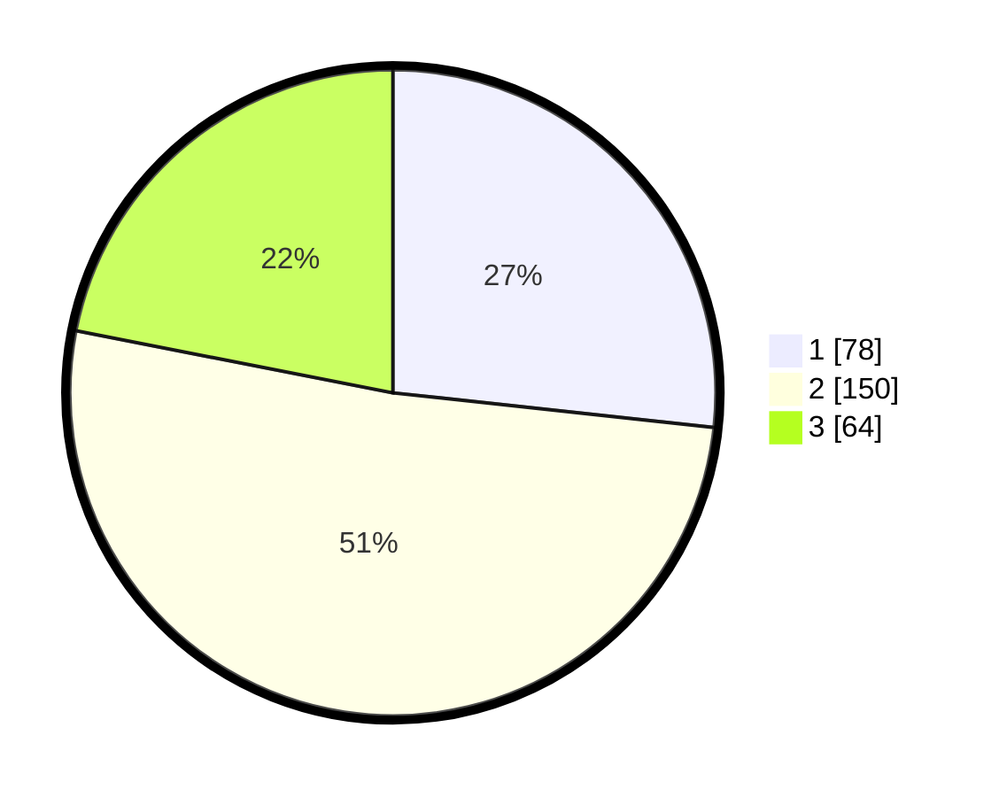

# Hasil

## Grafik

## Tabel

| No. | Nama Paslon    | Suara | Suara (raw) | Persentase |
|:--- |:-------------- | -----:| -----------:| ----------:|
| 1   | ANIES MUHAIMIN | 78    | [78][p-1]   | 26,71      |
| 2   | PRABOWO GIBRAN | 150   | [150][p-2]  | 51,37      |
| 3   | GANJAR MAHFUD  | 64    | [64][p-3]   | 21,92      |

[p-1]: https://github.com/gigit-pemilu/pemilu-2024/blob/main/pilpres/hitung-suara/sub/99-luar-negeri/sub/61-kota-kinabalu-malaysia/sub/01-kota-kinabalu-malaysia/sub/0001-kota-kinabalu-malaysia/sub/016-ksk-005/sub/paslon-1.txt
[p-2]: https://github.com/gigit-pemilu/pemilu-2024/blob/main/pilpres/hitung-suara/sub/99-luar-negeri/sub/61-kota-kinabalu-malaysia/sub/01-kota-kinabalu-malaysia/sub/0001-kota-kinabalu-malaysia/sub/016-ksk-005/sub/paslon-2.txt
[p-3]: https://github.com/gigit-pemilu/pemilu-2024/blob/main/pilpres/hitung-suara/sub/99-luar-negeri/sub/61-kota-kinabalu-malaysia/sub/01-kota-kinabalu-malaysia/sub/0001-kota-kinabalu-malaysia/sub/016-ksk-005/sub/paslon-3.txt

## Foto C Plano

https://sirekap-obj-formc.kpu.go.id/d868/pemilu/ppwp/99/61/01/00/01/9961010001016-20240215-053349--d368c8d9-dbce-4718-b2c9-90828f12a2b1.jpg

https://sirekap-obj-formc.kpu.go.id/d868/pemilu/ppwp/99/61/01/00/01/9961010001016-20240215-053238--08a772b2-e98a-4fff-8892-43a54dd4052c.jpg

https://sirekap-obj-formc.kpu.go.id/d868/pemilu/ppwp/99/61/01/00/01/9961010001016-20240215-053452--7cb9d943-8226-4723-9ac2-65dbccaf2e62.jpg

## Metadata

| Key        | Value               |
| ---------- | ------------------- |
| Time Stamp | 2024-02-19 10:00:00 |

