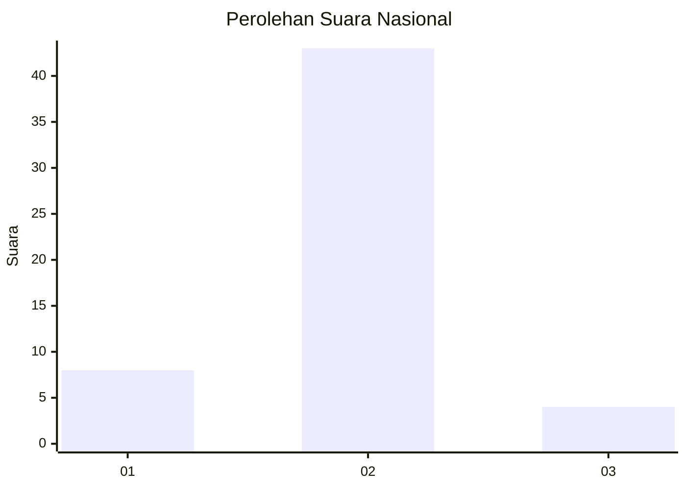
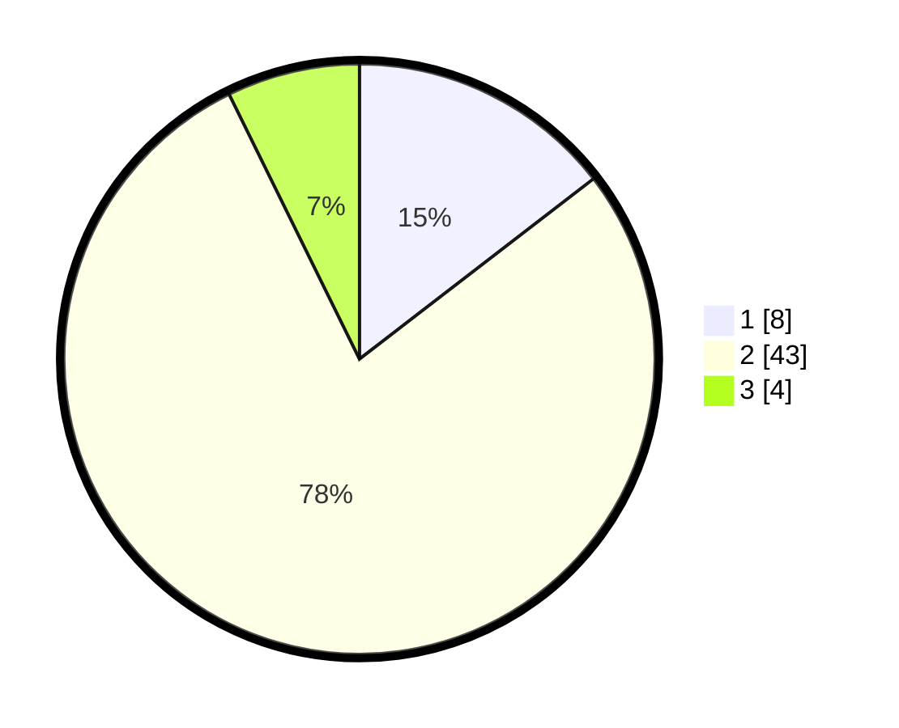

# Hasil

## Grafik

## Tabel

| No. | Nama Paslon    | Suara | Suara (raw) | Persentase |
|:--- |:-------------- | -----:| -----------:| ----------:|
| 1   | ANIES MUHAIMIN | 8     | [8][p-1]    | 14,55      |
| 2   | PRABOWO GIBRAN | 43    | [43][p-2]   | 78,18      |
| 3   | GANJAR MAHFUD  | 4     | [4][p-3]    | 7,27       |

[p-1]: https://github.com/gigit-pemilu/pemilu-2024/blob/main/pilpres/hitung-suara/sub/99-luar-negeri/sub/61-kota-kinabalu-malaysia/sub/01-kota-kinabalu-malaysia/sub/0001-kota-kinabalu-malaysia/sub/071-ksk-060/sub/paslon-1.txt
[p-2]: https://github.com/gigit-pemilu/pemilu-2024/blob/main/pilpres/hitung-suara/sub/99-luar-negeri/sub/61-kota-kinabalu-malaysia/sub/01-kota-kinabalu-malaysia/sub/0001-kota-kinabalu-malaysia/sub/071-ksk-060/sub/paslon-2.txt
[p-3]: https://github.com/gigit-pemilu/pemilu-2024/blob/main/pilpres/hitung-suara/sub/99-luar-negeri/sub/61-kota-kinabalu-malaysia/sub/01-kota-kinabalu-malaysia/sub/0001-kota-kinabalu-malaysia/sub/071-ksk-060/sub/paslon-3.txt

## Foto C Plano

https://sirekap-obj-formc.kpu.go.id/7259/pemilu/ppwp/99/61/01/00/01/9961010001071-20240214-193227--b238802c-9344-4188-a569-c457401d1b5f.jpg

https://sirekap-obj-formc.kpu.go.id/7259/pemilu/ppwp/99/61/01/00/01/9961010001071-20240214-191249--2cb00635-d6e2-4122-ab34-16c6fb001540.jpg

https://sirekap-obj-formc.kpu.go.id/7259/pemilu/ppwp/99/61/01/00/01/9961010001071-20240214-192600--cc2ed7aa-19d3-4fa0-9661-0452e0257fb3.jpg

## Metadata

| Key        | Value               |
| ---------- | ------------------- |
| Time Stamp | 2024-02-14 21:46:01 |

