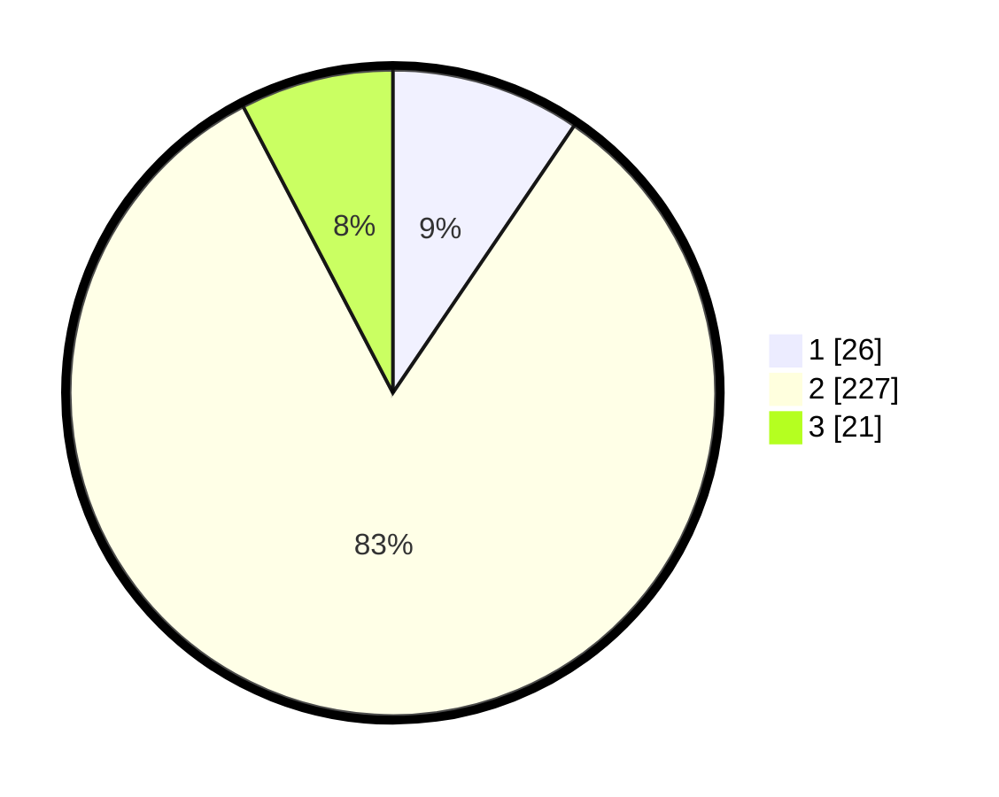

# Hasil

## Grafik

## Tabel

| No. | Nama Paslon    | Suara | Suara (raw) | Persentase |
|:--- |:-------------- | -----:| -----------:| ----------:|
| 1   | ANIES MUHAIMIN | 26    | [26][p-1]   | 9,49       |
| 2   | PRABOWO GIBRAN | 227   | [227][p-2]  | 82,85      |
| 3   | GANJAR MAHFUD  | 21    | [21][p-3]   | 7,66       |

[p-1]: https://github.com/gigit-pemilu/pemilu-2024-99-luar-negeri/blob/main/pilpres/hitung-suara/sub/99-luar-negeri/sub/61-kota-kinabalu-malaysia/sub/01-kota-kinabalu-malaysia/sub/0001-kota-kinabalu-malaysia/sub/161-ksk-150/sub/paslon-1.txt
[p-2]: https://github.com/gigit-pemilu/pemilu-2024-99-luar-negeri/blob/main/pilpres/hitung-suara/sub/99-luar-negeri/sub/61-kota-kinabalu-malaysia/sub/01-kota-kinabalu-malaysia/sub/0001-kota-kinabalu-malaysia/sub/161-ksk-150/sub/paslon-2.txt
[p-3]: https://github.com/gigit-pemilu/pemilu-2024-99-luar-negeri/blob/main/pilpres/hitung-suara/sub/99-luar-negeri/sub/61-kota-kinabalu-malaysia/sub/01-kota-kinabalu-malaysia/sub/0001-kota-kinabalu-malaysia/sub/161-ksk-150/sub/paslon-3.txt

## Foto C Plano

https://sirekap-obj-formc.kpu.go.id/f2e0/pemilu/ppwp/99/61/01/00/01/9961010001161-20240216-053339--d12081c9-6de2-4e3c-a5ed-6cdabf6dd21d.jpg

https://sirekap-obj-formc.kpu.go.id/f2e0/pemilu/ppwp/99/61/01/00/01/9961010001161-20240216-054640--b1fc5ba3-493a-4c2c-9c3d-4ae0d80f6b01.jpg

https://sirekap-obj-formc.kpu.go.id/f2e0/pemilu/ppwp/99/61/01/00/01/9961010001161-20240216-053349--183fc95d-2232-4747-9afd-f66649b51de1.jpg

## Metadata

| Key        | Value               |
| ---------- | ------------------- |
| Time Stamp | 2024-02-21 16:00:00 |

## DATA PEMILIH TETAP

Jumlah pemilih dalam DPT: **276**.
 * L: **101**.
 * P: **175**.

## DATA PENGGUNA HAK PILIH

Jumlah pengguna hak pilih dalam DPT: **38**.
 * L: **33**.
 * P: **5**.

Jumlah pengguna hak pilih dalam DPTb: **134**.
 * L: **77**.
 * P: **57**.

Jumlah pengguna hak pilih dalam DPK: **104**.
 * L: **67**.
 * P: **37**.

Jumlah pengguna hak pilih: **276**.
 * L: **177**.
 * P: **99**.

## JUMLAH SUARA SAH DAN TIDAK SAH

JUMLAH SELURUH SUARA SAH: **274**.

JUMLAH SUARA TIDAK SAH: **2**.

JUMLAH SELURUH SUARA SAH DAN SUARA TIDAK SAH: **276**.

