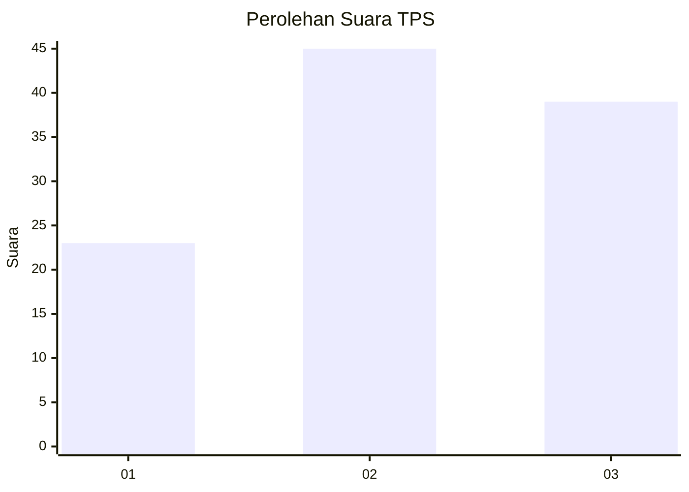
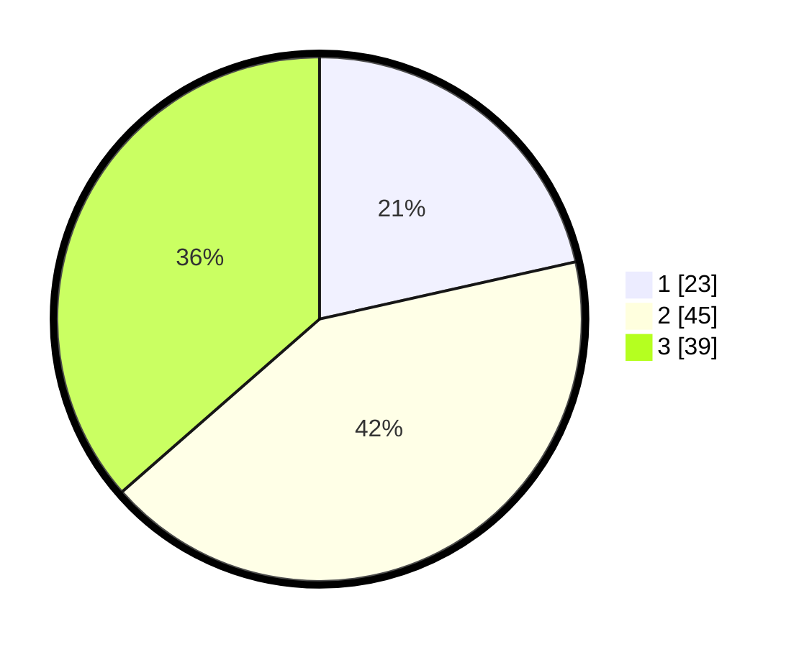

# Hasil

## Grafik

## Tabel

| No. | Nama Paslon    | Suara | Suara (raw) | Persentase |
|:--- |:-------------- | -----:| -----------:| ----------:|
| 1   | ANIES MUHAIMIN | 23    | [23][p-1]   | 21,50      |
| 2   | PRABOWO GIBRAN | 45    | [45][p-2]   | 42,06      |
| 3   | GANJAR MAHFUD  | 39    | [39][p-3]   | 36,45      |

[p-1]: https://github.com/gigit-pemilu/pemilu-2024-99-luar-negeri/blob/main/pilpres/hitung-suara/sub/99-luar-negeri/sub/61-kota-kinabalu-malaysia/sub/01-kota-kinabalu-malaysia/sub/0001-kota-kinabalu-malaysia/sub/204-ksk-193/sub/paslon-1.txt
[p-2]: https://github.com/gigit-pemilu/pemilu-2024-99-luar-negeri/blob/main/pilpres/hitung-suara/sub/99-luar-negeri/sub/61-kota-kinabalu-malaysia/sub/01-kota-kinabalu-malaysia/sub/0001-kota-kinabalu-malaysia/sub/204-ksk-193/sub/paslon-2.txt
[p-3]: https://github.com/gigit-pemilu/pemilu-2024-99-luar-negeri/blob/main/pilpres/hitung-suara/sub/99-luar-negeri/sub/61-kota-kinabalu-malaysia/sub/01-kota-kinabalu-malaysia/sub/0001-kota-kinabalu-malaysia/sub/204-ksk-193/sub/paslon-3.txt

## Foto C Plano

https://sirekap-obj-formc.kpu.go.id/f300/pemilu/ppwp/99/61/01/00/01/9961010001204-20240214-234648--cb2e13ef-c964-43fd-ada2-402b614c88cd.jpg

https://sirekap-obj-formc.kpu.go.id/f300/pemilu/ppwp/99/61/01/00/01/9961010001204-20240214-234713--a38a1d9a-aeff-4374-8045-908720c48f31.jpg

https://sirekap-obj-formc.kpu.go.id/f300/pemilu/ppwp/99/61/01/00/01/9961010001204-20240216-135842--75eee394-5343-4a5e-806e-eed572aa22b0.jpg

## Metadata

| Key        | Value               |
| ---------- | ------------------- |
| Time Stamp | 2024-02-16 14:00:34 |

## DATA PEMILIH TETAP

Jumlah pemilih dalam DPT: **149**.
 * L: **103**.
 * P: **46**.

## DATA PENGGUNA HAK PILIH

Jumlah pengguna hak pilih dalam DPT: **65**.
 * L: **43**.
 * P: **22**.

Jumlah pengguna hak pilih dalam DPTb: **31**.
 * L: **20**.
 * P: **11**.

Jumlah pengguna hak pilih dalam DPK: **53**.
 * L: **40**.
 * P: **13**.

Jumlah pengguna hak pilih: **149**.
 * L: **103**.
 * P: **46**.

## JUMLAH SUARA SAH DAN TIDAK SAH

JUMLAH SELURUH SUARA SAH: **147**.

JUMLAH SUARA TIDAK SAH: **2**.

JUMLAH SELURUH SUARA SAH DAN SUARA TIDAK SAH: **149**.

