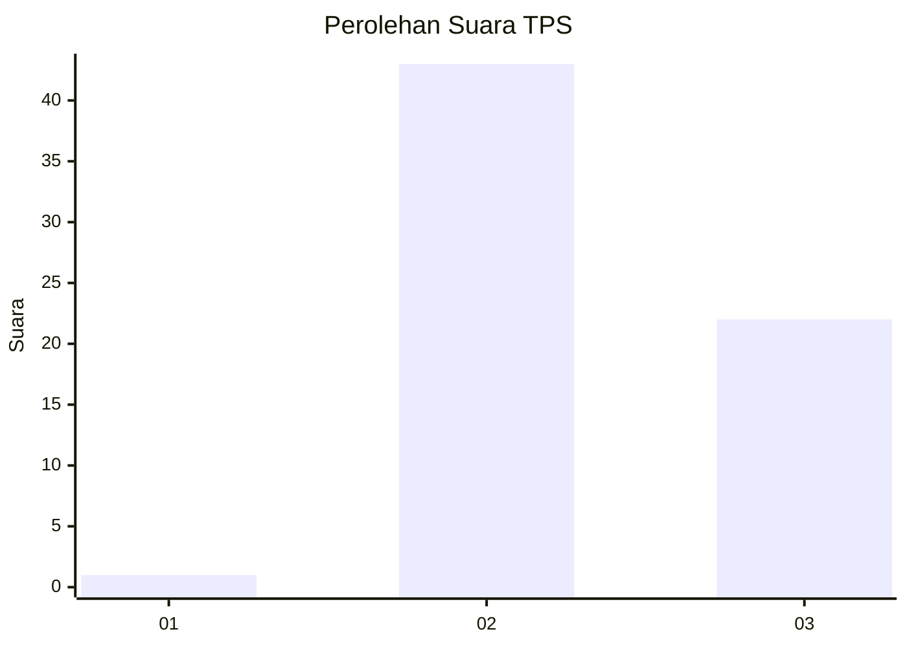
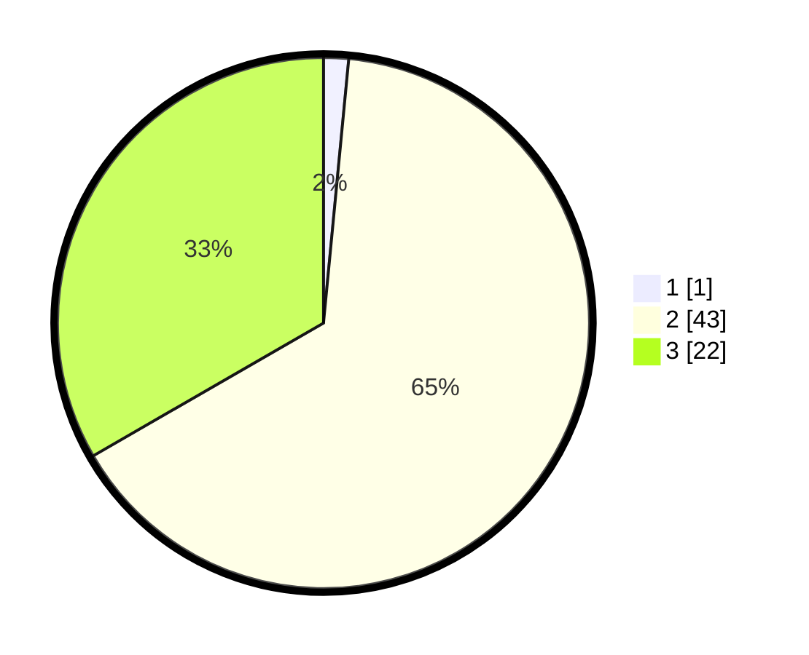

# Hasil

## Grafik

## Tabel

| No. | Nama Paslon    | Suara | Suara (raw) | Persentase |
|:--- |:-------------- | -----:| -----------:| ----------:|
| 1   | ANIES MUHAIMIN | 1     | [1][p-1]    | 1,52       |
| 2   | PRABOWO GIBRAN | 43    | [43][p-2]   | 65,15      |
| 3   | GANJAR MAHFUD  | 22    | [22][p-3]   | 33,33      |

[p-1]: https://github.com/gigit-pemilu/pemilu-2024-99-luar-negeri/blob/main/pilpres/hitung-suara/sub/99-luar-negeri/sub/61-kota-kinabalu-malaysia/sub/01-kota-kinabalu-malaysia/sub/0001-kota-kinabalu-malaysia/sub/361-ksk-350/sub/paslon-1.txt
[p-2]: https://github.com/gigit-pemilu/pemilu-2024-99-luar-negeri/blob/main/pilpres/hitung-suara/sub/99-luar-negeri/sub/61-kota-kinabalu-malaysia/sub/01-kota-kinabalu-malaysia/sub/0001-kota-kinabalu-malaysia/sub/361-ksk-350/sub/paslon-2.txt
[p-3]: https://github.com/gigit-pemilu/pemilu-2024-99-luar-negeri/blob/main/pilpres/hitung-suara/sub/99-luar-negeri/sub/61-kota-kinabalu-malaysia/sub/01-kota-kinabalu-malaysia/sub/0001-kota-kinabalu-malaysia/sub/361-ksk-350/sub/paslon-3.txt

## Foto C Plano

https://sirekap-obj-formc.kpu.go.id/34b6/pemilu/ppwp/99/61/01/00/01/9961010001361-20240218-163824--2ab863b2-d6e4-4b34-83ce-a378df1d8040.jpg

https://sirekap-obj-formc.kpu.go.id/34b6/pemilu/ppwp/99/61/01/00/01/9961010001361-20240218-164030--e1af92f0-0fa5-4b55-916d-3e9c78eba6f2.jpg

https://sirekap-obj-formc.kpu.go.id/34b6/pemilu/ppwp/99/61/01/00/01/9961010001361-20240218-164159--46473769-f36f-4aa7-aa9a-7cccbf66a4c1.jpg

## Metadata

| Key        | Value               |
| ---------- | ------------------- |
| Time Stamp | 2024-02-19 06:16:00 |

## DATA PEMILIH TETAP

Jumlah pemilih dalam DPT: **131**.
 * L: **79**.
 * P: **52**.

## DATA PENGGUNA HAK PILIH

Jumlah pengguna hak pilih dalam DPT: **17**.
 * L: **13**.
 * P: **4**.

Jumlah pengguna hak pilih dalam DPTb: **23**.
 * L: **19**.
 * P: **4**.

Jumlah pengguna hak pilih dalam DPK: **27**.
 * L: **20**.
 * P: **7**.

Jumlah pengguna hak pilih: **67**.
 * L: **52**.
 * P: **15**.

## JUMLAH SUARA SAH DAN TIDAK SAH

JUMLAH SELURUH SUARA SAH: **66**.

JUMLAH SUARA TIDAK SAH: **1**.

JUMLAH SELURUH SUARA SAH DAN SUARA TIDAK SAH: **67**.

