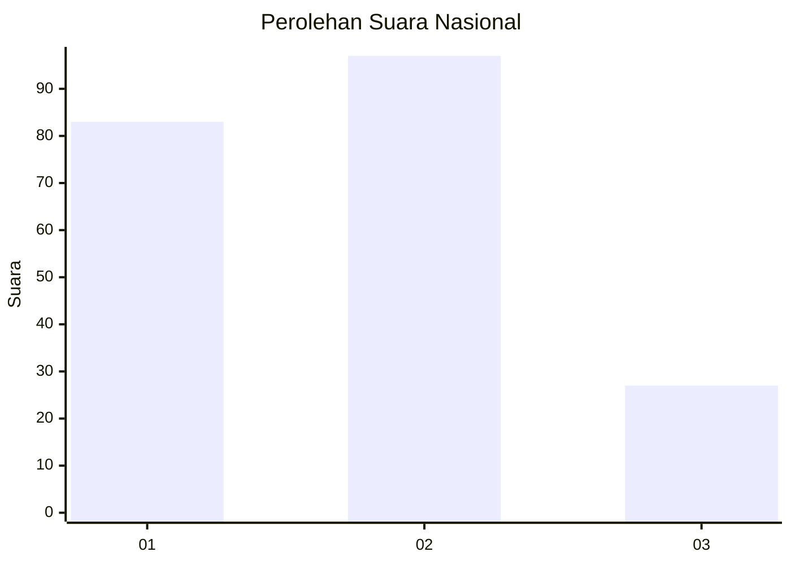
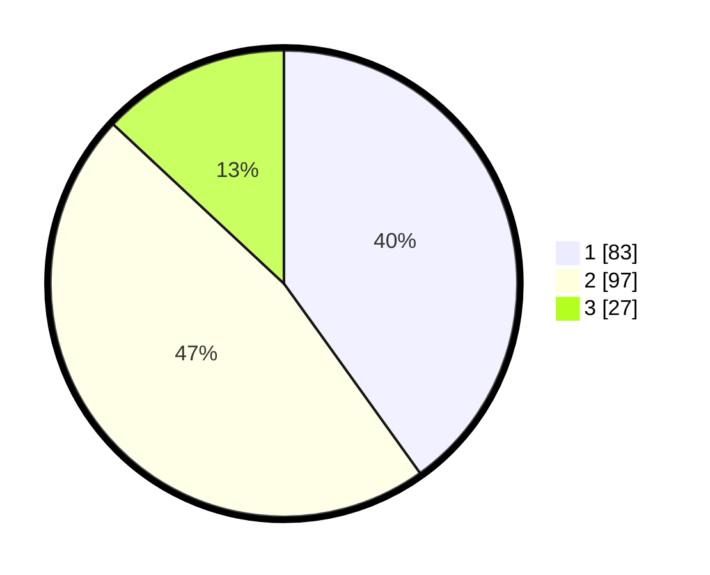

# Hasil

## Grafik

## Tabel

| No. | Nama Paslon    | Suara | Suara (raw) | Persentase |
|:--- |:-------------- | -----:| -----------:| ----------:|
| 1   | ANIES MUHAIMIN | 83    | [83][p-1]   | 40,10      |
| 2   | PRABOWO GIBRAN | 97    | [97][p-2]   | 46,86      |
| 3   | GANJAR MAHFUD  | 27    | [27][p-3]   | 13,04      |

[p-1]: https://github.com/gigit-pemilu/pemilu-2024/blob/main/pilpres/hitung-suara/sub/99-luar-negeri/sub/62-kuala-lumpur-malaysia/sub/01-kuala-lumpur-malaysia/sub/0001-kuala-lumpur-malaysia/sub/314-tps-001/sub/paslon-1.txt
[p-2]: https://github.com/gigit-pemilu/pemilu-2024/blob/main/pilpres/hitung-suara/sub/99-luar-negeri/sub/62-kuala-lumpur-malaysia/sub/01-kuala-lumpur-malaysia/sub/0001-kuala-lumpur-malaysia/sub/314-tps-001/sub/paslon-2.txt
[p-3]: https://github.com/gigit-pemilu/pemilu-2024/blob/main/pilpres/hitung-suara/sub/99-luar-negeri/sub/62-kuala-lumpur-malaysia/sub/01-kuala-lumpur-malaysia/sub/0001-kuala-lumpur-malaysia/sub/314-tps-001/sub/paslon-3.txt

## Foto C Plano

https://sirekap-obj-formc.kpu.go.id/0d1a/pemilu/ppwp/99/62/01/00/01/9962010001314-20240215-214242--e9e35d50-c1b2-4cd4-a591-d9161435c272.jpg

https://sirekap-obj-formc.kpu.go.id/0d1a/pemilu/ppwp/99/62/01/00/01/9962010001314-20240215-214331--7c75398c-41dd-40be-8b52-f77e08dc7e3a.jpg

https://sirekap-obj-formc.kpu.go.id/0d1a/pemilu/ppwp/99/62/01/00/01/9962010001314-20240215-214421--09e837db-50a8-45c9-96e6-f98e9d8f262a.jpg

## Metadata

| Key        | Value               |
| ---------- | ------------------- |
| Time Stamp | 2024-02-19 06:16:00 |

## DATA PEMILIH TETAP

Jumlah pemilih dalam DPT: **1000**.
 * L: **538**.
 * P: **462**.

## DATA PENGGUNA HAK PILIH

Jumlah pengguna hak pilih dalam DPT: **35**.
 * L: **21**.
 * P: **14**.

Jumlah pengguna hak pilih dalam DPTb: **146**.
 * L: **73**.
 * P: **73**.

Jumlah pengguna hak pilih dalam DPK: **37**.
 * L: **20**.
 * P: **17**.

Jumlah pengguna hak pilih: **218**.
 * L: **114**.
 * P: **104**.

## JUMLAH SUARA SAH DAN TIDAK SAH

JUMLAH SELURUH SUARA SAH: **207**.

JUMLAH SUARA TIDAK SAH: **11**.

JUMLAH SELURUH SUARA SAH DAN SUARA TIDAK SAH: **218**.

