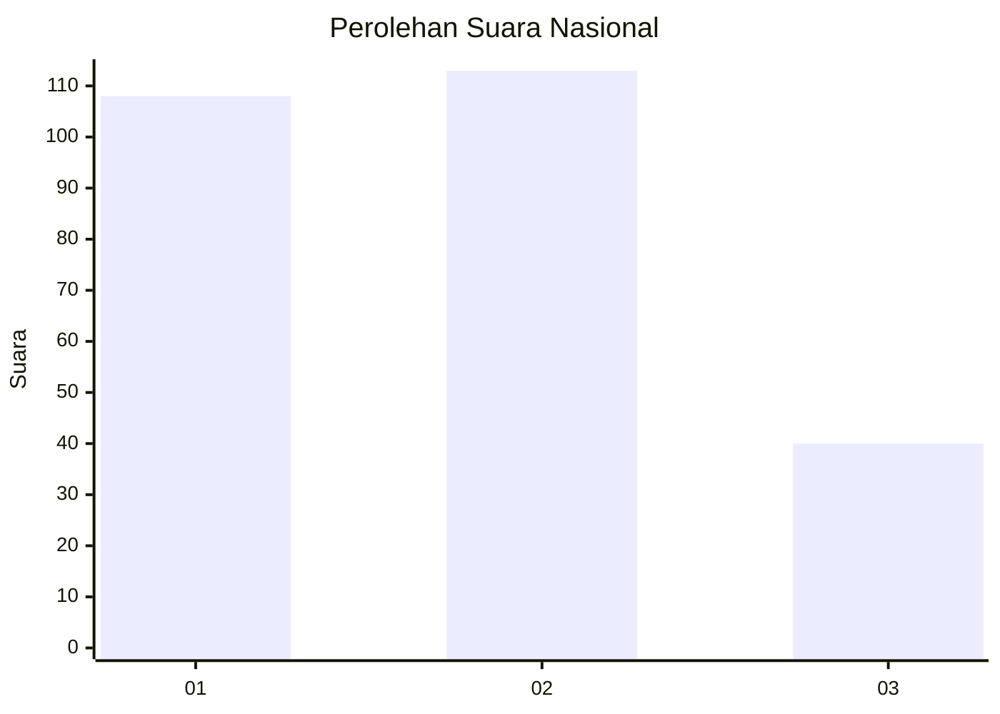
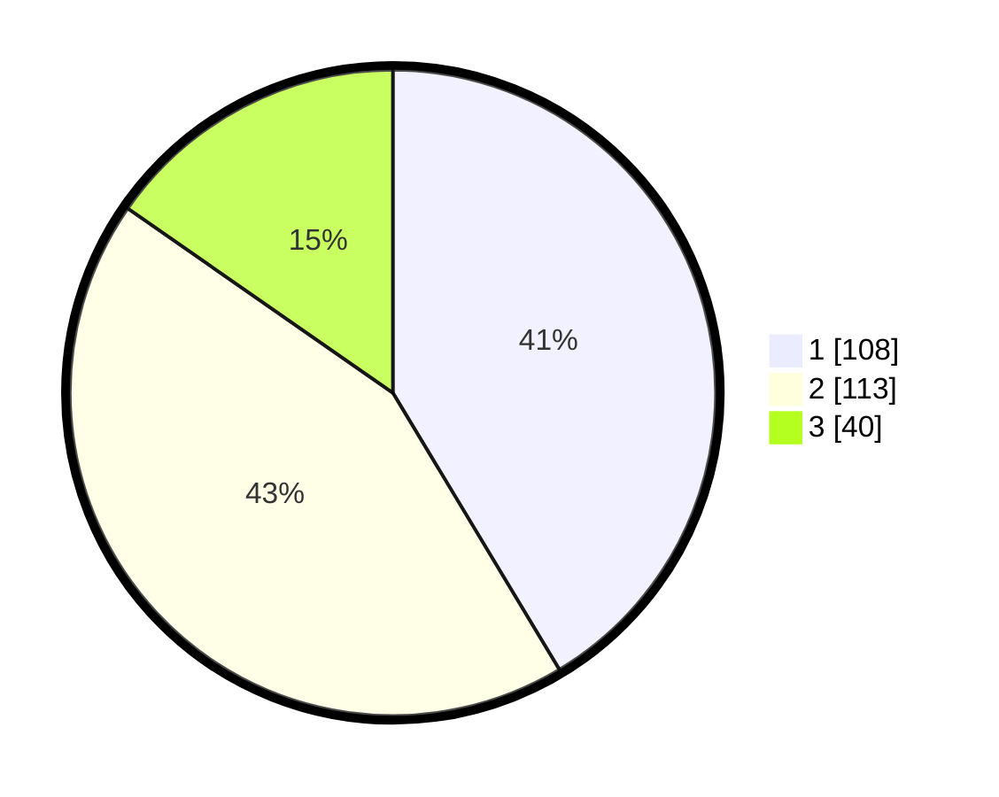

# Hasil

## Grafik

## Tabel

| No. | Nama Paslon    | Suara | Suara (raw) | Persentase |
|:--- |:-------------- | -----:| -----------:| ----------:|
| 1   | ANIES MUHAIMIN | 108   | [108][p-1]  | 41,38      |
| 2   | PRABOWO GIBRAN | 113   | [113][p-2]  | 43,30      |
| 3   | GANJAR MAHFUD  | 40    | [40][p-3]   | 15,33      |

[p-1]: https://github.com/gigit-pemilu/pemilu-2024/blob/main/pilpres/hitung-suara/sub/99-luar-negeri/sub/62-kuala-lumpur-malaysia/sub/01-kuala-lumpur-malaysia/sub/0001-kuala-lumpur-malaysia/sub/315-tps-002/sub/paslon-1.txt
[p-2]: https://github.com/gigit-pemilu/pemilu-2024/blob/main/pilpres/hitung-suara/sub/99-luar-negeri/sub/62-kuala-lumpur-malaysia/sub/01-kuala-lumpur-malaysia/sub/0001-kuala-lumpur-malaysia/sub/315-tps-002/sub/paslon-2.txt
[p-3]: https://github.com/gigit-pemilu/pemilu-2024/blob/main/pilpres/hitung-suara/sub/99-luar-negeri/sub/62-kuala-lumpur-malaysia/sub/01-kuala-lumpur-malaysia/sub/0001-kuala-lumpur-malaysia/sub/315-tps-002/sub/paslon-3.txt

## Foto C Plano

https://sirekap-obj-formc.kpu.go.id/64a2/pemilu/ppwp/99/62/01/00/01/9962010001315-20240215-220911--926549d9-f3ad-47d5-a472-47560e1a6f21.jpg

https://sirekap-obj-formc.kpu.go.id/64a2/pemilu/ppwp/99/62/01/00/01/9962010001315-20240215-220941--b1665ccd-a9c8-4f82-980a-9bdac6735828.jpg

https://sirekap-obj-formc.kpu.go.id/64a2/pemilu/ppwp/99/62/01/00/01/9962010001315-20240215-221013--a452b2e1-1538-4911-b8d7-a8c066e9d1fa.jpg

## Metadata

| Key        | Value               |
| ---------- | ------------------- |
| Time Stamp | 2024-02-15 23:29:50 |

