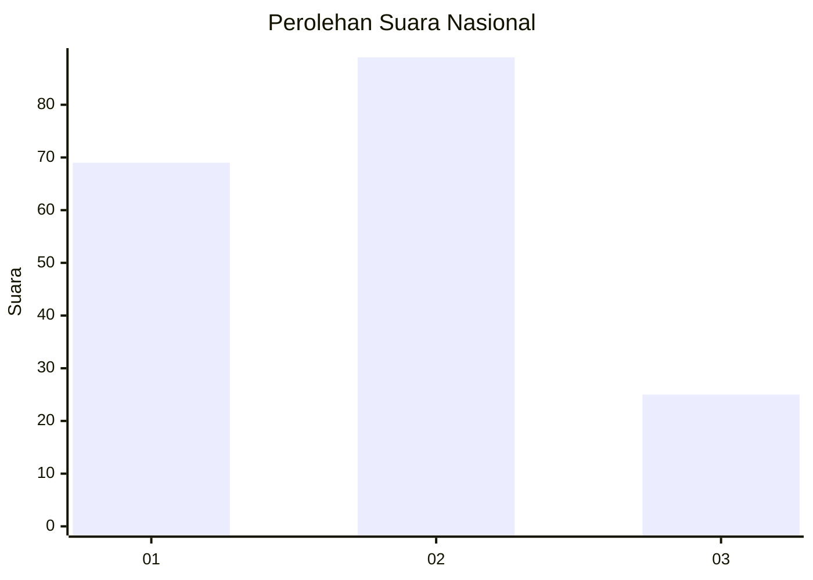
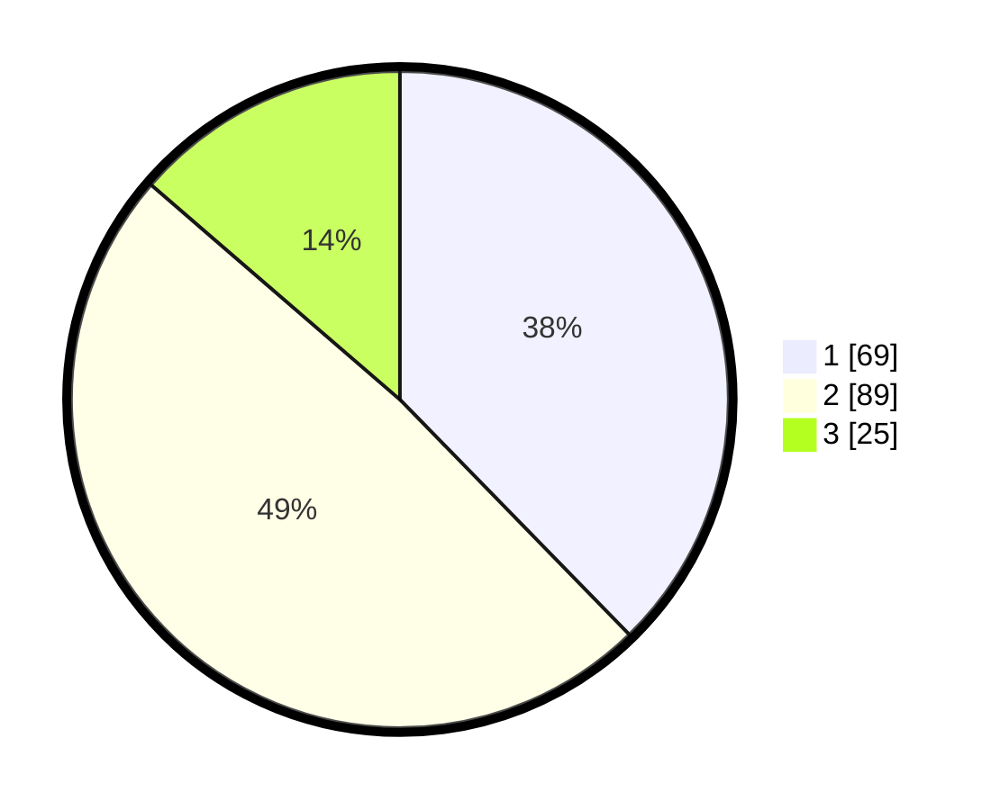

# Hasil

## Grafik

## Tabel

| No. | Nama Paslon    | Suara | Suara (raw) | Persentase |
|:--- |:-------------- | -----:| -----------:| ----------:|
| 1   | ANIES MUHAIMIN | 69    | [69][p-1]   | 37,70      |
| 2   | PRABOWO GIBRAN | 89    | [89][p-2]   | 48,63      |
| 3   | GANJAR MAHFUD  | 25    | [25][p-3]   | 13,66      |

[p-1]: https://github.com/gigit-pemilu/pemilu-2024/blob/main/pilpres/hitung-suara/sub/99-luar-negeri/sub/62-kuala-lumpur-malaysia/sub/01-kuala-lumpur-malaysia/sub/0001-kuala-lumpur-malaysia/sub/316-tps-003/sub/paslon-1.txt
[p-2]: https://github.com/gigit-pemilu/pemilu-2024/blob/main/pilpres/hitung-suara/sub/99-luar-negeri/sub/62-kuala-lumpur-malaysia/sub/01-kuala-lumpur-malaysia/sub/0001-kuala-lumpur-malaysia/sub/316-tps-003/sub/paslon-2.txt
[p-3]: https://github.com/gigit-pemilu/pemilu-2024/blob/main/pilpres/hitung-suara/sub/99-luar-negeri/sub/62-kuala-lumpur-malaysia/sub/01-kuala-lumpur-malaysia/sub/0001-kuala-lumpur-malaysia/sub/316-tps-003/sub/paslon-3.txt

## Foto C Plano

https://sirekap-obj-formc.kpu.go.id/3533/pemilu/ppwp/99/62/01/00/01/9962010001316-20240215-223300--2889b424-4462-4078-bfa6-ed1d61918d84.jpg

https://sirekap-obj-formc.kpu.go.id/3533/pemilu/ppwp/99/62/01/00/01/9962010001316-20240215-224322--dd7c4468-8335-423b-aa32-87c19e7bf454.jpg

https://sirekap-obj-formc.kpu.go.id/3533/pemilu/ppwp/99/62/01/00/01/9962010001316-20240215-224705--7a12fdae-d39b-4a8d-8d18-485cafb4dbb7.jpg

## Metadata

| Key        | Value               |
| ---------- | ------------------- |
| Time Stamp | 2024-02-15 23:29:50 |

## DATA PEMILIH TETAP

Jumlah pemilih dalam DPT: **1000**.
 * L: **559**.
 * P: **441**.

## DATA PENGGUNA HAK PILIH

Jumlah pengguna hak pilih dalam DPT: **16**.
 * L: **8**.
 * P: **8**.

Jumlah pengguna hak pilih dalam DPTb: **37**.
 * L: **10**.
 * P: **27**.

Jumlah pengguna hak pilih dalam DPK: **133**.
 * L: **80**.
 * P: **53**.

Jumlah pengguna hak pilih: **186**.
 * L: **98**.
 * P: **88**.

## JUMLAH SUARA SAH DAN TIDAK SAH

JUMLAH SELURUH SUARA SAH: **183**.

JUMLAH SUARA TIDAK SAH: **3**.

JUMLAH SELURUH SUARA SAH DAN SUARA TIDAK SAH: **186**.

