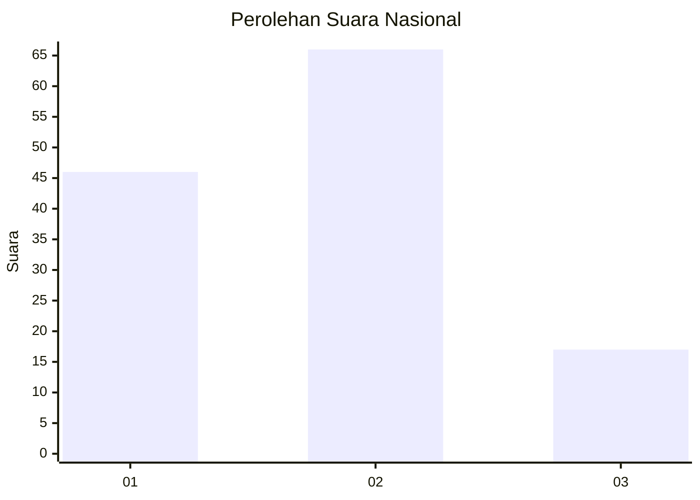
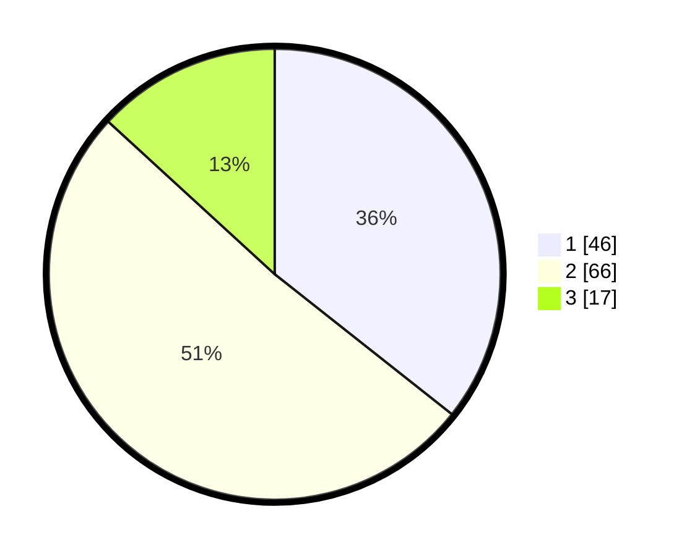

# Hasil

## Grafik

## Tabel

| No. | Nama Paslon    | Suara | Suara (raw) | Persentase |
|:--- |:-------------- | -----:| -----------:| ----------:|
| 1   | ANIES MUHAIMIN | 46    | [46][p-1]   | 35,66      |
| 2   | PRABOWO GIBRAN | 66    | [66][p-2]   | 51,16      |
| 3   | GANJAR MAHFUD  | 17    | [17][p-3]   | 13,18      |

[p-1]: https://github.com/gigit-pemilu/pemilu-2024/blob/main/pilpres/hitung-suara/sub/99-luar-negeri/sub/62-kuala-lumpur-malaysia/sub/01-kuala-lumpur-malaysia/sub/0001-kuala-lumpur-malaysia/sub/317-tps-004/sub/paslon-1.txt
[p-2]: https://github.com/gigit-pemilu/pemilu-2024/blob/main/pilpres/hitung-suara/sub/99-luar-negeri/sub/62-kuala-lumpur-malaysia/sub/01-kuala-lumpur-malaysia/sub/0001-kuala-lumpur-malaysia/sub/317-tps-004/sub/paslon-2.txt
[p-3]: https://github.com/gigit-pemilu/pemilu-2024/blob/main/pilpres/hitung-suara/sub/99-luar-negeri/sub/62-kuala-lumpur-malaysia/sub/01-kuala-lumpur-malaysia/sub/0001-kuala-lumpur-malaysia/sub/317-tps-004/sub/paslon-3.txt

## Foto C Plano

https://sirekap-obj-formc.kpu.go.id/5879/pemilu/ppwp/99/62/01/00/01/9962010001317-20240215-223809--c283f04f-8764-4454-a9c6-1353519ed562.jpg

https://sirekap-obj-formc.kpu.go.id/5879/pemilu/ppwp/99/62/01/00/01/9962010001317-20240215-213951--44b5c81b-c3a1-4279-831f-403699e6e9ed.jpg

https://sirekap-obj-formc.kpu.go.id/5879/pemilu/ppwp/99/62/01/00/01/9962010001317-20240215-213023--4664c049-2b2e-4de7-abde-5ac282411e66.jpg

## Metadata

| Key        | Value               |
| ---------- | ------------------- |
| Time Stamp | 2024-02-15 23:29:50 |

## DATA PEMILIH TETAP

Jumlah pemilih dalam DPT: **1000**.
 * L: **562**.
 * P: **438**.

## DATA PENGGUNA HAK PILIH

Jumlah pengguna hak pilih dalam DPT: **13**.
 * L: **9**.
 * P: **4**.

Jumlah pengguna hak pilih dalam DPTb: **29**.
 * L: **12**.
 * P: **17**.

Jumlah pengguna hak pilih dalam DPK: **91**.
 * L: **50**.
 * P: **41**.

Jumlah pengguna hak pilih: **133**.
 * L: **71**.
 * P: **62**.

## JUMLAH SUARA SAH DAN TIDAK SAH

JUMLAH SELURUH SUARA SAH: **129**.

JUMLAH SUARA TIDAK SAH: **4**.

JUMLAH SELURUH SUARA SAH DAN SUARA TIDAK SAH: **133**.

