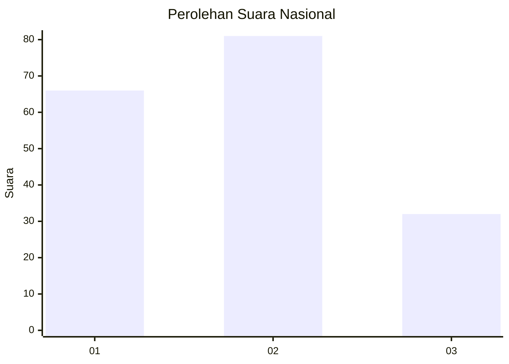
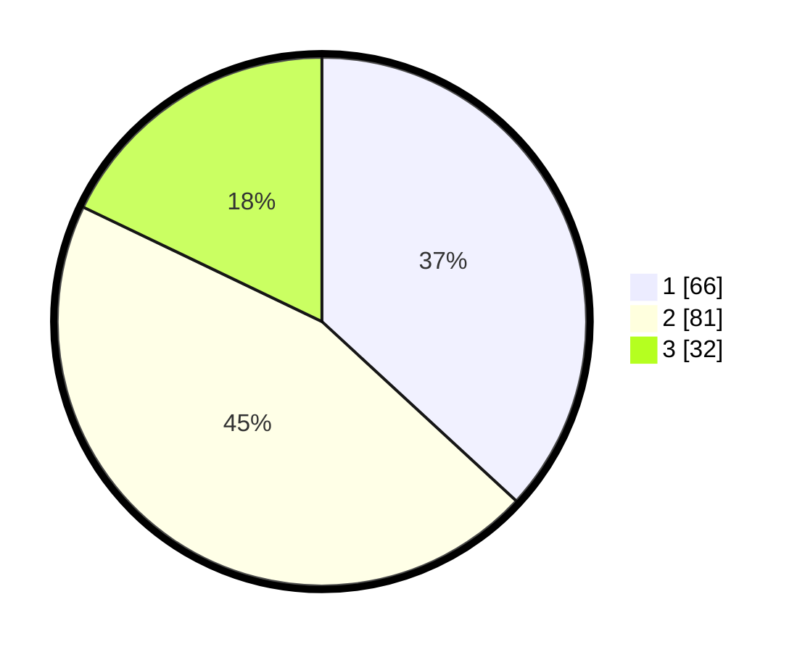

# Hasil

## Grafik

## Tabel

| No. | Nama Paslon    | Suara | Suara (raw) | Persentase |
|:--- |:-------------- | -----:| -----------:| ----------:|
| 1   | ANIES MUHAIMIN | 66    | [66][p-1]   | 36,87      |
| 2   | PRABOWO GIBRAN | 81    | [81][p-2]   | 45,25      |
| 3   | GANJAR MAHFUD  | 32    | [32][p-3]   | 17,88      |

[p-1]: https://github.com/gigit-pemilu/pemilu-2024/blob/main/pilpres/hitung-suara/sub/99-luar-negeri/sub/62-kuala-lumpur-malaysia/sub/01-kuala-lumpur-malaysia/sub/0001-kuala-lumpur-malaysia/sub/318-tps-005/sub/paslon-1.txt
[p-2]: https://github.com/gigit-pemilu/pemilu-2024/blob/main/pilpres/hitung-suara/sub/99-luar-negeri/sub/62-kuala-lumpur-malaysia/sub/01-kuala-lumpur-malaysia/sub/0001-kuala-lumpur-malaysia/sub/318-tps-005/sub/paslon-2.txt
[p-3]: https://github.com/gigit-pemilu/pemilu-2024/blob/main/pilpres/hitung-suara/sub/99-luar-negeri/sub/62-kuala-lumpur-malaysia/sub/01-kuala-lumpur-malaysia/sub/0001-kuala-lumpur-malaysia/sub/318-tps-005/sub/paslon-3.txt

## Foto C Plano

https://sirekap-obj-formc.kpu.go.id/2bee/pemilu/ppwp/99/62/01/00/01/9962010001318-20240215-213829--4d9f9262-2272-443e-be6a-41c4ab0f077c.jpg

https://sirekap-obj-formc.kpu.go.id/2bee/pemilu/ppwp/99/62/01/00/01/9962010001318-20240215-215409--e681c5b4-a2e5-4507-8ec4-df797e0cd95b.jpg

https://sirekap-obj-formc.kpu.go.id/2bee/pemilu/ppwp/99/62/01/00/01/9962010001318-20240215-214943--42ba4bb3-cfb8-4128-b0e1-43847df79ca4.jpg

## Metadata

| Key        | Value               |
| ---------- | ------------------- |
| Time Stamp | 2024-02-19 06:16:00 |

## DATA PEMILIH TETAP

Jumlah pemilih dalam DPT: **1000**.
 * L: **545**.
 * P: **454**.

## DATA PENGGUNA HAK PILIH

Jumlah pengguna hak pilih dalam DPT: **18**.
 * L: **7**.
 * P: **11**.

Jumlah pengguna hak pilih dalam DPTb: **115**.
 * L: **46**.
 * P: **69**.

Jumlah pengguna hak pilih dalam DPK: **49**.
 * L: **27**.
 * P: **22**.

Jumlah pengguna hak pilih: **182**.
 * L: **80**.
 * P: **102**.

## JUMLAH SUARA SAH DAN TIDAK SAH

JUMLAH SELURUH SUARA SAH: **179**.

JUMLAH SUARA TIDAK SAH: **3**.

JUMLAH SELURUH SUARA SAH DAN SUARA TIDAK SAH: **182**.

