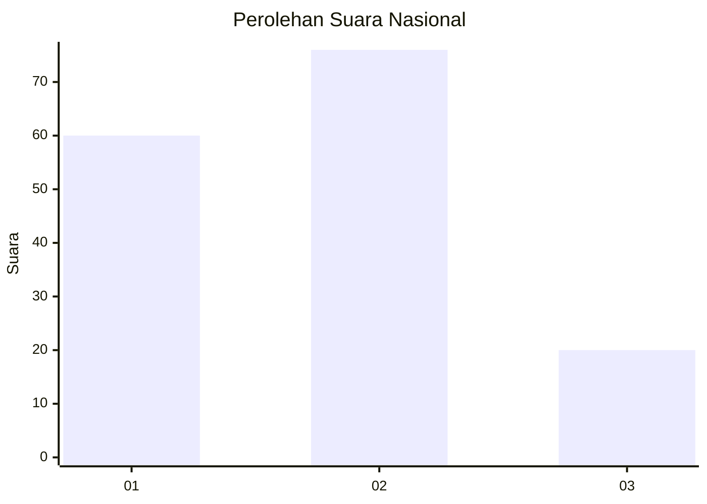
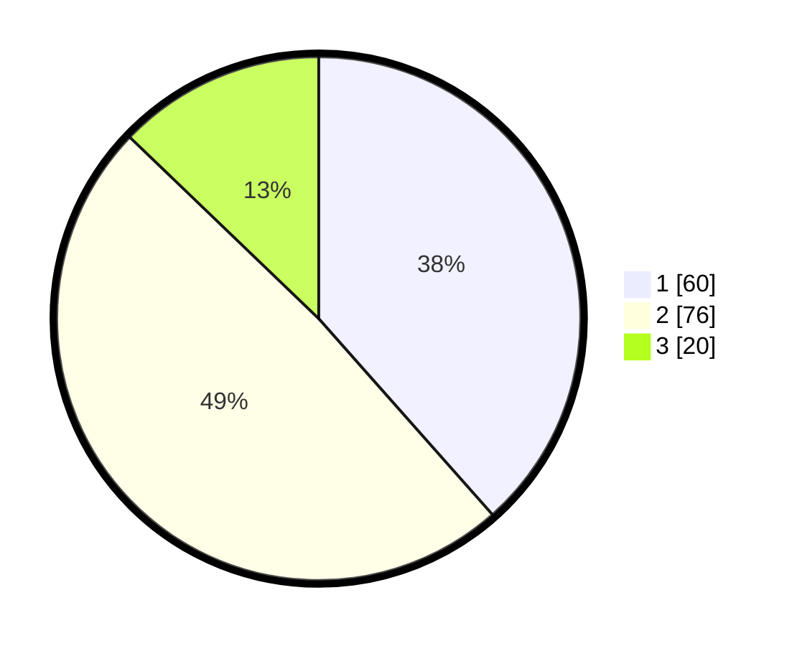

# Hasil

## Grafik

## Tabel

| No. | Nama Paslon    | Suara | Suara (raw) | Persentase |
|:--- |:-------------- | -----:| -----------:| ----------:|
| 1   | ANIES MUHAIMIN | 60    | [60][p-1]   | 38,46      |
| 2   | PRABOWO GIBRAN | 76    | [76][p-2]   | 48,72      |
| 3   | GANJAR MAHFUD  | 20    | [20][p-3]   | 12,82      |

[p-1]: https://github.com/gigit-pemilu/pemilu-2024/blob/main/pilpres/hitung-suara/sub/99-luar-negeri/sub/62-kuala-lumpur-malaysia/sub/01-kuala-lumpur-malaysia/sub/0001-kuala-lumpur-malaysia/sub/336-tps-023/sub/paslon-1.txt
[p-2]: https://github.com/gigit-pemilu/pemilu-2024/blob/main/pilpres/hitung-suara/sub/99-luar-negeri/sub/62-kuala-lumpur-malaysia/sub/01-kuala-lumpur-malaysia/sub/0001-kuala-lumpur-malaysia/sub/336-tps-023/sub/paslon-2.txt
[p-3]: https://github.com/gigit-pemilu/pemilu-2024/blob/main/pilpres/hitung-suara/sub/99-luar-negeri/sub/62-kuala-lumpur-malaysia/sub/01-kuala-lumpur-malaysia/sub/0001-kuala-lumpur-malaysia/sub/336-tps-023/sub/paslon-3.txt

## Foto C Plano

https://sirekap-obj-formc.kpu.go.id/4528/pemilu/ppwp/99/62/01/00/01/9962010001336-20240215-225312--337a4492-9b84-4a4c-9c62-4e958a3210fe.jpg

https://sirekap-obj-formc.kpu.go.id/4528/pemilu/ppwp/99/62/01/00/01/9962010001336-20240215-214021--a7733055-ff42-4b04-852d-aecb15943c9a.jpg

https://sirekap-obj-formc.kpu.go.id/4528/pemilu/ppwp/99/62/01/00/01/9962010001336-20240215-225718--7356ef8b-2b96-4703-a383-5a57ec42af87.jpg

## Metadata

| Key        | Value               |
| ---------- | ------------------- |
| Time Stamp | 2024-02-17 16:36:25 |

## DATA PEMILIH TETAP

Jumlah pemilih dalam DPT: **1000**.
 * L: **565**.
 * P: **435**.

## DATA PENGGUNA HAK PILIH

Jumlah pengguna hak pilih dalam DPT: **13**.
 * L: **8**.
 * P: **5**.

Jumlah pengguna hak pilih dalam DPTb: **64**.
 * L: **34**.
 * P: **30**.

Jumlah pengguna hak pilih dalam DPK: **80**.
 * L: **48**.
 * P: **32**.

Jumlah pengguna hak pilih: **157**.
 * L: **90**.
 * P: **67**.

## JUMLAH SUARA SAH DAN TIDAK SAH

JUMLAH SELURUH SUARA SAH: **156**.

JUMLAH SUARA TIDAK SAH: **1**.

JUMLAH SELURUH SUARA SAH DAN SUARA TIDAK SAH: **157**.

