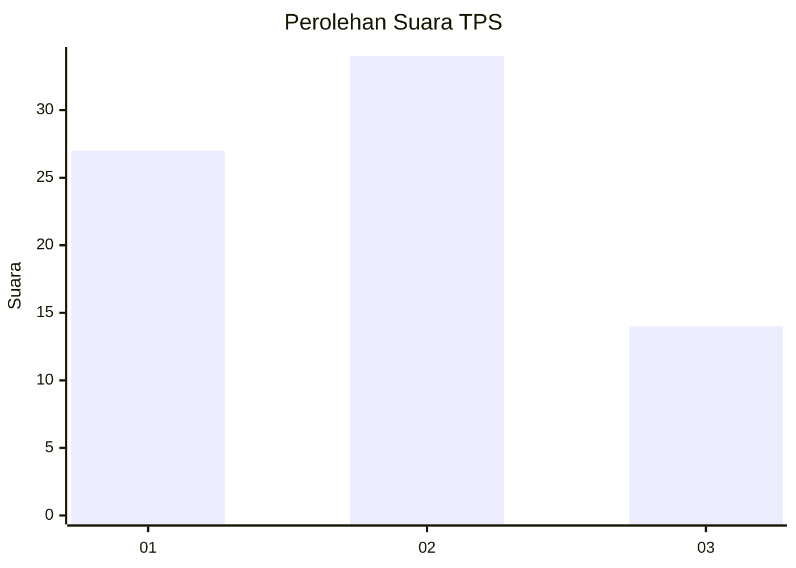
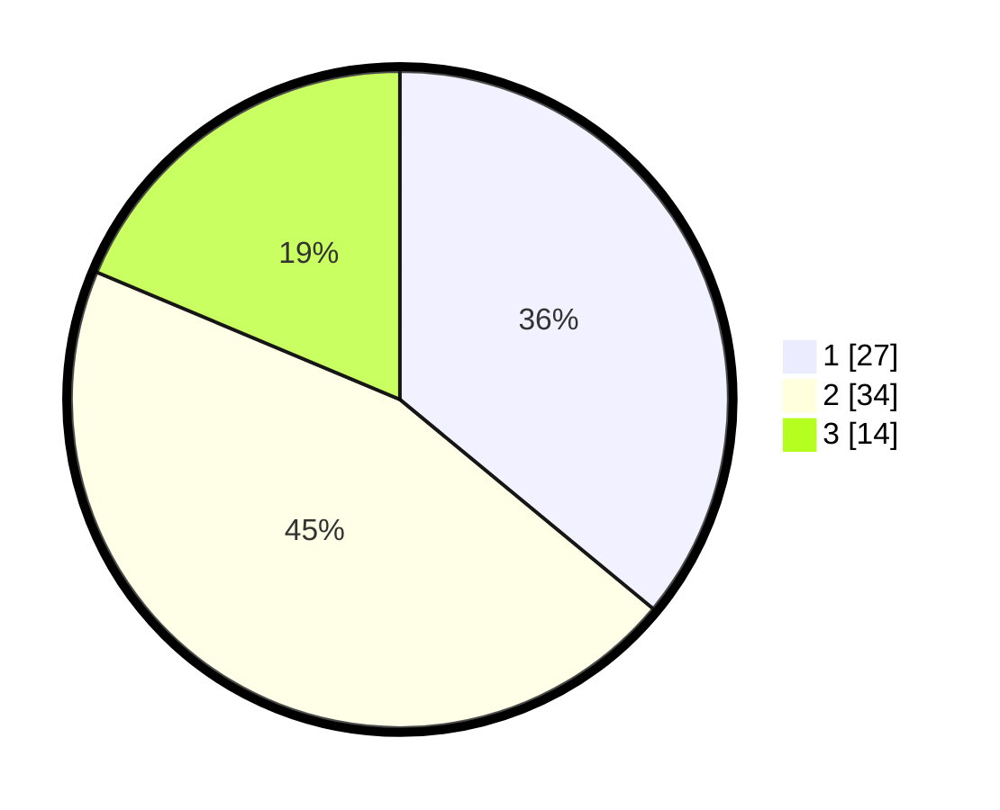

# Hasil

## Grafik

## Tabel

| No. | Nama Paslon    | Suara | Suara (raw) | Persentase |
|:--- |:-------------- | -----:| -----------:| ----------:|
| 1   | ANIES MUHAIMIN | 27    | [27][p-1]   | 36,00      |
| 2   | PRABOWO GIBRAN | 34    | [34][p-2]   | 45,33      |
| 3   | GANJAR MAHFUD  | 14    | [14][p-3]   | 18,67      |

[p-1]: https://github.com/gigit-pemilu/pemilu-2024-99-luar-negeri/blob/main/pilpres/hitung-suara/sub/99-luar-negeri/sub/62-kuala-lumpur-malaysia/sub/01-kuala-lumpur-malaysia/sub/0001-kuala-lumpur-malaysia/sub/368-tps-055/sub/paslon-1.txt
[p-2]: https://github.com/gigit-pemilu/pemilu-2024-99-luar-negeri/blob/main/pilpres/hitung-suara/sub/99-luar-negeri/sub/62-kuala-lumpur-malaysia/sub/01-kuala-lumpur-malaysia/sub/0001-kuala-lumpur-malaysia/sub/368-tps-055/sub/paslon-2.txt
[p-3]: https://github.com/gigit-pemilu/pemilu-2024-99-luar-negeri/blob/main/pilpres/hitung-suara/sub/99-luar-negeri/sub/62-kuala-lumpur-malaysia/sub/01-kuala-lumpur-malaysia/sub/0001-kuala-lumpur-malaysia/sub/368-tps-055/sub/paslon-3.txt

## Foto C Plano

https://sirekap-obj-formc.kpu.go.id/28f6/pemilu/ppwp/99/62/01/00/01/9962010001368-20240215-232944--b64096e0-0fa8-4b18-bb4e-40c02aec8bb8.jpg

https://sirekap-obj-formc.kpu.go.id/28f6/pemilu/ppwp/99/62/01/00/01/9962010001368-20240215-233053--1404255a-53f0-46e7-a524-ec071c0489b3.jpg

https://sirekap-obj-formc.kpu.go.id/28f6/pemilu/ppwp/99/62/01/00/01/9962010001368-20240215-233213--23676717-fbe5-4b21-af42-2a2e1b03f123.jpg

## Metadata

| Key        | Value               |
| ---------- | ------------------- |
| Time Stamp | 2024-02-24 22:31:28 |

