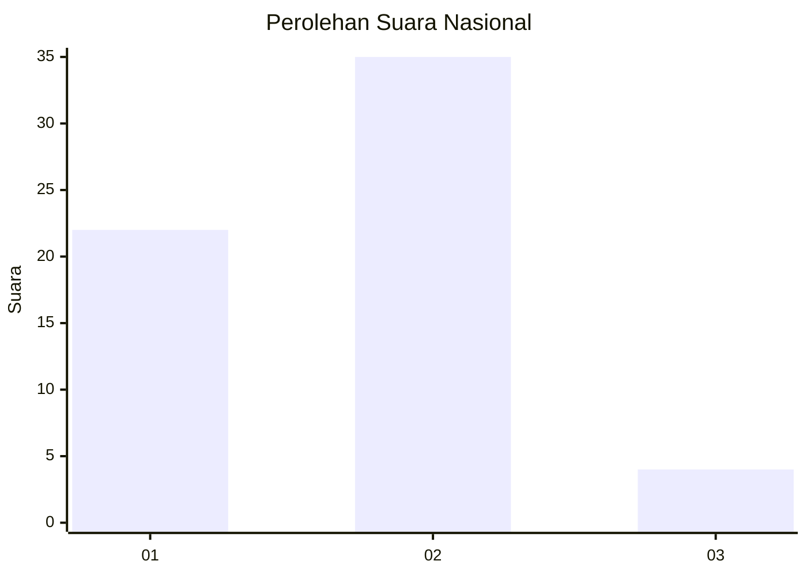
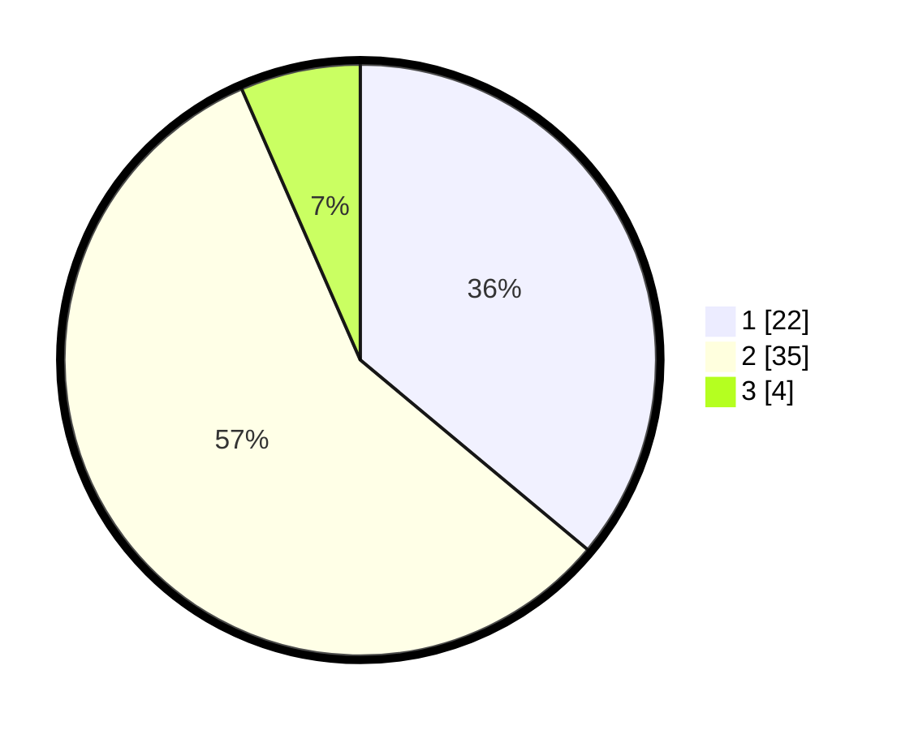

# Hasil

## Grafik

## Tabel

| No. | Nama Paslon    | Suara | Suara (raw) | Persentase |
|:--- |:-------------- | -----:| -----------:| ----------:|
| 1   | ANIES MUHAIMIN | 22    | [22][p-1]   | 36,07      |
| 2   | PRABOWO GIBRAN | 35    | [35][p-2]   | 57,38      |
| 3   | GANJAR MAHFUD  | 4     | [4][p-3]    | 6,56       |

[p-1]: https://github.com/gigit-pemilu/pemilu-2024/blob/main/pilpres/hitung-suara/sub/99-luar-negeri/sub/62-kuala-lumpur-malaysia/sub/01-kuala-lumpur-malaysia/sub/0001-kuala-lumpur-malaysia/sub/369-tps-056/sub/paslon-1.txt
[p-2]: https://github.com/gigit-pemilu/pemilu-2024/blob/main/pilpres/hitung-suara/sub/99-luar-negeri/sub/62-kuala-lumpur-malaysia/sub/01-kuala-lumpur-malaysia/sub/0001-kuala-lumpur-malaysia/sub/369-tps-056/sub/paslon-2.txt
[p-3]: https://github.com/gigit-pemilu/pemilu-2024/blob/main/pilpres/hitung-suara/sub/99-luar-negeri/sub/62-kuala-lumpur-malaysia/sub/01-kuala-lumpur-malaysia/sub/0001-kuala-lumpur-malaysia/sub/369-tps-056/sub/paslon-3.txt

## Foto C Plano

https://sirekap-obj-formc.kpu.go.id/d665/pemilu/ppwp/99/62/01/00/01/9962010001369-20240216-000630--125d4530-1a19-45a7-bb4b-f017157061d2.jpg

https://sirekap-obj-formc.kpu.go.id/d665/pemilu/ppwp/99/62/01/00/01/9962010001369-20240216-000923--feff9e36-3dee-4a02-b2a9-8ebfa5d33466.jpg

https://sirekap-obj-formc.kpu.go.id/d665/pemilu/ppwp/99/62/01/00/01/9962010001369-20240216-001016--1131d170-b3bf-4f7a-aa35-93e135fe1dd4.jpg

## Metadata

| Key        | Value               |
| ---------- | ------------------- |
| Time Stamp | 2024-02-16 01:00:27 |

