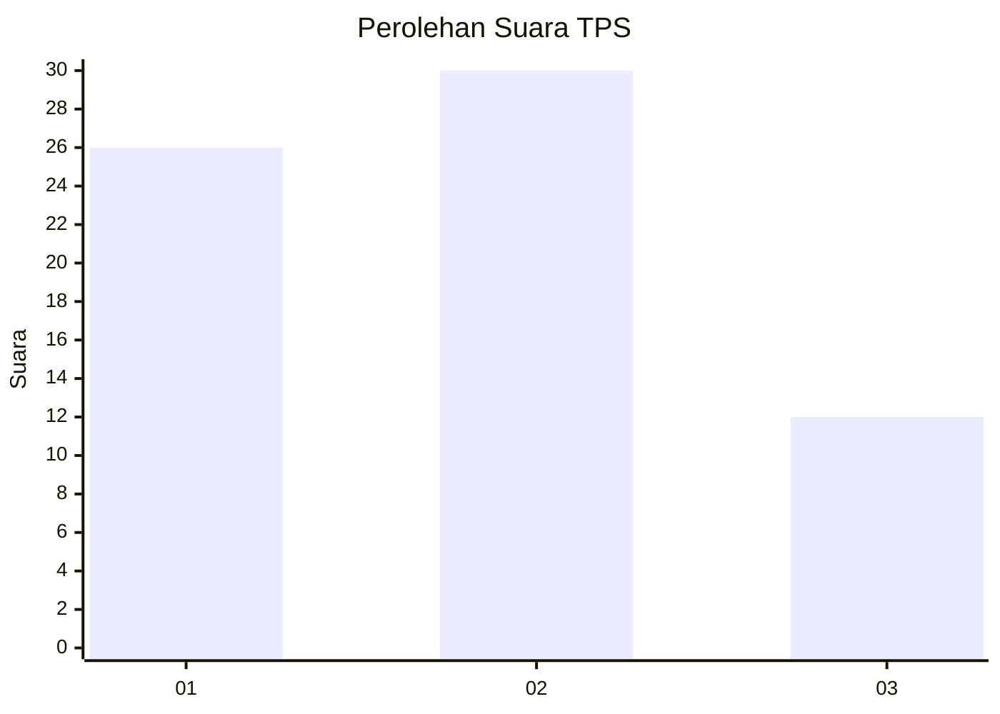
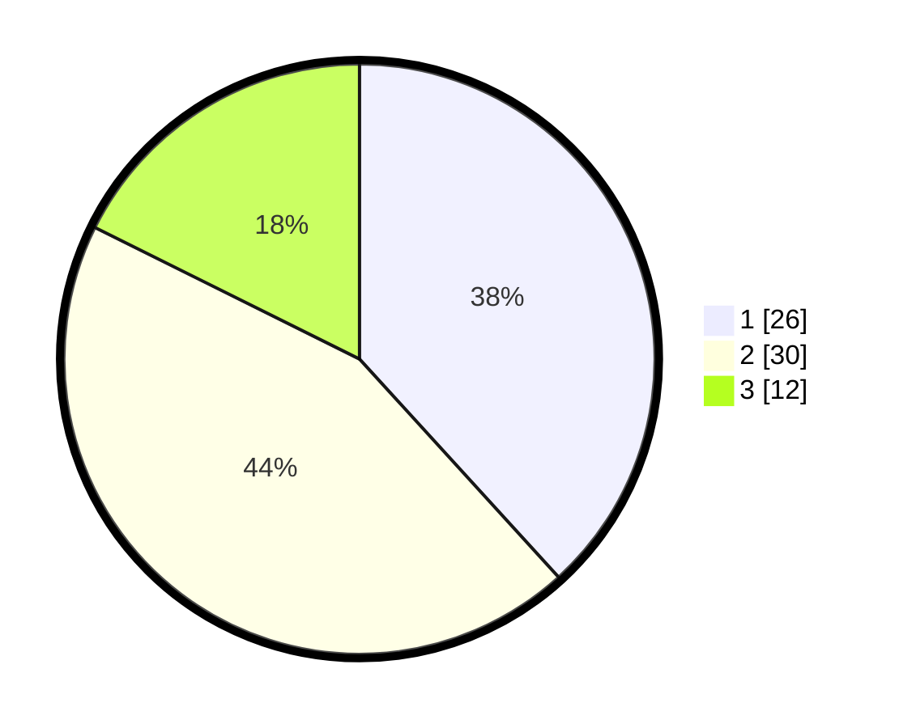

# Hasil

## Grafik

## Tabel

| No. | Nama Paslon    | Suara | Suara (raw) | Persentase |
|:--- |:-------------- | -----:| -----------:| ----------:|
| 1   | ANIES MUHAIMIN | 26    | [26][p-1]   | 38,24      |
| 2   | PRABOWO GIBRAN | 30    | [30][p-2]   | 44,12      |
| 3   | GANJAR MAHFUD  | 12    | [12][p-3]   | 17,65      |

[p-1]: https://github.com/gigit-pemilu/pemilu-2024-99-luar-negeri/blob/main/pilpres/hitung-suara/sub/99-luar-negeri/sub/62-kuala-lumpur-malaysia/sub/01-kuala-lumpur-malaysia/sub/0001-kuala-lumpur-malaysia/sub/388-tps-075/sub/paslon-1.txt
[p-2]: https://github.com/gigit-pemilu/pemilu-2024-99-luar-negeri/blob/main/pilpres/hitung-suara/sub/99-luar-negeri/sub/62-kuala-lumpur-malaysia/sub/01-kuala-lumpur-malaysia/sub/0001-kuala-lumpur-malaysia/sub/388-tps-075/sub/paslon-2.txt
[p-3]: https://github.com/gigit-pemilu/pemilu-2024-99-luar-negeri/blob/main/pilpres/hitung-suara/sub/99-luar-negeri/sub/62-kuala-lumpur-malaysia/sub/01-kuala-lumpur-malaysia/sub/0001-kuala-lumpur-malaysia/sub/388-tps-075/sub/paslon-3.txt

## Foto C Plano

https://sirekap-obj-formc.kpu.go.id/1242/pemilu/ppwp/99/62/01/00/01/9962010001388-20240216-013310--6b4d8742-76bf-40d4-9e8b-4f9607ede32d.jpg

https://sirekap-obj-formc.kpu.go.id/1242/pemilu/ppwp/99/62/01/00/01/9962010001388-20240216-003513--179fea09-e9b7-45aa-92a3-53fa300f7732.jpg

https://sirekap-obj-formc.kpu.go.id/1242/pemilu/ppwp/99/62/01/00/01/9962010001388-20240216-004402--4a453225-89c9-4a75-848e-97809c4e0bef.jpg

## Metadata

| Key        | Value               |
| ---------- | ------------------- |
| Time Stamp | 2024-02-17 16:00:02 |

