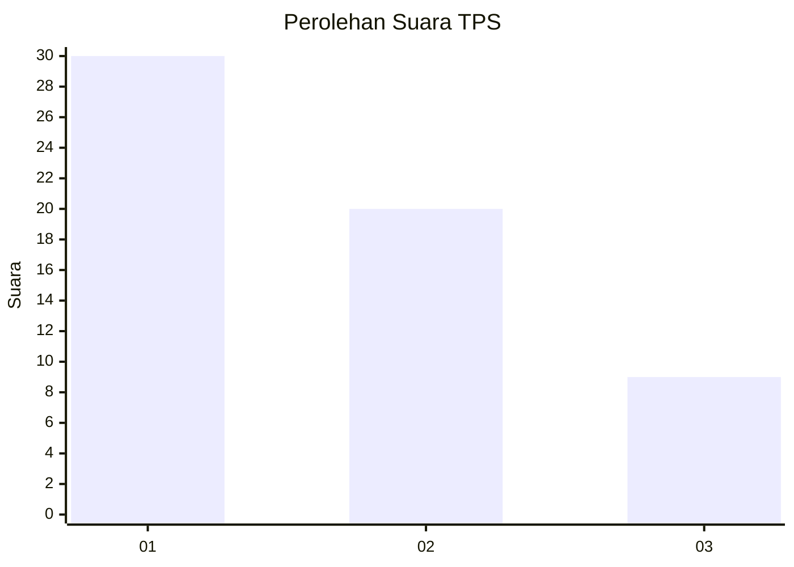
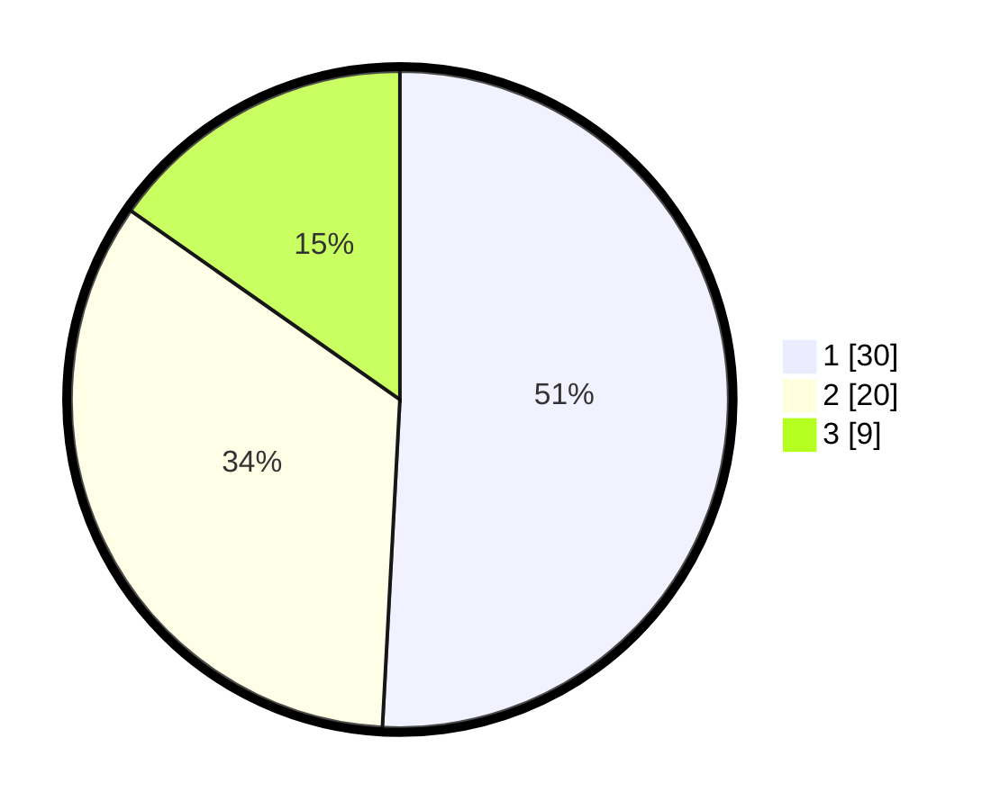

# Hasil

## Grafik

## Tabel

| No. | Nama Paslon    | Suara | Suara (raw) | Persentase |
|:--- |:-------------- | -----:| -----------:| ----------:|
| 1   | ANIES MUHAIMIN | 30    | [30][p-1]   | 50,85      |
| 2   | PRABOWO GIBRAN | 20    | [20][p-2]   | 33,90      |
| 3   | GANJAR MAHFUD  | 9     | [9][p-3]    | 15,25      |

[p-1]: https://github.com/gigit-pemilu/pemilu-2024-99-luar-negeri/blob/main/pilpres/hitung-suara/sub/99-luar-negeri/sub/62-kuala-lumpur-malaysia/sub/01-kuala-lumpur-malaysia/sub/0001-kuala-lumpur-malaysia/sub/400-tps-087/sub/paslon-1.txt
[p-2]: https://github.com/gigit-pemilu/pemilu-2024-99-luar-negeri/blob/main/pilpres/hitung-suara/sub/99-luar-negeri/sub/62-kuala-lumpur-malaysia/sub/01-kuala-lumpur-malaysia/sub/0001-kuala-lumpur-malaysia/sub/400-tps-087/sub/paslon-2.txt
[p-3]: https://github.com/gigit-pemilu/pemilu-2024-99-luar-negeri/blob/main/pilpres/hitung-suara/sub/99-luar-negeri/sub/62-kuala-lumpur-malaysia/sub/01-kuala-lumpur-malaysia/sub/0001-kuala-lumpur-malaysia/sub/400-tps-087/sub/paslon-3.txt

## Foto C Plano

https://sirekap-obj-formc.kpu.go.id/ee5c/pemilu/ppwp/99/62/01/00/01/9962010001400-20240215-231219--8f255f53-2c4b-49f2-9067-5b8690390d2f.jpg

https://sirekap-obj-formc.kpu.go.id/ee5c/pemilu/ppwp/99/62/01/00/01/9962010001400-20240215-231512--e59a39fc-f1fd-49c5-b19b-49bdba504d85.jpg

https://sirekap-obj-formc.kpu.go.id/ee5c/pemilu/ppwp/99/62/01/00/01/9962010001400-20240215-231611--02929f5a-7cff-4d3b-948c-f84691fdc98e.jpg

## Metadata

| Key        | Value               |
| ---------- | ------------------- |
| Time Stamp | 2024-02-16 00:00:26 |

