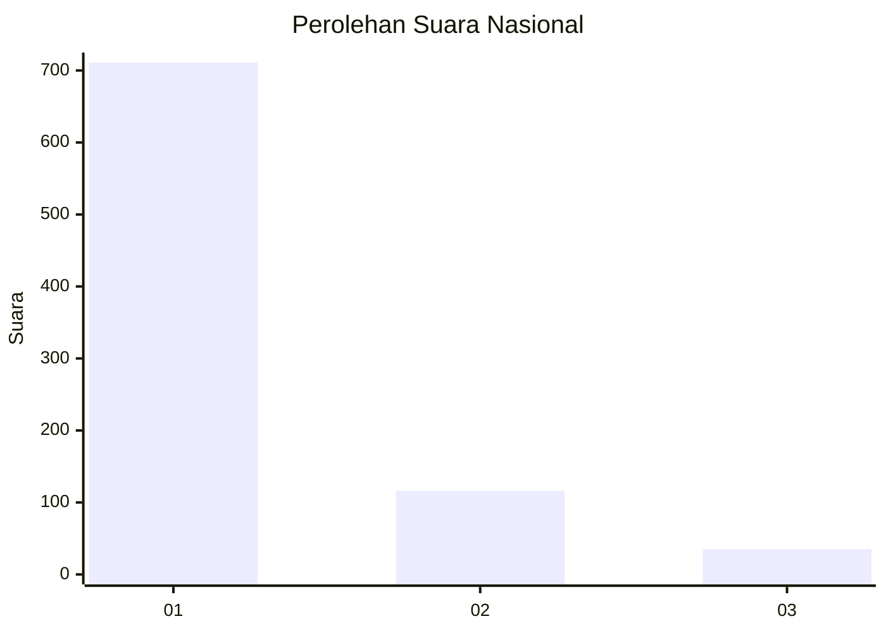
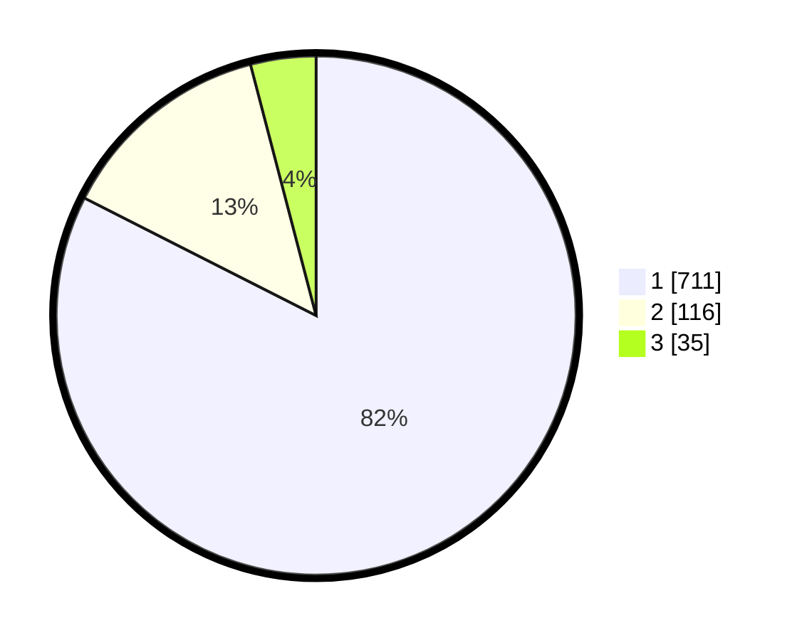

# Hasil

## Grafik

## Tabel

| No. | Nama Paslon    | Suara | Suara (raw) | Persentase |
|:--- |:-------------- | -----:| -----------:| ----------:|
| 1   | ANIES MUHAIMIN | 711   | [711][p-1]  | 82,48      |
| 2   | PRABOWO GIBRAN | 116   | [116][p-2]  | 13,46      |
| 3   | GANJAR MAHFUD  | 35    | [35][p-3]   | 4,06       |

[p-1]: https://github.com/gigit-pemilu/pemilu-2024/blob/main/pilpres/hitung-suara/sub/99-luar-negeri/sub/62-kuala-lumpur-malaysia/sub/01-kuala-lumpur-malaysia/sub/0001-kuala-lumpur-malaysia/sub/447-tps-134/sub/paslon-1.txt
[p-2]: https://github.com/gigit-pemilu/pemilu-2024/blob/main/pilpres/hitung-suara/sub/99-luar-negeri/sub/62-kuala-lumpur-malaysia/sub/01-kuala-lumpur-malaysia/sub/0001-kuala-lumpur-malaysia/sub/447-tps-134/sub/paslon-2.txt
[p-3]: https://github.com/gigit-pemilu/pemilu-2024/blob/main/pilpres/hitung-suara/sub/99-luar-negeri/sub/62-kuala-lumpur-malaysia/sub/01-kuala-lumpur-malaysia/sub/0001-kuala-lumpur-malaysia/sub/447-tps-134/sub/paslon-3.txt

## Foto C Plano

https://sirekap-obj-formc.kpu.go.id/0383/pemilu/ppwp/99/62/01/00/01/9962010001447-20240216-014805--9a91a52a-00e9-486d-8ad0-80a54755c189.jpg

https://sirekap-obj-formc.kpu.go.id/0383/pemilu/ppwp/99/62/01/00/01/9962010001447-20240216-015149--eca91a86-e99e-4d64-bbb3-c26a8e5488a9.jpg

https://sirekap-obj-formc.kpu.go.id/0383/pemilu/ppwp/99/62/01/00/01/9962010001447-20240216-000458--fc62fa46-3da0-44e6-bc6d-1bb21422b5d4.jpg

## Metadata

| Key        | Value               |
| ---------- | ------------------- |
| Time Stamp | 2024-02-25 15:00:00 |

## DATA PEMILIH TETAP

Jumlah pemilih dalam DPT: **0**.
 * L: **0**.
 * P: **0**.

## DATA PENGGUNA HAK PILIH

Jumlah pengguna hak pilih dalam DPT: **3**.
 * L: **3**.
 * P: **0**.

Jumlah pengguna hak pilih dalam DPTb: **112**.
 * L: **63**.
 * P: **49**.

Jumlah pengguna hak pilih dalam DPK: **110**.
 * L: **63**.
 * P: **47**.

Jumlah pengguna hak pilih: **225**.
 * L: **129**.
 * P: **96**.

## JUMLAH SUARA SAH DAN TIDAK SAH

JUMLAH SELURUH SUARA SAH: **222**.

JUMLAH SUARA TIDAK SAH: **3**.

JUMLAH SELURUH SUARA SAH DAN SUARA TIDAK SAH: **225**.

